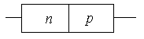

# Формат `result.xml`

`result.xml` — объединённый банк тестовых вопросов (Айрен, `.it2`) без повторов, с правильными ответами.
Это **well-formed XML** (расширение `.xml`), читается любым XML-парсером. Спецсимволы экранированы
(`&lt;`, `&amp;` и т.д.), кодировка UTF-8.

Файлы рядом:

| Файл | Что это |
|---|---|
| `result.xml` | сам банк вопросов |
| `images/` | все картинки, на которые ссылаются теги `` |
| `parse_result.py` | проверенный пример парсера `result.xml → result.json` |
| `merged.md`, `conflicts.md` | человекочитаемые выгрузки (не нужны для парсинга) |

---

## 1. Общая структура

```
<result>
  <meta> … </meta>
  <category name="…" level="1">
    <question …> … </question>
    <category name="…" level="2">      ← подкатегория
      <question …> … </question>
    </category>
  </category>
</result>
```

Категории вложены максимум на 2 уровня. Категория может одновременно содержать и вопросы, и подкатегории
(например «Ключи на БТ» → подкатегория «1»). Порядок элементов в файле значим — сохраняйте его.

---

## 2. Справочник тегов

### Служебные

| Тег | Где | За что отвечает |
|---|---|---|
| `<result>` | корень | Контейнер всего банка |
| `<meta>` | в `<result>` | Сводка по слиянию (для парсинга вопросов не нужна) |
| `<questionsTotal>` | в `<meta>` | Число уникальных вопросов |
| `<conflictGroupsTotal>` | в `<meta>` | Число групп «конфликтных» вопросов (см. `conflictGroup`) |
| `<file name questions duplicatesInFile alreadyInPrevious>` | в `<meta>` | По одному на исходный файл: сколько в нём вопросов, повторов внутри него, и сколько уже встречалось в предыдущих файлах |

### Категории

| Тег / атрибут | За что отвечает |
|---|---|
| `<category>` | Раздел теста (тема) |
| `name` | Название раздела |
| `level` | `1` — верхний уровень, `2` — подраздел |

### Вопрос

| Тег / атрибут | За что отвечает |
|---|---|
| `<question>` | Один вопрос |
| `id` | Сквозной номер вопроса в этом файле (1…433), уникален. **Не** совпадает с id в исходных `.it2` |
| `type` | Тип: `select`, `input`, `match`, `classify` (см. раздел 3) |
| `enabled` | `true`/`false`. `false` — вопрос отключён в исходном тесте (таких 5); при желании фильтруйте |
| `weight` | Вес вопроса (во всех сейчас `1`) |
| `multiple` | Только у `select`: `true` — несколько правильных ответов |
| `conflictGroup` | Есть только у вопросов из групп с одинаковой формулировкой, но разными вариантами/ответами (номер группы 1–9). Чаще это разные вопросы с общим началом, а не ошибки; атрибут — лишь пометка «стоит глянуть» |
| `<title>` | Текст/условие вопроса (блок контента, см. раздел 4) |
| `<sources>` / `<source>` | В каких исходных файлах вопрос встретился |
| `<scripts>` / `<script>` | Есть только у вопросов с параметрами (см. раздел 5) |

### Блок контента (внутри `<title>`, `<answer>`, `<left>`, `<right>`, `<item>`, `<groupTitle>`, `<distractor>`)

| Тег | За что отвечает |
|---|---|
| `<text>` | Кусок текста. Пробелы по краям сохранены как в оригинале |
| `<br/>` | Перенос строки |
| `` | Картинка (путь относительно `result.xml`) |

Дочерние теги идут **в порядке отображения**: текст, перенос, картинка, снова текст. Чтобы собрать вопрос, обходите
детей по порядку. Один блок может содержать только картинки, только текст или смесь.

---

## 3. Что лежит в вопросе по типам

### `type="select"` — выбор из вариантов

```xml
<question id="36" type="select" enabled="true" weight="1" multiple="false">
  <title><text>В чистом кристалле …</text></title>
  <answers>
    <answer correct="true"><text>Число электронов равно числу дырок.</text></answer>
    <answer correct="false"><text>…</text></answer>
  </answers>
  <sources>…</sources>
</question>
```

| Тег / атрибут | Смысл |
|---|---|
| `<answers>` | Список вариантов |
| `<answer correct="true\|false">` | Вариант ответа; `correct="true"` — правильный. Содержимое — блок контента (может быть картинкой) |

### `type="input"` — ввод ответа

```xml
<patterns>
  <pattern value="*$(y)*" quality="1.0000" wildcard="true" caseSensitive="false"/>
</patterns>
```

| Тег / атрибут | Смысл |
|---|---|
| `<patterns>` | Список допустимых правильных ответов (подходит любой из них) |
| `<pattern>` | Один допустимый ответ |
| `value` | Ожидаемая строка. Может содержать `$(имя)` — подстановку переменной из `<script>` |
| `wildcard` | `true` — в `value` символ `*` означает «любые символы» (маска) |
| `caseSensitive` | `true` — регистр важен |
| `quality` | Доля баллов за этот ответ: `1.0000` — полный, `0.9000` — частичный (встречается 1 раз) |

### `type="match"` — соответствие

```xml
<pairs>
  <pair><left>…</left><right>…</right></pair>
</pairs>
<distractors>
  <distractor>…</distractor>
</distractors>
```

| Тег | Смысл |
|---|---|
| `<pairs>` / `<pair>` | Верные пары «элемент → соответствие» |
| `<left>` | Элемент слева (то, к чему подбирают) |
| `<right>` | Правильное соответствие ему |
| `<distractors>` / `<distractor>` | Лишние варианты справа, которые ни к чему не подходят. Тега может не быть |

### `type="classify"` — классификация

```xml
<groups>
  <group>
    <groupTitle><text>Усилитель</text></groupTitle>
    <item></item>
    <item>…</item>
  </group>
</groups>
```

| Тег | Смысл |
|---|---|
| `<groups>` / `<group>` | Категория для раскладки элементов |
| `<groupTitle>` | Название группы (блок контента) |
| `<item>` | Элемент, который **правильно** относится к этой группе |

> Тег `<group>` — это категория внутри вопроса классификации. Не путайте с `<category>` (раздел теста).

---

## 4. Как правильно читать блок контента

Пример из файла: условие с текстом, переносами и картинкой:

```xml
<title>
  <text>На рисунке показана условная структура  диода. </text>
  <br/>
  <text>В каком направлении протекает ток открытого диода ?</text>
  <br/>
  
</title>
```

Соберите его в список блоков `[{text}, {br}, {text}, {br}, {img}]` — так порядок не теряется
(`parse_result.py` делает ровно это). Склеивать в одну строку стоит только если картинки вам не нужны.

---

## 5. Вопросы со скриптами (`<scripts>`)

В 53 вопросах значения генерируются случайно (например, состояния логических входов), поэтому единого
правильного ответа нет:

- в `<title>` и `<pattern value>` встречаются переменные вида `$(x1)`, `$(y)`;
- `<script>` — код на Pascal-подобном языке Айрен (`RandomFloat`, `if … then`, `goto` и т.п.), который эти
  переменные вычисляет;
- в текущем файле у каждого такого вопроса ровно один `<script>`, но парсер лучше писать под список.

Текст скрипта лежит как обычный текст элемента (с переносами строк и отступами). Если вам нужен только «банк
статичных» вопросов, фильтруйте по наличию `<scripts>`.

---

## 6. Как парсить

### Готовый пример

```bash
cd out/merged
python3 parse_result.py      # создаст result.json (433 вопроса)
```

Скрипт `parse_result.py` использует только стандартную библиотеку (`xml.etree.ElementTree`).

### Основной приём

```python
import xml.etree.ElementTree as ET

root = ET.parse("result.xml").getroot()

def walk(node, path):
    for ch in node:
        if ch.tag == "category":
            walk(ch, path + [ch.get("name")])       # путь категории: ["Задачи", "Задача ТТЛ"]
        elif ch.tag == "question":
            print(path, ch.get("id"), ch.get("type"))

walk(root, [])
```

### Форма JSON (то, что делает `parse_result.py`)

```json
{
  "id": 36,
  "type": "select",
  "category": ["Диоды"],
  "enabled": true,
  "weight": 1.0,
  "conflictGroup": null,
  "multiple": false,
  "title":   [{"kind": "text", "value": "В чистом кристалле …"}],
  "answers": [{"correct": true, "content": [{"kind": "text", "value": "Число электронов равно числу дырок."}]}],
  "scripts": [],
  "sources": ["Экзамен АВТИ 2016"]
}
```

Остальные типы дают вместо `answers` поля `patterns` (input), `pairs` + `distractors` (match) или `groups` (classify).

---

## 7. Итоговые числа и подводные камни

- 433 вопроса: `select` 312, `input` 70, `match` 49, `classify` 2. 31 категория (из них 8 подкатегорий).
- 885 ссылок на картинки; все файлы есть в `images/`. Одна и та же картинка может использоваться в нескольких
  вопросах, имя файла — хэш содержимого.
- Порядок вариантов в исходном тесте перемешивается при прохождении, поэтому дубли определялись без учёта
  порядка. В файле варианты идут в порядке первого встреченного вопроса.
- Значения `<text>` не обрезаются. Если нужен `strip`, делайте его на своей стороне.
- `id` вопроса — сквозной номер в этом файле и **не совпадает** с id из исходных `.it2`; при перегенерации через
  `export.py` может измениться, если изменится набор исходных `.it2`.
- `<group>` (группа внутри вопроса `classify`) и `<category>` (раздел теста) — разные теги, не путайте их при парсинге.
- Пустой `<text>` (в файле таких 7) и отсутствие `<distractors>` (у 3 вопросов `match`) или `<scripts>` (у 380 вопросов) —
  нормальная ситуация: перед чтением всегда проверяйте, что тег есть, и не полагайтесь на его наличие.
