# Объединённый тест (без повторов)

Вопросов: 433

**Сводка слияния**

| Файл | Вопросов | Повторов внутри файла | Уже были в предыдущих файлах |
|---|---|---|---|
| Переэкзаменовка АВТИ 2015 | 369 | 0 | 0 |
| Экзамен АВТИ 2015 2 | 425 | 0 | 369 |
| Экзамен АВТИ 2016 | 425 | 0 | 417 |

**Итого уникальных вопросов: 433**


## АЧХ линейных схем 1

#### 1. Установить соответствие приведенных АЧХ схемам ?

| Элемент | Соответствует |
|---|---|
| 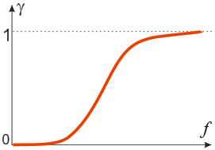 | 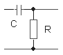 |
| 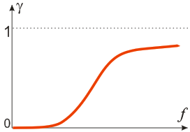 | 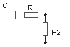 |

**Лишние варианты:** 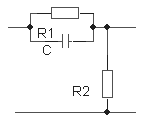

_Источники: Переэкзаменовка АВТИ 2015, Экзамен АВТИ 2015 2, Экзамен АВТИ 2016_

#### 2. Установить соответствие приведенных АЧХ схемам ?

| Элемент | Соответствует |
|---|---|
|  |  |
| 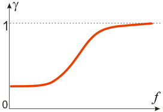 |  |

**Лишние варианты:** 

_Источники: Переэкзаменовка АВТИ 2015, Экзамен АВТИ 2015 2, Экзамен АВТИ 2016_

#### 3. Установить соответствие приведенных АЧХ схемам ?

| Элемент | Соответствует |
|---|---|
|  |  |
| 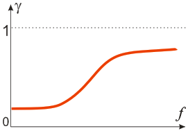 | 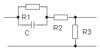 |

**Лишние варианты:** 

_Источники: Переэкзаменовка АВТИ 2015, Экзамен АВТИ 2015 2, Экзамен АВТИ 2016_

#### 4. Установить соответствие приведенных АЧХ схемам ?

| Элемент | Соответствует |
|---|---|
|  |  |
|  |  |

**Лишние варианты:** 

_Источники: Переэкзаменовка АВТИ 2015, Экзамен АВТИ 2015 2, Экзамен АВТИ 2016_

#### 5. Установить соответствие приведенных АЧХ схемам ?

| Элемент | Соответствует |
|---|---|
|  |  |
|  |  |

**Лишние варианты:** 

_Источники: Переэкзаменовка АВТИ 2015, Экзамен АВТИ 2015 2, Экзамен АВТИ 2016_

#### 6. Установить соответствие приведенных АЧХ схемам ?

| Элемент | Соответствует |
|---|---|
| 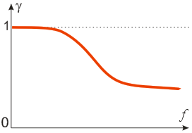 | 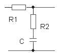 |
|  |  |

**Лишние варианты:** 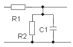

_Источники: Переэкзаменовка АВТИ 2015, Экзамен АВТИ 2015 2, Экзамен АВТИ 2016_

#### 7. Установить соответствие приведенных АЧХ схемам ?

| Элемент | Соответствует |
|---|---|
| 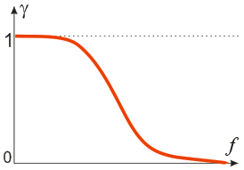 | 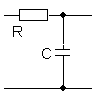 |
|  |  |

**Лишние варианты:** 

_Источники: Переэкзаменовка АВТИ 2015, Экзамен АВТИ 2015 2, Экзамен АВТИ 2016_

#### 8. Установить соответствие приведенных АЧХ схемам ?

| Элемент | Соответствует |
|---|---|
|  |  |
| 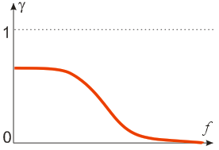 |  |

**Лишние варианты:** 

_Источники: Переэкзаменовка АВТИ 2015, Экзамен АВТИ 2015 2, Экзамен АВТИ 2016_

#### 9. Установить соответствие приведенных АЧХ схемам ?

| Элемент | Соответствует |
|---|---|
|  |  |
| 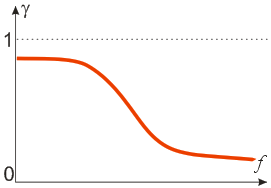 | 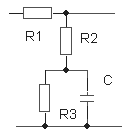 |

**Лишние варианты:** 

_Источники: Переэкзаменовка АВТИ 2015, Экзамен АВТИ 2015 2, Экзамен АВТИ 2016_

#### 10. Установить соответствие приведенных АЧХ схемам ?

| Элемент | Соответствует |
|---|---|
|  |  |
|  |  |

**Лишние варианты:** 

_Источники: Переэкзаменовка АВТИ 2015, Экзамен АВТИ 2015 2, Экзамен АВТИ 2016_

#### 11. Установить соответствие приведенных АЧХ схемам ?

| Элемент | Соответствует |
|---|---|
|  |  |
|  |  |

**Лишние варианты:** 

_Источники: Переэкзаменовка АВТИ 2015, Экзамен АВТИ 2015 2, Экзамен АВТИ 2016_

#### 12. Установить соответствие приведенных АЧХ схемам ?

| Элемент | Соответствует |
|---|---|
|  |  |
|  |  |

**Лишние варианты:** 

_Источники: Переэкзаменовка АВТИ 2015, Экзамен АВТИ 2015 2, Экзамен АВТИ 2016_

#### 13. Установить соответствие приведенных АЧХ схемам ?

| Элемент | Соответствует |
|---|---|
|  |  |
|  |  |

**Лишние варианты:** 

_Источники: Переэкзаменовка АВТИ 2015, Экзамен АВТИ 2015 2, Экзамен АВТИ 2016_

#### 14. Установить соответствие приведенных АЧХ схемам ?

| Элемент | Соответствует |
|---|---|
|  |  |
|  |  |

**Лишние варианты:** 

_Источники: Переэкзаменовка АВТИ 2015, Экзамен АВТИ 2015 2, Экзамен АВТИ 2016_

#### 15. Установить соответствие приведенных АЧХ схемам ?

| Элемент | Соответствует |
|---|---|
|  |  |
|  |  |

**Лишние варианты:** 

_Источники: Переэкзаменовка АВТИ 2015, Экзамен АВТИ 2015 2, Экзамен АВТИ 2016_

#### 16. Установить соответствие приведенных АЧХ схемам ?

| Элемент | Соответствует |
|---|---|
|  |  |
|  |  |

**Лишние варианты:** 

_Источники: Переэкзаменовка АВТИ 2015, Экзамен АВТИ 2015 2, Экзамен АВТИ 2016_

#### 17. Установить соответствие приведенных АЧХ схемам ?

| Элемент | Соответствует |
|---|---|
|  |  |
|  |  |

**Лишние варианты:** 

_Источники: Переэкзаменовка АВТИ 2015, Экзамен АВТИ 2015 2, Экзамен АВТИ 2016_

#### 18. Установить соответствие приведенных АЧХ схемам ?

| Элемент | Соответствует |
|---|---|
|  |  |
|  |  |

**Лишние варианты:** 

_Источники: Переэкзаменовка АВТИ 2015, Экзамен АВТИ 2015 2, Экзамен АВТИ 2016_

#### 19. Установить соответствие приведенных АЧХ схемам ?

| Элемент | Соответствует |
|---|---|
|  |  |
|  |  |

**Лишние варианты:** 

_Источники: Переэкзаменовка АВТИ 2015, Экзамен АВТИ 2015 2, Экзамен АВТИ 2016_

#### 20. Установить соответствие приведенных АЧХ схемам ?

| Элемент | Соответствует |
|---|---|
|  |  |
|  |  |

**Лишние варианты:** 

_Источники: Переэкзаменовка АВТИ 2015, Экзамен АВТИ 2015 2, Экзамен АВТИ 2016_

#### 21. Установить соответствие приведенных АЧХ схемам ?

| Элемент | Соответствует |
|---|---|
|  |  |
|  |  |

**Лишние варианты:** 

_Источники: Переэкзаменовка АВТИ 2015, Экзамен АВТИ 2015 2, Экзамен АВТИ 2016_

#### 22. Установить соответствие приведенных АЧХ схемам ?

| Элемент | Соответствует |
|---|---|
|  |  |
|  |  |

**Лишние варианты:** 

_Источники: Переэкзаменовка АВТИ 2015, Экзамен АВТИ 2015 2, Экзамен АВТИ 2016_

#### 23. Установить соответствие приведенных АЧХ схемам ?

| Элемент | Соответствует |
|---|---|
|  |  |
|  |  |

**Лишние варианты:** 

_Источники: Переэкзаменовка АВТИ 2015, Экзамен АВТИ 2015 2, Экзамен АВТИ 2016_

#### 24. Установить соответствие приведенных АЧХ схемам ?

| Элемент | Соответствует |
|---|---|
|  |  |
|  |  |

**Лишние варианты:** 

_Источники: Переэкзаменовка АВТИ 2015, Экзамен АВТИ 2015 2, Экзамен АВТИ 2016_


## Переходные характеристики в RC-цепях

#### 25. Установить соответствие между осциллограмми и схемами ?

| Элемент | Соответствует |
|---|---|
| 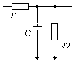 | 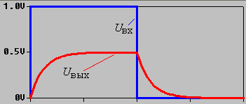 |
| 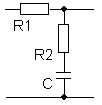 | 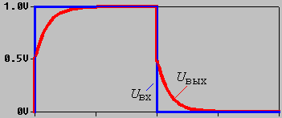 |

**Лишние варианты:** 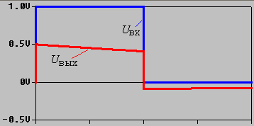

_Источники: Переэкзаменовка АВТИ 2015, Экзамен АВТИ 2015 2, Экзамен АВТИ 2016_

#### 26. Установить соответствие между осциллограмми и схемами ?

| Элемент | Соответствует |
|---|---|
|  |  |
|  |  |

**Лишние варианты:** 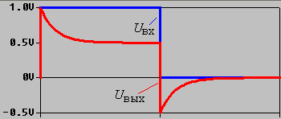

_Источники: Переэкзаменовка АВТИ 2015, Экзамен АВТИ 2015 2, Экзамен АВТИ 2016_

#### 27. Установить соответствие между осциллограмми и схемами ?

| Элемент | Соответствует |
|---|---|
|  | 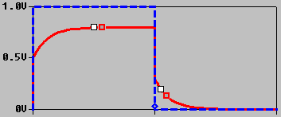 |
|  |  |

**Лишние варианты:** 

_Источники: Переэкзаменовка АВТИ 2015, Экзамен АВТИ 2015 2, Экзамен АВТИ 2016_

#### 28. Установить соответствие между осциллограмми и схемами ?

| Элемент | Соответствует |
|---|---|
|  |  |
|  |  |

**Лишние варианты:** 

_Источники: Переэкзаменовка АВТИ 2015, Экзамен АВТИ 2015 2, Экзамен АВТИ 2016_

#### 29. Установить соответствие между осциллограмми и схемами ?

| Элемент | Соответствует |
|---|---|
|  |  |
|  | 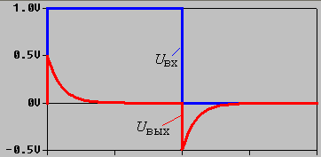 |

**Лишние варианты:** 

_Источники: Переэкзаменовка АВТИ 2015, Экзамен АВТИ 2015 2, Экзамен АВТИ 2016_

#### 30. Установить соответствие между осциллограмми и схемами ?

| Элемент | Соответствует |
|---|---|
|  |  |
|  |  |

**Лишние варианты:** 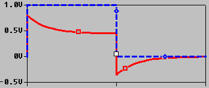

_Источники: Переэкзаменовка АВТИ 2015, Экзамен АВТИ 2015 2, Экзамен АВТИ 2016_

#### 31. Установить соответствие между осциллограмми и схемами ?

| Элемент | Соответствует |
|---|---|
|  |  |
|  |  |

**Лишние варианты:** 

_Источники: Переэкзаменовка АВТИ 2015, Экзамен АВТИ 2015 2, Экзамен АВТИ 2016_

#### 32. Установить соответствие между осциллограмми и схемами ?

| Элемент | Соответствует |
|---|---|
|  |  |
|  |  |

**Лишние варианты:** 

_Источники: Переэкзаменовка АВТИ 2015, Экзамен АВТИ 2015 2, Экзамен АВТИ 2016_


## Диоды

#### 33. В чистом кристалле  полупроводника кремния при комнатной температуре


- ✅ Число электронов равно числу дырок.
- ⬜ Концентрация электронов превыщает концентрацию дырок.
- ⬜ Концентрация дырок превыщает концентрацию электронов.
- ⬜ Концентрация электронов и дырок равна нулю.

_Источники: Переэкзаменовка АВТИ 2015, Экзамен АВТИ 2015 2, Экзамен АВТИ 2016_

#### 34. В полупроводнике кремния n-типа


- ⬜ Число электронов равно числу дырок.
- ✅ Концентрация электронов превыщает концентрацию дырок.
- ⬜ Концентрация дырок превыщает концентрацию электронов.
- ⬜ Концентрация электронов и дырок равна нулю.

_Источники: Переэкзаменовка АВТИ 2015, Экзамен АВТИ 2015 2, Экзамен АВТИ 2016_

#### 35. В полупроводнике кремния р-типа


- ⬜ Число электронов равно числу дырок.
- ⬜ Концентрация электронов превыщает концентрацию дырок.
- ✅ Концентрация дырок превыщает концентрацию электронов.
- ⬜ Концентрация электронов и дырок равна нулю.

_Источники: Переэкзаменовка АВТИ 2015, Экзамен АВТИ 2015 2, Экзамен АВТИ 2016_

#### 36. В полупроводнике кремния n-типа


- ✅ ток в основном обусловлен перемещением электронов
- ⬜ ток в основном обусловлен перемещением дырок
- ⬜ ток  обусловлен перемещением отрицательно заряженными ионами акцепторной примеси
- ⬜ ток  обусловлен перемещением отрицательно заряженными ионами донорной примеси

_Источники: Переэкзаменовка АВТИ 2015, Экзамен АВТИ 2015 2, Экзамен АВТИ 2016_

#### 37. В полупроводнике кремния р-типа


- ⬜ ток в основном обусловлен перемещением электронов
- ✅ ток в основном обусловлен перемещением дырок
- ⬜ ток  обусловлен перемещением положительно заряженными ионами акцепторной примеси
- ⬜ ток  обусловлен перемещением положительно заряженными ионами донорной примеси

_Источники: Переэкзаменовка АВТИ 2015, Экзамен АВТИ 2015 2, Экзамен АВТИ 2016_

#### 38. В полупроводнике кремния n-типа


- ✅ основными носителями являются электроны
- ⬜ основными носителями являются дырки
- ⬜ основными носителями являются отрицательно заряженные ионы акцепторной примеси
- ⬜ основными носителями являются отрицательно заряженные ионы донорной примеси

_Источники: Переэкзаменовка АВТИ 2015, Экзамен АВТИ 2015 2, Экзамен АВТИ 2016_

#### 39. В полупроводнике кремния р-типа


- ⬜ основными носителями являются электроны
- ✅ основными носителями являются дырки
- ⬜ основными носителями являются отрицательно заряженные ионы акцепторной примеси
- ⬜ основными носителями являются отрицательно заряженные ионы донорной примеси

_Источники: Переэкзаменовка АВТИ 2015, Экзамен АВТИ 2015 2, Экзамен АВТИ 2016_

#### 40. В диоде при его прямом включении ток через p-n-переход обусловлен


- ✅ диффузией основных носителей
- ⬜ дрейфом основных носителей
- ⬜ перемещением дырок
- ⬜ перемещением электронов
- ⬜ диффузией неосновных носителей
- ⬜ дрейфом неосновных носителей

_Источники: Переэкзаменовка АВТИ 2015, Экзамен АВТИ 2015 2, Экзамен АВТИ 2016_

#### 41. В диоде при его обратном включении ток через p-n-переход обусловлен


- ⬜ диффузией основных носителей
- ⬜ дрейфом основных носителей
- ⬜ перемещением дырок
- ⬜ перемещением электронов
- ⬜ диффузией неосновных носителей
- ✅ дрейфом неосновных носителей

_Источники: Переэкзаменовка АВТИ 2015, Экзамен АВТИ 2015 2, Экзамен АВТИ 2016_

#### 42. На рисунке показана структура некоторой интегральной схемы.   
Указать область со структурой диода.  
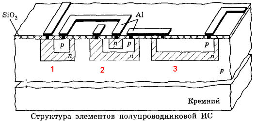

**Правильный ответ (шаблон):**

- `1`

_Источники: Переэкзаменовка АВТИ 2015, Экзамен АВТИ 2015 2, Экзамен АВТИ 2016_

#### 43. На рисунке показана условная структура  диода.   
В каком направлении протекает ток открытого диода ?  


- ⬜ 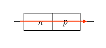
- ✅ 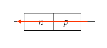

_Источники: Переэкзаменовка АВТИ 2015, Экзамен АВТИ 2015 2, Экзамен АВТИ 2016_

#### 44. На рисунке показана условная структура  диода.   
В каком направлении протекает ток закрытого диода ?  


- ✅ 
- ⬜ 

_Источники: Переэкзаменовка АВТИ 2015, Экзамен АВТИ 2015 2, Экзамен АВТИ 2016_

#### 45. На рисунке показана условная структура  диода.  
Какая область полупроводника является эмиттером, а какая - базой ?  
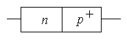


- ✅ 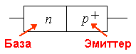
- ⬜ 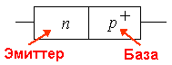

_Источники: Переэкзаменовка АВТИ 2015, Экзамен АВТИ 2015 2, Экзамен АВТИ 2016_

#### 46. На рисунке показаны вольтамперные характеристики трех типов.  
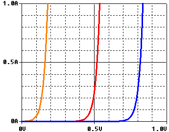

| Элемент | Соответствует |
|---|---|
| Диод Шоттки | Характеристика коричневого цвета |
| Германиевый диод | Характеристика красного цвета |
| Кремниевый диод | Характеристика синего цвета |

_Источники: Переэкзаменовка АВТИ 2015, Экзамен АВТИ 2015 2, Экзамен АВТИ 2016_

#### 47. Какая из приведенных характеристик соответствует диоду Шоттки ?  
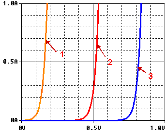

**Правильный ответ (шаблон):**

- `1`

_Источники: Переэкзаменовка АВТИ 2015, Экзамен АВТИ 2015 2, Экзамен АВТИ 2016_

#### 48. Какая из приведенных характеристик соответствует германиевому диоду ?  


**Правильный ответ (шаблон):**

- `2`

_Источники: Переэкзаменовка АВТИ 2015, Экзамен АВТИ 2015 2, Экзамен АВТИ 2016_

#### 49. Какая из приведенных характеристик соответствует кремниевому диоду ?  


**Правильный ответ (шаблон):**

- `3`

_Источники: Переэкзаменовка АВТИ 2015, Экзамен АВТИ 2015 2, Экзамен АВТИ 2016_

#### 50. На рисунке показана условная структура  диода, созданная сплавлением двух примесных полупроводников.   
Полупроводник 1 был создан путем внедрения в него атомов бора, а полупроводник 2 - атомов фосфора.  
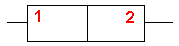  
В каком направлении протекает ток открытого диода ?


- ⬜ 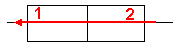
- ✅ 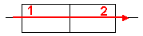

_Источники: Переэкзаменовка АВТИ 2015, Экзамен АВТИ 2015 2, Экзамен АВТИ 2016_

#### 51. На рисунке показана условная структура  диода, созданная сплавлением двух примесных полупроводников.   
Полупроводник 1 был создан путем внедрения в него атомов бора, а полупроводник 2 - атомов фосфора.  
  
В каком направлении протекает ток закрытого диода ?


- ⬜ 
- ✅ 

_Источники: Переэкзаменовка АВТИ 2015, Экзамен АВТИ 2015 2, Экзамен АВТИ 2016_

#### 52. На рисунке показана условная структура  диода, созданная сплавлением двух примесных полупроводников.   
Полупроводник 1 был создан путем внедрения в него атомов бора с концентрацией  ,   
а полупроводник 2 - атомов фосфора с концентрацией  .  
  
Какая область полупроводника является эмиттером, а какая - базой ?


- ⬜ 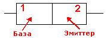
- ✅ 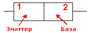

_Источники: Переэкзаменовка АВТИ 2015, Экзамен АВТИ 2015 2, Экзамен АВТИ 2016_

#### 53. На рисунке показана условная структура  диода, созданная сплавлением двух примесных полупроводников.   
Полупроводник 1 был создан путем внедрения в него атомов бора с концентрацией  ,   
а полупроводник 2 - атомов фосфора с концентрацией  .  
  
Какая область полупроводника является эмиттером, а какая - базой ?


- ✅ 
- ⬜ 

_Источники: Переэкзаменовка АВТИ 2015, Экзамен АВТИ 2015 2, Экзамен АВТИ 2016_


## Схемы с диодами 1

#### 54. Какой вид имеет передаточная характеристика для схемы, изображенной на рисунке?  
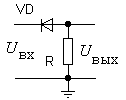


- ⬜ 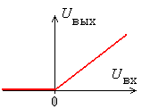
- ⬜ 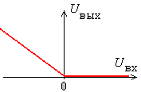
- ⬜ 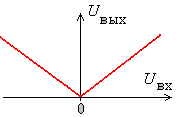
- ⬜ 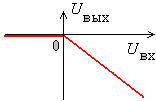
- ✅ 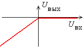
- ⬜ 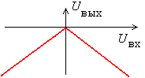

_Источники: Переэкзаменовка АВТИ 2015, Экзамен АВТИ 2015 2, Экзамен АВТИ 2016_

#### 55. Какой вид имеет передаточная характеристика для схемы, изображенной на рисунке?  
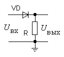


- ✅ 
- ⬜ 
- ⬜ 
- ⬜ 
- ⬜ 
- ⬜ 

_Источники: Переэкзаменовка АВТИ 2015, Экзамен АВТИ 2015 2, Экзамен АВТИ 2016_

#### 56. Какой вид имеет передаточная характеристика для схемы, изображенной на рисунке?  
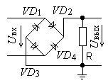


- ⬜ 
- ⬜ 
- ✅ 
- ⬜ 
- ⬜ 
- ⬜ 

_Источники: Переэкзаменовка АВТИ 2015, Экзамен АВТИ 2015 2, Экзамен АВТИ 2016_

#### 57. Какой вид имеет передаточная характеристика для схемы, изображенной на рисунке?  
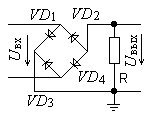


- ⬜ 
- ⬜ 
- ⬜ 
- ⬜ 
- ⬜ 
- ✅ 

_Источники: Переэкзаменовка АВТИ 2015, Экзамен АВТИ 2015 2, Экзамен АВТИ 2016_

#### 58. Какой вид имеет передаточная характеристика для схемы, изображенной на рисунке?  
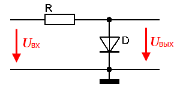


- ✅ 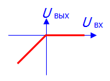
- ⬜ 
- ⬜ 
- ⬜ 

_Источники: Переэкзаменовка АВТИ 2015, Экзамен АВТИ 2015 2, Экзамен АВТИ 2016_

#### 59. Какой вид имеет передаточная характеристика для схемы, изображенной на рисунке?  


- ⬜ 
- ✅ 
- ⬜ 
- ⬜ 

_Источники: Переэкзаменовка АВТИ 2015, Экзамен АВТИ 2015 2, Экзамен АВТИ 2016_

#### 60. Какой вид имеет передаточная характеристика для схемы, изображенной на рисунке?  


- ✅ 
- ⬜ 
- ⬜ 
- ⬜ 

_Источники: Переэкзаменовка АВТИ 2015, Экзамен АВТИ 2015 2, Экзамен АВТИ 2016_

#### 61. Какой вид имеет передаточная характеристика для схемы, изображенной на рисунке?  


- ⬜ 
- ✅ 
- ⬜ 
- ⬜ 

_Источники: Переэкзаменовка АВТИ 2015, Экзамен АВТИ 2015 2, Экзамен АВТИ 2016_

#### 62. Какой вид имеет передаточная характеристика для схемы, изображенной на рисунке?  


- ⬜ 
- ⬜ 
- ✅ 
- ⬜ 

_Источники: Переэкзаменовка АВТИ 2015, Экзамен АВТИ 2015 2, Экзамен АВТИ 2016_

#### 63. Какой вид имеет передаточная характеристика для схемы, изображенной на рисунке?  


- ⬜ 
- ⬜ 
- ⬜ 
- ✅ 

_Источники: Переэкзаменовка АВТИ 2015, Экзамен АВТИ 2015 2, Экзамен АВТИ 2016_

#### 64. Какой вид имеет передаточная характеристика для схемы, изображенной на рисунке?  


- ✅ 
- ⬜ 
- ⬜ 
- ⬜ 

_Источники: Переэкзаменовка АВТИ 2015, Экзамен АВТИ 2015 2, Экзамен АВТИ 2016_

#### 65. Какой вид имеет передаточная характеристика для схемы, изображенной на рисунке?  


- ⬜ 
- ✅ 
- ⬜ 
- ⬜ 

_Источники: Переэкзаменовка АВТИ 2015, Экзамен АВТИ 2015 2, Экзамен АВТИ 2016_

#### 66. Какой вид имеет передаточная характеристика для схемы, изображенной на рисунке?  


- ⬜ 
- ⬜ 
- ✅ 
- ⬜ 

_Источники: Переэкзаменовка АВТИ 2015, Экзамен АВТИ 2015 2, Экзамен АВТИ 2016_

#### 67. Какой вид имеет передаточная характеристика для схемы, изображенной на рисунке?  


- ⬜ 
- ⬜ 
- ⬜ 
- ✅ 

_Источники: Переэкзаменовка АВТИ 2015, Экзамен АВТИ 2015 2, Экзамен АВТИ 2016_

#### 68. Какой вид имеет передаточная характеристика для схемы, изображенной на рисунке?  


- ⬜ 
- ✅ 
- ⬜ 
- ⬜ 

_Источники: Переэкзаменовка АВТИ 2015, Экзамен АВТИ 2015 2, Экзамен АВТИ 2016_

#### 69. Какой вид имеет передаточная характеристика для схемы, изображенной на рисунке?  


- ✅ 
- ⬜ 
- ⬜ 
- ⬜ 

_Источники: Переэкзаменовка АВТИ 2015, Экзамен АВТИ 2015 2, Экзамен АВТИ 2016_


## Схемы с диодами 2

#### 70. В схеме, изображенной на рисунке, были сняты осциллограммы входного и выходного напряжения.  
Какая из осциллограмм выходного напряжения соответствует схеме ?   
                              


- ⬜ 
- ⬜ 
- ✅ 
- ⬜ 
- ⬜ 
- ⬜ 

_Источники: Переэкзаменовка АВТИ 2015, Экзамен АВТИ 2015 2, Экзамен АВТИ 2016_

#### 71. В схеме, изображенной на рисунке, были сняты осциллограммы входного и выходного напряжения.  
Какая из осциллограмм выходного напряжения соответствует схеме ?   
                              


- ⬜ 
- ✅ 
- ⬜ 
- ⬜ 
- ⬜ 
- ⬜ 

_Источники: Переэкзаменовка АВТИ 2015, Экзамен АВТИ 2015 2, Экзамен АВТИ 2016_

#### 72. В схеме, изображенной на рисунке, были сняты осциллограммы входного и выходного напряжения.  
Какая из осциллограмм выходного напряжения соответствует схеме ?   
                              


- ✅ 
- ⬜ 
- ⬜ 
- ⬜ 
- ⬜ 
- ⬜ 

_Источники: Переэкзаменовка АВТИ 2015, Экзамен АВТИ 2015 2, Экзамен АВТИ 2016_

#### 73. В схеме, изображенной на рисунке, были сняты осциллограммы входного и выходного напряжения.  
Какая из осциллограмм выходного напряжения соответствует схеме ?   
                              


- ⬜ 
- ⬜ 
- ⬜ 
- ⬜ 
- ✅ 
- ⬜ 

_Источники: Переэкзаменовка АВТИ 2015, Экзамен АВТИ 2015 2, Экзамен АВТИ 2016_

#### 74. В схеме, изображенной на рисунке, были сняты осциллограммы входного и выходного напряжения.  
Какая из осциллограмм выходного напряжения соответствует схеме ?   


- ✅ 
- ⬜ 
- ⬜ 
- ⬜ 

_Источники: Переэкзаменовка АВТИ 2015, Экзамен АВТИ 2015 2, Экзамен АВТИ 2016_

#### 75. В схеме, изображенной на рисунке, были сняты осциллограммы входного и выходного напряжения.  
Какая из осциллограмм выходного напряжения соответствует схеме ?   


- ⬜ 
- ✅ 
- ⬜ 
- ⬜ 

_Источники: Переэкзаменовка АВТИ 2015, Экзамен АВТИ 2015 2, Экзамен АВТИ 2016_

#### 76. В схеме, изображенной на рисунке, были сняты осциллограммы входного и выходного напряжения.  
Какая из осциллограмм выходного напряжения соответствует схеме ?   


- ✅ 
- ⬜ 
- ⬜ 
- ⬜ 

_Источники: Переэкзаменовка АВТИ 2015, Экзамен АВТИ 2015 2, Экзамен АВТИ 2016_

#### 77. В схеме, изображенной на рисунке, были сняты осциллограммы входного и выходного напряжения.  
Какая из осциллограмм выходного напряжения соответствует схеме ?   


- ⬜ 
- ✅ 
- ⬜ 
- ⬜ 

_Источники: Переэкзаменовка АВТИ 2015, Экзамен АВТИ 2015 2, Экзамен АВТИ 2016_

#### 78. В схеме, изображенной на рисунке, были сняты осциллограммы входного и выходного напряжения.  
Какая из осциллограмм выходного напряжения соответствует схеме ?   


- ⬜ 
- ⬜ 
- ✅ 
- ⬜ 

_Источники: Переэкзаменовка АВТИ 2015, Экзамен АВТИ 2015 2, Экзамен АВТИ 2016_

#### 79. В схеме, изображенной на рисунке, были сняты осциллограммы входного и выходного напряжения.  
Какая из осциллограмм выходного напряжения соответствует схеме ?   


- ⬜ 
- ⬜ 
- ⬜ 
- ✅ 

_Источники: Переэкзаменовка АВТИ 2015, Экзамен АВТИ 2015 2, Экзамен АВТИ 2016_

#### 80. В схеме, изображенной на рисунке, были сняты осциллограммы входного и выходного напряжения.  
Какая из осциллограмм выходного напряжения соответствует схеме ?   


- ✅ 
- ⬜ 
- ⬜ 
- ⬜ 

_Источники: Переэкзаменовка АВТИ 2015, Экзамен АВТИ 2015 2, Экзамен АВТИ 2016_

#### 81. В схеме, изображенной на рисунке, были сняты осциллограммы входного и выходного напряжения.  
Какая из осциллограмм выходного напряжения соответствует схеме ?   


- ⬜ 
- ✅ 
- ⬜ 
- ⬜ 

_Источники: Переэкзаменовка АВТИ 2015, Экзамен АВТИ 2015 2, Экзамен АВТИ 2016_

#### 82. В схеме, изображенной на рисунке, были сняты осциллограммы входного и выходного напряжения.  
Какая из осциллограмм выходного напряжения соответствует схеме ?   


- ⬜ 
- ⬜ 
- ✅ 
- ⬜ 

_Источники: Переэкзаменовка АВТИ 2015, Экзамен АВТИ 2015 2, Экзамен АВТИ 2016_

#### 83. В схеме, изображенной на рисунке, были сняты осциллограммы входного и выходного напряжения.  
Какая из осциллограмм выходного напряжения соответствует схеме ?   


- ⬜ 
- ⬜ 
- ⬜ 
- ✅ 

_Источники: Переэкзаменовка АВТИ 2015, Экзамен АВТИ 2015 2_

#### 84. В схеме, изображенной на рисунке, были сняты осциллограммы входного и выходного напряжения.  
Какая из осциллограмм выходного напряжения соответствует схеме ?   


- ⬜ 
- ✅ 
- ⬜ 
- ⬜ 

_Источники: Переэкзаменовка АВТИ 2015, Экзамен АВТИ 2015 2, Экзамен АВТИ 2016_

#### 85. В схеме, изображенной на рисунке, были сняты осциллограммы входного и выходного напряжения.  
Какая из осциллограмм выходного напряжения соответствует схеме ?   


- ✅ 
- ⬜ 
- ⬜ 
- ⬜ 

_Источники: Переэкзаменовка АВТИ 2015, Экзамен АВТИ 2015 2, Экзамен АВТИ 2016_

#### 86. В схеме, изображенной на рисунке, были сняты осциллограммы входного и выходного напряжения.  
Какая из осциллограмм выходного напряжения соответствует схеме ?   


- ⬜ 
- ⬜ 
- ✅ 
- ⬜ 

_Источники: Экзамен АВТИ 2016_


## Параметрический стабилизатор 1

#### 87. Какой полупроводниковый элемент используется в  данной схеме ?  


- ✅ Стабилитрон
- ⬜ Диод
- ⬜ Тиристор
- ⬜ Варистор

_Источники: Переэкзаменовка АВТИ 2015, Экзамен АВТИ 2015 2, Экзамен АВТИ 2016_

#### 88. За счет чего обеспечивается стабилизация напряжения на выходе данной схемы ?  


- ✅ За счет собственной нелинейности  элемента VD1.
- ⬜ За счет регулирования напряжения  элементом VD1.
- ⬜ За счет  сопротивления Rб.

_Источники: Переэкзаменовка АВТИ 2015, Экзамен АВТИ 2015 2, Экзамен АВТИ 2016_

#### 89. К какому типу относится схема параметрического стабилизатора ?  


- ✅ Схема с параллельным типом стабилизации.
- ⬜ Схема с последовательным типом стабилизации.
- ⬜ Схема с последовательно-параллельным типом стабилизации.

_Источники: Переэкзаменовка АВТИ 2015, Экзамен АВТИ 2015 2, Экзамен АВТИ 2016_

#### 90. Какой участок вольт-амперной характеристики стабилитрона используется  
в схеме стабилизатора напряжения ?  


- ✅ Участок электрического пробоя.
- ⬜ Прямая ветвь характеристики стабилитрона.
- ⬜ Обратная ветвь ВАХ.

_Источники: Переэкзаменовка АВТИ 2015, Экзамен АВТИ 2015 2, Экзамен АВТИ 2016_

#### 91.   
Коэффициент стабилизации параметрического стабилизатора  
(при заданных входном и выходном напряжениях) зависят от:

_Несколько правильных_

- ✅ дифференциального сопротивления стабилитрона
- ✅ сопротивления баластного резистора
- ⬜ емкости конденсатора фильтра выпрямителя

_Источники: Переэкзаменовка АВТИ 2015, Экзамен АВТИ 2015 2, Экзамен АВТИ 2016_

#### 92.   
Минимальное значение входного напряжения (при фиксированной нагрузке)  в параметрическом стабилизаторе  определяется


- ✅ Минимальным значением рабочего тока через стабилитрон.
- ⬜ Максимально допустимым током через стабилитрон.
- ⬜ Допустимой температурой.
- ⬜ Допустимой мощностью рассеяния стабилитрона

_Источники: Переэкзаменовка АВТИ 2015, Экзамен АВТИ 2015 2, Экзамен АВТИ 2016_

#### 93.   
Максимальное значение входного напряжения (при фиксированной нагрузке)  в параметрическом стабилизаторе  определяется


- ⬜ Минимальным значением рабочего тока через стабилитрон.
- ✅ Максимально допустимым током через стабилитрон.
- ⬜ Допустимой температурой.
- ⬜ Допустимой мощностью рассеяния стабилитрона

_Источники: Переэкзаменовка АВТИ 2015, Экзамен АВТИ 2015 2, Экзамен АВТИ 2016_

#### 94.   
Чем определяется  максимальное значение сопротивленя нагрузки (при фиксированных других параметрах) ?


- ⬜ Минимальным значением рабочего тока через стабилитрон.
- ✅ Максимально допустимым током через стабилитрон.
- ⬜ Допустимой температурой.
- ⬜ Допустимой мощностью рассеяния баластного резистора.

_Источники: Переэкзаменовка АВТИ 2015, Экзамен АВТИ 2015 2, Экзамен АВТИ 2016_

#### 95.   
Чем определяется  минимальное значение сопротивленя нагрузки (при фиксированных других параметрах) ?


- ✅ Минимальным значением рабочего тока через стабилитрон.
- ⬜ Максимально допустимым током через стабилитрон.
- ⬜ Допустимой температурой.
- ⬜ Допустимой мощностью рассеяния баластного резистора.

_Источники: Переэкзаменовка АВТИ 2015, Экзамен АВТИ 2015 2, Экзамен АВТИ 2016_


## Биполярный транзистор

#### 96. На рисунке показана структура интегрального транзистора.  
  
Установить соответствие.

| Элемент | Соответствует |
|---|---|
| Эмиттер | Вывод 2 |
| База | Вывод 3 |
| Коллектор | Вывод 1 |

**Лишние варианты:** Вывод 4

_Источники: Переэкзаменовка АВТИ 2015, Экзамен АВТИ 2015 2, Экзамен АВТИ 2016_

#### 97. На рисунке показана структура некоторой интегральной схемы.   
  
Установить соответствие.

| Элемент | Соответствует |
|---|---|
|  | Диод |
|  | Биполярный транзистор n-p-n-типа |
|  | Резистор |

**Лишние варианты:** Биполярный транзистор p-n-p-типа ; Полевой транзистор с управляющим p-n-переходом р-канальный ; МДП транзистор со встроенным  р-каналом

_Источники: Переэкзаменовка АВТИ 2015, Экзамен АВТИ 2015 2, Экзамен АВТИ 2016_

#### 98. Установить соответствие параметрам малосигнальной схемы замещения транзистора в Н-параметрах.

| Элемент | Соответствует |
|---|---|
| H11 | Входное сопротивление |
| H12 | Коэффициент влияния выходного напряжения на входное (коэффициент обратной связи) |
| H21 | Коэффициент передачи входного тока |
| H22 | Выходная проводимость |

**Лишние варианты:** Входная проводимость ; Коэффициент усиления входного напряжения ; Выходное сопротивление ; Крутизна

_Источники: Переэкзаменовка АВТИ 2015, Экзамен АВТИ 2015 2, Экзамен АВТИ 2016_

#### 99. Установить соответствие параметрам малосигнальной схемы замещения транзистора в Y-параметрах.

| Элемент | Соответствует |
|---|---|
| Y11 | Входная проводимость |
| Y12 | Коэффициент влияния выходного напряжения на входной ток |
| Y21 | Крутизна |
| Y22 | Выходная проводимость |

**Лишние варианты:** Входное сопротивление ; Коэффициент усиления входного напряжения ; Выходное сопротивление ; Коэффициент передачи входного тока ; Коэффициент влияния выходного напряжения на входное (коэффициент обратной связи)

_Источники: Переэкзаменовка АВТИ 2015, Экзамен АВТИ 2015 2, Экзамен АВТИ 2016_

#### 100. Какие соотношения  верны, если биполярный транзистор работает в активном режиме?

_Несколько правильных_

- ✅ 
- ✅ 
- ✅ 
- ⬜ 
- ⬜ 
- ⬜ 

_Источники: Переэкзаменовка АВТИ 2015, Экзамен АВТИ 2015 2, Экзамен АВТИ 2016_

#### 101. Какие соотношения  верны, если биполярный транзистор работает в  режиме насыщения?

_Несколько правильных_

- ✅ 
- ⬜ 
- ✅ 
- ⬜ 
- ⬜ 
- ✅ 
- ⬜ 

_Источники: Переэкзаменовка АВТИ 2015, Экзамен АВТИ 2015 2, Экзамен АВТИ 2016_


## Каскады на БТ

#### 102. На рисунке показана схема усилительного каскада, на вход которого подан синусоидальный сигнал.  
Здесь же приведена осциллограмма выходного напряжения.  
  
Указать  участки осциллограмм, где транзистор работает в активном режиме.

_Несколько правильных_

- ✅ a
- ⬜ b
- ✅ c
- ✅ d
- ⬜ e
- ✅ f

_Источники: Переэкзаменовка АВТИ 2015, Экзамен АВТИ 2015 2, Экзамен АВТИ 2016_

#### 103. На рисунке показана схема усилительного каскада, на вход которого подан синусоидальный сигнал.  
Здесь же приведена осциллограмма выходного напряжения.  
  
Указать  участки осциллограмм, где транзистор работает в режиме насыщения.


- ⬜ a
- ⬜ b
- ⬜ c
- ⬜ d
- ✅ e
- ⬜ f

_Источники: Переэкзаменовка АВТИ 2015, Экзамен АВТИ 2015 2, Экзамен АВТИ 2016_

#### 104. На рисунке показана схема усилительного каскада, на вход которого подан синусоидальный сигнал.  
Здесь же приведена осциллограмма выходного напряжения.  
  
Указать  участки осциллограмм, где транзистор работает в режиме отсечки.


- ⬜ a
- ✅ b
- ⬜ c
- ⬜ d
- ⬜ e
- ⬜ f

_Источники: Переэкзаменовка АВТИ 2015, Экзамен АВТИ 2015 2, Экзамен АВТИ 2016_

#### 105. На рисунке показана схема усилительного каскада, на вход которого подан синусоидальный сигнал.  
Здесь же приведена осциллограмма выходного напряжения.  
  
Указать  участки осциллограмм, где транзистор работает в активном режиме.

_Несколько правильных_

- ✅ a
- ✅ b
- ⬜ c
- ✅ d
- ✅ e
- ⬜ f

_Источники: Переэкзаменовка АВТИ 2015, Экзамен АВТИ 2015 2, Экзамен АВТИ 2016_

#### 106. На рисунке показана схема усилительного каскада, на вход которого подан синусоидальный сигнал.  
Здесь же приведена осциллограмма выходного напряжения.  
  
Указать  участки осциллограмм, где транзистор работает в режиме насыщения.


- ⬜ a
- ⬜ b
- ⬜ c
- ⬜ d
- ⬜ e
- ✅ f

_Источники: Переэкзаменовка АВТИ 2015, Экзамен АВТИ 2015 2, Экзамен АВТИ 2016_

#### 107. На рисунке показана схема усилительного каскада, на вход которого подан синусоидальный сигнал.  
Здесь же приведена осциллограмма выходного напряжения.  
  
Указать  участки осциллограмм, где транзистор работает в режиме отсечки.


- ⬜ a
- ⬜ b
- ✅ c
- ⬜ d
- ⬜ e
- ⬜ f

_Источники: Переэкзаменовка АВТИ 2015, Экзамен АВТИ 2015 2, Экзамен АВТИ 2016_

#### 108. На рисунке показана схема усилительного каскада, на вход которого подан синусоидальный сигнал.  
По осциллограмме выходного напряжения видно, что каскад работает с искажениями.  
  
Что надо сделать, чтобы избавиться от искажений?


- ✅ Уменьшить амплитуду входного сигнала
- ⬜ Увеличить сопротивление резистора R1
- ⬜ Увеличить сопротивление резистора R2
- ⬜ Увеличить сопротивление резистора Rк
- ⬜ Уменьшить сопротивление резистора Rэ

_Источники: Переэкзаменовка АВТИ 2015, Экзамен АВТИ 2015 2, Экзамен АВТИ 2016_

#### 109. На рисунке показана схема усилительного каскада, на вход которого подан синусоидальный сигнал.  
По осциллограмме выходного напряжения видно, что каскад работает с искажениями.  
  
Что надо сделать, чтобы избавиться от искажений?


- ✅ Уменьшить амплитуду входного сигнала
- ⬜ Увеличить сопротивление резистора R1
- ⬜ Увеличить сопротивление резистора R2
- ⬜ Увеличить сопротивление резистора Rэ

_Источники: Переэкзаменовка АВТИ 2015, Экзамен АВТИ 2015 2, Экзамен АВТИ 2016_

#### 110. На рисунке показана схема усилительного каскада, на вход которого подан синусоидальный сигнал.  
По осциллограмме выходного напряжения видно, что каскад работает с искажениями.  
  
Каким образом можно избавиться от искажений, не изменяя амплитуду входного сигнала?


- ✅ Искажения можно убрать, увеличив сопротивление резистора R1
- ⬜ Искажения можно убрать, уменьшив сопротивление резистора R1
- ⬜ С помощью R1 невозможно убрать искажения

_Источники: Переэкзаменовка АВТИ 2015, Экзамен АВТИ 2015 2, Экзамен АВТИ 2016_

#### 111. На рисунке показана схема усилительного каскада, на вход которого подан синусоидальный сигнал.  
По осциллограмме выходного напряжения видно, что каскад работает с искажениями.  
  
Каким образом можно избавиться от искажений, не изменяя амплитуду входного сигнала?


- ✅ Искажения можно убрать, уменьшив сопротивление резистора R2
- ⬜ Искажения можно убрать, увеличив  сопротивление резистора R2
- ⬜ С помощью R2 невозможно убрать искажения

_Источники: Переэкзаменовка АВТИ 2015, Экзамен АВТИ 2015 2, Экзамен АВТИ 2016_

#### 112. На рисунке показана схема усилительного каскада, на вход которого подан синусоидальный сигнал.  
По осциллограмме выходного напряжения видно, что каскад работает с искажениями.  
  
Каким образом можно избавиться от искажений, не изменяя амплитуду входного сигнала?


- ⬜ Искажения можно убрать, увеличив сопротивление резистора R1
- ✅ Искажения можно убрать, уменьшив сопротивление резистора R1
- ⬜ С помощью R1 невозможно убрать искажения

_Источники: Переэкзаменовка АВТИ 2015, Экзамен АВТИ 2015 2, Экзамен АВТИ 2016_

#### 113. На рисунке показана схема усилительного каскада, на вход которого подан синусоидальный сигнал.  
По осциллограмме выходного напряжения видно, что каскад работает с искажениями.  
  
Каким образом можно избавиться от искажений, не изменяя амплитуду входного сигнала?


- ⬜ Искажения можно убрать, уменьшив сопротивление резистора R2
- ✅ Искажения можно убрать, увеличив  сопротивление резистора R2
- ⬜ С помощью R2 невозможно убрать искажения

_Источники: Переэкзаменовка АВТИ 2015, Экзамен АВТИ 2015 2, Экзамен АВТИ 2016_

#### 114. На рисунке показана схема усилительного каскада, на вход которого подан синусоидальный сигнал.  
По осциллограмме выходного напряжения видно, что каскад работает с искажениями.  
  
Каким образом можно избавиться от искажений, не изменяя амплитуду входного сигнала?


- ⬜ Искажения можно убрать, увеличив сопротивление резистора R1
- ✅ Искажения можно убрать, уменьшив сопротивление резистора R1
- ⬜ С помощью R1 невозможно убрать искажения

_Источники: Переэкзаменовка АВТИ 2015, Экзамен АВТИ 2015 2, Экзамен АВТИ 2016_

#### 115. На рисунке показана схема усилительного каскада, на вход которого подан синусоидальный сигнал.  
По осциллограмме выходного напряжения видно, что каскад работает с искажениями.  
  
Каким образом можно избавиться от искажений, не изменяя амплитуду входного сигнала?


- ✅ Искажения можно убрать, увеличив  сопротивление резистора R2
- ⬜ Искажения можно убрать, уменьшив сопротивление резистора R2
- ⬜ С помощью R2 невозможно убрать искажения

_Источники: Переэкзаменовка АВТИ 2015, Экзамен АВТИ 2015 2, Экзамен АВТИ 2016_

#### 116. На рисунке показана схема усилительного каскада, на вход которого подан синусоидальный сигнал.  
По осциллограмме выходного напряжения видно, что каскад работает с искажениями.  
  
Каким образом можно избавиться от искажений, не изменяя амплитуду входного сигнала?


- ✅ Искажения можно убрать, увеличив сопротивление резистора R1
- ⬜ Искажения можно убрать, уменьшив сопротивление резистора R1
- ⬜ С помощью R1 невозможно убрать искажения

_Источники: Переэкзаменовка АВТИ 2015, Экзамен АВТИ 2015 2, Экзамен АВТИ 2016_

#### 117. На рисунке показана схема усилительного каскада, на вход которого подан синусоидальный сигнал.  
По осциллограмме выходного напряжения видно, что каскад работает с искажениями.  
  
Каким образом можно избавиться от искажений, не изменяя амплитуду входного сигнала?


- ⬜ Искажения можно убрать, увеличив  сопротивление резистора R2
- ✅ Искажения можно убрать, уменьшив сопротивление резистора R2
- ⬜ С помощью R2 невозможно убрать искажения

_Источники: Переэкзаменовка АВТИ 2015, Экзамен АВТИ 2015 2, Экзамен АВТИ 2016_

#### 118. Для какого усилительного каскада снята амплитудно-частотная характеристика?  


- ✅ Для  усилительного каскада "Общий эмиттер"
- ⬜ Для  усилительного каскада "Общий коллектор"

_Источники: Переэкзаменовка АВТИ 2015, Экзамен АВТИ 2015 2, Экзамен АВТИ 2016_

#### 119. Для какого усилительного каскада снята амплитудно-частотная характеристика?  


- ✅ Для  усилительного каскада "Общий эмиттер"
- ⬜ Для  усилительного каскада "Общий коллектор"

_Источники: Переэкзаменовка АВТИ 2015, Экзамен АВТИ 2015 2, Экзамен АВТИ 2016_

#### 120. Какой усилительный каскад имеет более широкую амплитудно-частотную характеристику?


- ⬜ Усилительный каскад "Общий эмиттер"
- ✅ Усилительный каскад "Общий коллектор"

_Источники: Переэкзаменовка АВТИ 2015, Экзамен АВТИ 2015 2, Экзамен АВТИ 2016_

#### 121. Из-за каких элементов схемы снижается коэффициент усиления в области низких частот?  


_Несколько правильных_

- ✅ Из-за разделительного конденсатора Ср1
- ✅ Из-за разделительного конденсатора Ср2
- ✅ Из-за блокирующего конденсатора Сэ
- ⬜ Из-за биполярного транзистора VT
- ⬜ Из-за паразитных элементов схемы
- ⬜ Из-за резистора обратной связи Rэ

_Источники: Переэкзаменовка АВТИ 2015, Экзамен АВТИ 2015 2, Экзамен АВТИ 2016_

#### 122. Из-за каких элементов схемы снижается коэффициент усиления в области высоких частот?  


_Несколько правильных_

- ⬜ Из-за разделительного конденсатора Ср1
- ⬜ Из-за разделительного конденсатора Ср2
- ⬜ Из-за блокирующего конденсатора Сэ
- ✅ Из-за биполярного транзистора VT
- ✅ Из-за паразитных элементов схемы
- ⬜ Из-за резистора обратной связи Rэ

_Источники: Переэкзаменовка АВТИ 2015, Экзамен АВТИ 2015 2, Экзамен АВТИ 2016_

#### 123. Из-за каких элементов схемы снижается коэффициент усиления в области низких частот?  


_Несколько правильных_

- ✅ Из-за разделительного конденсатора Ср1
- ✅ Из-за разделительного конденсатора Ср2
- ⬜ Из-за биполярного транзистора VT
- ⬜ Из-за паразитных элементов схемы
- ⬜ Из-за резистора в цепи эмиттера Rэ

_Источники: Переэкзаменовка АВТИ 2015, Экзамен АВТИ 2015 2, Экзамен АВТИ 2016_

#### 124. Из-за каких элементов схемы снижается коэффициент усиления в области высоких частот?  


_Несколько правильных_

- ⬜ Из-за разделительного конденсатора Ср1
- ⬜ Из-за разделительного конденсатора Ср2
- ✅ Из-за биполярного транзистора VT
- ✅ Из-за паразитных элементов схемы
- ⬜ Из-за резистора в цепи эмиттера Rэ

_Источники: Переэкзаменовка АВТИ 2015, Экзамен АВТИ 2015 2, Экзамен АВТИ 2016_

#### 125. Классифицировать вид обратной связи в схеме усилительного каскада за счет введения сопротивления Rос.  


| Элемент | Соответствует |
|---|---|
| Обратная связь пложительная или отрицательная ? | Отрицательная обратная связь |
| Это последовательная или параллельная обратная связь ? | Последовательная обратная связь |
| Это обратная связь по току или по напряжению ? | Обратная связь по току |

**Лишние варианты:** Положительная обратная связь ; Параллельная обратная связь ; Обратная связь по напряжению

_Источники: Переэкзаменовка АВТИ 2015, Экзамен АВТИ 2015 2, Экзамен АВТИ 2016_

#### 126. Классифицировать вид обратной связи в схеме усилительного каскада за счет введения сопротивления Rос.  


| Элемент | Соответствует |
|---|---|
| Обратная связь пложительная или отрицательная ? | Отрицательная обратная связь |
| Это последовательная или параллельная обратная связь ? | Последовательная обратная связь |
| Это обратная связь по току или по напряжению ? | Обратная связь по напряжению |

**Лишние варианты:** Положительная обратная связь ; Параллельная обратная связь ; Обратная связь по току

_Источники: Переэкзаменовка АВТИ 2015, Экзамен АВТИ 2015 2, Экзамен АВТИ 2016_

#### 127. Классифицировать вид обратной связи в схеме усилительного каскада за счет введения сопротивления Rос.  


| Элемент | Соответствует |
|---|---|
| Обратная связь пложительная или отрицательная ? | Отрицательная обратная связь |
| Это последовательная или параллельная обратная связь ? | Параллельная обратная связь |
| Это обратная связь по току или по напряжению ? | Обратная связь по напряжению |

**Лишние варианты:** Положительная обратная связь ; Последовательная обратная связь ; Обратная связь по току

_Источники: Переэкзаменовка АВТИ 2015, Экзамен АВТИ 2015 2, Экзамен АВТИ 2016_

#### 128. Выбрать каскады  инвертирующие  входной сигнал. _(отключён)_

_Несколько правильных_

- ⬜ 
- ⬜ 
- ✅ 
- ✅ 

_Источники: Переэкзаменовка АВТИ 2015, Экзамен АВТИ 2015 2, Экзамен АВТИ 2016_

#### 129. Выбрать каскады  неинвертирующие  входной сигнал. _(отключён)_

_Несколько правильных_

- ✅ 
- ✅ 
- ⬜ 
- ⬜ 

_Источники: Переэкзаменовка АВТИ 2015, Экзамен АВТИ 2015 2, Экзамен АВТИ 2016_

#### 130. Этот усилительный каскад  


- ⬜ Инвертирует входной сигнал
- ✅ Неинвертирует входной сигнал

_Источники: Переэкзаменовка АВТИ 2015, Экзамен АВТИ 2015 2, Экзамен АВТИ 2016_

#### 131. Этот усилительный каскад  


- ⬜ Инвертирует входной сигнал
- ✅ Неинвертирует входной сигнал

_Источники: Переэкзаменовка АВТИ 2015, Экзамен АВТИ 2015 2, Экзамен АВТИ 2016_

#### 132. Этот усилительный каскад  


- ✅ Инвертирует входной сигнал
- ⬜ Неинвертирует входной сигнал

_Источники: Переэкзаменовка АВТИ 2015, Экзамен АВТИ 2015 2, Экзамен АВТИ 2016_


## Полевые транзисторы

#### 133. Основными вольт-амперными характеристиками полевого транзистора являются:

_Несколько правильных_

- ✅ Стоко-затворная характеристика
- ✅ Выходная характеристика
- ⬜ Входная характеристика
- ⬜ Передаточная характеристика

_Источники: Переэкзаменовка АВТИ 2015, Экзамен АВТИ 2015 2, Экзамен АВТИ 2016_

#### 134. Для указанных рабочих точек указать соотношение для малосигнальной крутизны  
малосигнальной схемы замещения полевого транзистора.  


- ✅ S1 < S2
- ⬜ S1 > S2
- ⬜ S1 = S2

_Источники: Переэкзаменовка АВТИ 2015, Экзамен АВТИ 2015 2, Экзамен АВТИ 2016_

#### 135. Какие из указанных параметров не относятся к малосигнальной схеме замещения полевого транзистора?

_Несколько правильных_

- ⬜ S - крутизна транзистора
- ⬜ Rвых - выходное сопротивление транзистора
- ✅ H11 - входное сопротивление транзистора
- ✅ H21 - коэффициент передачи тока
- ✅ Uo - пороговое напряжение
- ✅ Kp - коэффициент пропорциональности

_Источники: Переэкзаменовка АВТИ 2015, Экзамен АВТИ 2015 2, Экзамен АВТИ 2016_

#### 136. Какие из указанных параметров определяют малосигнальную схему замещения полевого транзистора?

_Несколько правильных_

- ✅ S - крутизна транзистора
- ✅ Rвых - выходное сопротивление транзистора
- ⬜ H11 - входное сопротивление транзистора
- ⬜ H21 - коэффициент передачи тока
- ⬜ Uo - пороговое напряжение
- ⬜ Kp - коэффициент пропорциональности

_Источники: Переэкзаменовка АВТИ 2015, Экзамен АВТИ 2015 2, Экзамен АВТИ 2016_

#### 137. Какие схемы замещения полевого транзистора используется при анализе в режиме малого сигнала?


- ✅ Схема замещения в y-параметрах
- ⬜ Схема замещения в h-параметрах
- ⬜ Модель Эберса-Молла
- ⬜ Зарядовая модель

_Источники: Переэкзаменовка АВТИ 2015, Экзамен АВТИ 2015 2, Экзамен АВТИ 2016_

#### 138. На рисунке приведена стоко-затворная характеристика полевого транзистора.   
  
Указать тип транзистора.


- ⬜ МДП-транзистор со встроенным каналом p-типа.
- ⬜ МДП-транзистор со встроенным каналом n-типа.
- ⬜ МДП-транзистор с индуцированным  каналом p-типа.
- ✅ МДП-транзистор с индуцированным  каналом n-типа.
- ⬜ Транзистор с управляющим p-n-переходом и  каналом p-типа.
- ⬜ Транзистор с управляющим p-n-переходом и  каналом n-типа.

_Источники: Переэкзаменовка АВТИ 2015, Экзамен АВТИ 2015 2, Экзамен АВТИ 2016_

#### 139. На рисунке приведена стоко-затворная характеристика полевого транзистора.   
  
Указать тип транзистора.


- ⬜ МДП-транзистор со встроенным каналом p-типа.
- ⬜ МДП-транзистор со встроенным каналом n-типа.
- ✅ МДП-транзистор с индуцированным  каналом p-типа.
- ⬜ МДП-транзистор с индуцированным  каналом n-типа.
- ⬜ Транзистор с управляющим p-n-переходом и  каналом p-типа.
- ⬜ Транзистор с управляющим p-n-переходом и  каналом n-типа.

_Источники: Переэкзаменовка АВТИ 2015, Экзамен АВТИ 2015 2, Экзамен АВТИ 2016_

#### 140. На рисунке приведена стоко-затворная характеристика полевого транзистора.   
  
Указать тип транзистора.


- ⬜ МДП-транзистор со встроенным каналом p-типа.
- ✅ МДП-транзистор со встроенным каналом n-типа.
- ⬜ МДП-транзистор с индуцированным  каналом p-типа.
- ⬜ МДП-транзистор с индуцированным  каналом n-типа.
- ⬜ Транзистор с управляющим p-n-переходом и  каналом p-типа.
- ⬜ Транзистор с управляющим p-n-переходом и  каналом n-типа.

_Источники: Переэкзаменовка АВТИ 2015, Экзамен АВТИ 2015 2, Экзамен АВТИ 2016_

#### 141. На рисунке приведена стоко-затворная характеристика полевого транзистора.   
  
Указать тип транзистора.


- ✅ МДП-транзистор со встроенным каналом p-типа.
- ⬜ МДП-транзистор со встроенным каналом n-типа.
- ⬜ МДП-транзистор с индуцированным  каналом p-типа.
- ⬜ МДП-транзистор с индуцированным  каналом n-типа.
- ⬜ Транзистор с управляющим p-n-переходом и  каналом p-типа.
- ⬜ Транзистор с управляющим p-n-переходом и  каналом n-типа.

_Источники: Переэкзаменовка АВТИ 2015, Экзамен АВТИ 2015 2, Экзамен АВТИ 2016_

#### 142. На рисунке приведена стоко-затворная характеристика полевого транзистора.   
  
Указать тип транзистора.


- ⬜ МДП-транзистор со встроенным каналом p-типа.
- ⬜ МДП-транзистор со встроенным каналом n-типа.
- ⬜ МДП-транзистор с индуцированным  каналом p-типа.
- ⬜ МДП-транзистор с индуцированным  каналом n-типа.
- ⬜ Транзистор с управляющим p-n-переходом и  каналом p-типа.
- ✅ Транзистор с управляющим p-n-переходом и  каналом n-типа.

_Источники: Переэкзаменовка АВТИ 2015, Экзамен АВТИ 2015 2, Экзамен АВТИ 2016_

#### 143. На рисунке приведена стоко-затворная характеристика полевого транзистора.   
  
Указать тип транзистора.


- ⬜ МДП-транзистор со встроенным каналом p-типа.
- ⬜ МДП-транзистор со встроенным каналом n-типа.
- ⬜ МДП-транзистор с индуцированным  каналом p-типа.
- ⬜ МДП-транзистор с индуцированным  каналом n-типа.
- ✅ Транзистор с управляющим p-n-переходом и  каналом p-типа.
- ⬜ Транзистор с управляющим p-n-переходом и  каналом n-типа.

_Источники: Переэкзаменовка АВТИ 2015, Экзамен АВТИ 2015 2, Экзамен АВТИ 2016_

#### 144. На рисунке приведена стоко-затворная характеристика полевого транзистора.   
  
Каким параметром (Uo) характеризуется данная характеристика?


- ⬜ Uo - напряжение отсечки.
- ✅ Uo - пороговое напряжение.

_Источники: Переэкзаменовка АВТИ 2015, Экзамен АВТИ 2015 2, Экзамен АВТИ 2016_

#### 145. На рисунке приведена стоко-затворная характеристика полевого транзистора.   
  
Каким параметром (Uo) характеризуется данная характеристика?


- ⬜ Uo - напряжение отсечки.
- ✅ Uo - пороговое напряжение.

_Источники: Переэкзаменовка АВТИ 2015, Экзамен АВТИ 2015 2, Экзамен АВТИ 2016_

#### 146. На рисунке приведена стоко-затворная характеристика полевого транзистора.   
  
Каким параметром (Uo) характеризуется данная характеристика?


- ✅ Uo - напряжение отсечки.
- ⬜ Uo - пороговое напряжение.

_Источники: Переэкзаменовка АВТИ 2015, Экзамен АВТИ 2015 2, Экзамен АВТИ 2016_

#### 147. На рисунке приведена стоко-затворная характеристика полевого транзистора.   
  
Каким параметром (Uo) характеризуется данная характеристика?


- ✅ Uo - напряжение отсечки.
- ⬜ Uo - пороговое напряжение.

_Источники: Переэкзаменовка АВТИ 2015, Экзамен АВТИ 2015 2, Экзамен АВТИ 2016_

#### 148. На рисунке приведена стоко-затворная характеристика полевого транзистора.   
  
Каким параметром (Uo) характеризуется данная характеристика?


- ✅ Uo - напряжение отсечки.
- ⬜ Uo - пороговое напряжение.

_Источники: Переэкзаменовка АВТИ 2015, Экзамен АВТИ 2015 2, Экзамен АВТИ 2016_

#### 149. На рисунке приведена стоко-затворная характеристика полевого транзистора.   
  
Каким параметром (Uo) характеризуется данная характеристика?


- ✅ Uo - напряжение отсечки.
- ⬜ Uo - пороговое напряжение.

_Источники: Переэкзаменовка АВТИ 2015, Экзамен АВТИ 2015 2, Экзамен АВТИ 2016_

#### 150. Указать тип транзистора.  


- ⬜ МДП-транзистор со встроенным каналом p-типа.
- ⬜ МДП-транзистор со встроенным каналом n-типа.
- ⬜ МДП-транзистор с индуцированным  каналом p-типа.
- ⬜ МДП-транзистор с индуцированным  каналом n-типа.
- ⬜ Транзистор с управляющим p-n-переходом и  каналом p-типа.
- ✅ Транзистор с управляющим p-n-переходом и  каналом n-типа.

_Источники: Переэкзаменовка АВТИ 2015, Экзамен АВТИ 2015 2, Экзамен АВТИ 2016_

#### 151. Указать тип транзистора.  


- ⬜ МДП-транзистор со встроенным каналом p-типа.
- ⬜ МДП-транзистор со встроенным каналом n-типа.
- ⬜ МДП-транзистор с индуцированным  каналом p-типа.
- ⬜ МДП-транзистор с индуцированным  каналом n-типа.
- ✅ Транзистор с управляющим p-n-переходом и  каналом p-типа.
- ⬜ Транзистор с управляющим p-n-переходом и  каналом n-типа.

_Источники: Переэкзаменовка АВТИ 2015, Экзамен АВТИ 2015 2, Экзамен АВТИ 2016_

#### 152. Указать тип транзистора.  


- ⬜ МДП-транзистор со встроенным каналом p-типа.
- ⬜ МДП-транзистор со встроенным каналом n-типа.
- ⬜ МДП-транзистор с индуцированным  каналом p-типа.
- ✅ МДП-транзистор с индуцированным  каналом n-типа.
- ⬜ Транзистор с управляющим p-n-переходом и  каналом p-типа.
- ⬜ Транзистор с управляющим p-n-переходом и  каналом n-типа.

_Источники: Переэкзаменовка АВТИ 2015, Экзамен АВТИ 2015 2, Экзамен АВТИ 2016_

#### 153. Указать тип транзистора.  


- ⬜ МДП-транзистор со встроенным каналом p-типа.
- ✅ МДП-транзистор со встроенным каналом n-типа.
- ⬜ МДП-транзистор с индуцированным  каналом p-типа.
- ⬜ МДП-транзистор с индуцированным  каналом n-типа.
- ⬜ Транзистор с управляющим p-n-переходом и  каналом p-типа.
- ⬜ Транзистор с управляющим p-n-переходом и  каналом n-типа.

_Источники: Переэкзаменовка АВТИ 2015, Экзамен АВТИ 2015 2, Экзамен АВТИ 2016_

#### 154. Указать тип транзистора.  


- ⬜ МДП-транзистор со встроенным каналом p-типа.
- ⬜ МДП-транзистор со встроенным каналом n-типа.
- ✅ МДП-транзистор с индуцированным  каналом p-типа.
- ⬜ МДП-транзистор с индуцированным  каналом n-типа.
- ⬜ Транзистор с управляющим p-n-переходом и  каналом p-типа.
- ⬜ Транзистор с управляющим p-n-переходом и  каналом n-типа.

_Источники: Переэкзаменовка АВТИ 2015, Экзамен АВТИ 2015 2, Экзамен АВТИ 2016_

#### 155. Указать тип транзистора.  


- ✅ МДП-транзистор со встроенным каналом p-типа.
- ⬜ МДП-транзистор со встроенным каналом n-типа.
- ⬜ МДП-транзистор с индуцированным  каналом p-типа.
- ⬜ МДП-транзистор с индуцированным  каналом n-типа.
- ⬜ Транзистор с управляющим p-n-переходом и  каналом p-типа.
- ⬜ Транзистор с управляющим p-n-переходом и  каналом n-типа.

_Источники: Переэкзаменовка АВТИ 2015, Экзамен АВТИ 2015 2, Экзамен АВТИ 2016_

#### 156.   
В полевом транзисторе (см. рисунок) ток в канале обусловлен направленным движением


- ✅ электронов
- ⬜ дырок
- ⬜ как электронов, так и дырок
- ⬜ ионами акцепторной примеси
- ⬜ ионами донорной примеси

_Источники: Переэкзаменовка АВТИ 2015, Экзамен АВТИ 2015 2, Экзамен АВТИ 2016_

#### 157.   
В полевом транзисторе (см. рисунок) ток в канале обусловлен направленным движением


- ⬜ электронов
- ✅ дырок
- ⬜ как электронов, так и дырок
- ⬜ ионами акцепторной примеси
- ⬜ ионами донорной примеси

_Источники: Переэкзаменовка АВТИ 2015, Экзамен АВТИ 2015 2, Экзамен АВТИ 2016_

#### 158.   
В полевом транзисторе (см. рисунок) ток в канале обусловлен направленным движением


- ⬜ электронов
- ✅ дырок
- ⬜ как электронов, так и дырок
- ⬜ ионами акцепторной примеси
- ⬜ ионами донорной примеси

_Источники: Переэкзаменовка АВТИ 2015, Экзамен АВТИ 2015 2, Экзамен АВТИ 2016_

#### 159.   
В полевом транзисторе (см. рисунок) ток в канале обусловлен направленным движением


- ✅ электронов
- ⬜ дырок
- ⬜ как электронов, так и дырок
- ⬜ ионами акцепторной примеси
- ⬜ ионами донорной примеси

_Источники: Переэкзаменовка АВТИ 2015, Экзамен АВТИ 2015 2, Экзамен АВТИ 2016_

#### 160.   
В полевом транзисторе (см. рисунок) ток в канале обусловлен направленным движением


- ✅ электронов
- ⬜ дырок
- ⬜ как электронов, так и дырок
- ⬜ ионами акцепторной примеси
- ⬜ ионами донорной примеси

_Источники: Переэкзаменовка АВТИ 2015, Экзамен АВТИ 2015 2, Экзамен АВТИ 2016_

#### 161.   
В полевом транзисторе (см. рисунок) ток в канале обусловлен направленным движением


- ⬜ электронов
- ✅ дырок
- ⬜ как электронов, так и дырок
- ⬜ ионами акцепторной примеси
- ⬜ ионами донорной примеси

_Источники: Переэкзаменовка АВТИ 2015, Экзамен АВТИ 2015 2, Экзамен АВТИ 2016_

#### 162. На рисунке показана структура некоторой интегральной схемы.  
  
Указать область со структурой полевого транзистора.


- ⬜ Область 1
- ⬜ Область 2
- ⬜ Область 3
- ✅ Здесь нет такой структуры

_Источники: Переэкзаменовка АВТИ 2015, Экзамен АВТИ 2015 2, Экзамен АВТИ 2016_


## Каскады на ПТ

#### 163. Как изменится коэффициент усиления напряжения Кu при выключении конденсатора С3?  


- ✅ Коэффициент усиления напряжения Ku уменьшится
- ⬜ Коэффициент усиления напряжения Ku увеличится
- ⬜ Коэффициент усиления напряжения Ku не изменится

_Источники: Переэкзаменовка АВТИ 2015, Экзамен АВТИ 2015 2, Экзамен АВТИ 2016_

#### 164. Как изменится входное сопротивление каскада Rвх при выключении конденсатора С3?  


- ⬜ Входное сопротивление каскада Rвх уменьшится
- ⬜ Входное сопротивление каскада Rвх увеличится
- ✅ Входное сопротивление каскада Rвх не изменится

_Источники: Переэкзаменовка АВТИ 2015, Экзамен АВТИ 2015 2, Экзамен АВТИ 2016_

#### 165. Как изменится полоса пропускания каскада при выключении конденсатора С3?  


- ⬜ Полоса пропускания каскада сузится
- ✅ Полоса пропускания каскада расширится
- ⬜ Полоса пропускания каскада не изменится

_Источники: Переэкзаменовка АВТИ 2015, Экзамен АВТИ 2015 2, Экзамен АВТИ 2016_

#### 166. Для какого усилительного каскада снята амплитудно-частотная характеристика?  


- ✅ Для  усилительного каскада "Общий исток"
- ⬜ Для  усилительного каскада "Общий сток"

_Источники: Переэкзаменовка АВТИ 2015, Экзамен АВТИ 2015 2, Экзамен АВТИ 2016_

#### 167. Какой усилительный каскад имеет более широкую амплитудно-частотную характеристику?


- ⬜ Усилительный каскад "Общий исток"
- ✅ Усилительный каскад "Общий сток"

_Источники: Переэкзаменовка АВТИ 2015, Экзамен АВТИ 2015 2, Экзамен АВТИ 2016_

#### 168. Из-за каких элементов схемы снижается коэффициент усиления в области низких частот ?  


_Несколько правильных_

- ✅ Из-за разделительного конденсатора С1
- ✅ Из-за разделительного конденсатора С2
- ✅ Из-за блокирующего конденсатора С3
- ⬜ Из-за межэлектродных емкостей полевого транзистора VT
- ⬜ Из-за паразитных элементов схемы
- ⬜ Из-за резистора обратной связи R4

_Источники: Переэкзаменовка АВТИ 2015, Экзамен АВТИ 2015 2, Экзамен АВТИ 2016_

#### 169. Из-за каких элементов схемы снижается коэффициент усиления в области высоких частот ?  


_Несколько правильных_

- ⬜ Из-за разделительного конденсатора С1
- ⬜ Из-за разделительного конденсатора С2
- ⬜ Из-за блокирующего конденсатора С3
- ✅ Из-за межэлектродных емкостей полевого транзистора VT
- ✅ Из-за паразитных элементов схемы
- ⬜ Из-за резистора обратной связи R4

_Источники: Переэкзаменовка АВТИ 2015, Экзамен АВТИ 2015 2, Экзамен АВТИ 2016_

#### 170. Как изменится рабочий ток транзистора VT при обрыве резистора R2?  


- ⬜ Рабочий ток транзистора VT уменьшится
- ✅ Рабочий ток транзистора VT увеличится
- ⬜ Рабочий ток транзистора VT не изменится

_Источники: Переэкзаменовка АВТИ 2015, Экзамен АВТИ 2015 2, Экзамен АВТИ 2016_

#### 171. Как изменится напряжение на транзисторе Uси при обрыве резистора R1 ?  


- ⬜ Напряжение  Uси уменьшится
- ✅ Напряжение  Uси увеличится
- ⬜ Напряжение  Uси не изменится

_Источники: Переэкзаменовка АВТИ 2015, Экзамен АВТИ 2015 2, Экзамен АВТИ 2016_

#### 172. Как изменится напряжение на транзисторе Uси при обрыве резистора R2 ?  


- ✅ Напряжение  Uси уменьшится
- ⬜ Напряжение  Uси увеличится
- ⬜ Напряжение  Uси не изменится

_Источники: Переэкзаменовка АВТИ 2015, Экзамен АВТИ 2015 2, Экзамен АВТИ 2016_

#### 173. Какие нижеприведенные утверждения верны?  


- ✅ Резистор в цепи истока R4  стабилизизирует режим транзистора.
- ⬜ Резистор в цепи истока R4 уменьшает коэффициент усиления каскада.
- ⬜ Резистор в цепи истока R4 увеличивает входное сопротивление каскада.

_Источники: Переэкзаменовка АВТИ 2015, Экзамен АВТИ 2015 2, Экзамен АВТИ 2016_

#### 174. Какие нижеприведенные утверждения верны?  


_Несколько правильных_

- ✅ Резистор в цепи истока R4  стабилизизирует режим транзистора.
- ✅ Резистор в цепи истока R4 уменьшает коэффициент усиления каскада.
- ⬜ Резистор в цепи истока R4 увеличивает входное сопротивление каскада.

_Источники: Переэкзаменовка АВТИ 2015, Экзамен АВТИ 2015 2, Экзамен АВТИ 2016_


## Линейный усилитель 1

#### 175. Какие элементы схемы замещения усилителя влияют на коэффициент усиления на низких частотах ?  


_Несколько правильных_

- ✅ разделительный конденсатор Ср1
- ✅ разделительный конденсатор Ср2
- ⬜ Входная емкость Свх
- ⬜ Емкость нагрузки Сн
- ⬜ Входное сопротивление Rвх
- ⬜ Выходное сопротивление Rвых

_Источники: Переэкзаменовка АВТИ 2015, Экзамен АВТИ 2015 2, Экзамен АВТИ 2016_

#### 176. Какие элементы схемы замещения усилителя  влияют на коэффициент усиления на высоких частотах ?  


_Несколько правильных_

- ⬜ разделительный конденсатор Ср1
- ⬜ разделительный конденсатор Ср2
- ✅ Входная емкость Свх
- ✅ Емкость нагрузки Сн
- ⬜ Входное сопротивление Rвх
- ⬜ Выходное сопротивление Rвых

_Источники: Переэкзаменовка АВТИ 2015, Экзамен АВТИ 2015 2, Экзамен АВТИ 2016_

#### 177. Как изменится полоса пропускания усилителя, если емкость разделительного конденсатора Ср1 увеличить ?  


_Несколько правильных_

- ⬜ Нижняя граничная частота усилителя увеличится
- ✅ Нижняя граничная частота усилителя уменьшится
- ⬜ Нижняя граничная частота усилителя не изменится
- ⬜ Верхняя граничная частота усилителя увеличится
- ⬜ Верхняя граничная частота усилителя уменьшится
- ✅ Верхняя граничная частота усилителя не изменится

_Источники: Переэкзаменовка АВТИ 2015, Экзамен АВТИ 2015 2, Экзамен АВТИ 2016_

#### 178. Как изменится полоса пропускания усилителя, если емкость разделительного конденсатора Ср2 увеличить ?  


_Несколько правильных_

- ⬜ Нижняя граничная частота усилителя увеличится
- ✅ Нижняя граничная частота усилителя уменьшится
- ⬜ Нижняя граничная частота усилителя не изменится
- ⬜ Верхняя граничная частота усилителя увеличится
- ⬜ Верхняя граничная частота усилителя уменьшится
- ✅ Верхняя граничная частота усилителя не изменится

_Источники: Переэкзаменовка АВТИ 2015, Экзамен АВТИ 2015 2, Экзамен АВТИ 2016_

#### 179. Как изменится полоса пропускания усилителя, если уменьшится входная емкость Свх ?  


_Несколько правильных_

- ⬜ Нижняя граничная частота усилителя увеличится
- ⬜ Нижняя граничная частота усилителя уменьшится
- ✅ Нижняя граничная частота усилителя не изменится
- ✅ Верхняя граничная частота усилителя увеличится
- ⬜ Верхняя граничная частота усилителя уменьшится
- ⬜ Верхняя граничная частота усилителя не изменится

_Источники: Переэкзаменовка АВТИ 2015, Экзамен АВТИ 2015 2, Экзамен АВТИ 2016_

#### 180. Как изменится полоса пропускания усилителя, если уменьшить емкость нагрузки Сн ?  


_Несколько правильных_

- ⬜ Нижняя граничная частота усилителя увеличится
- ⬜ Нижняя граничная частота усилителя уменьшится
- ✅ Нижняя граничная частота усилителя не изменится
- ✅ Верхняя граничная частота усилителя увеличится
- ⬜ Верхняя граничная частота усилителя уменьшится
- ⬜ Верхняя граничная частота усилителя не изменится

_Источники: Переэкзаменовка АВТИ 2015, Экзамен АВТИ 2015 2, Экзамен АВТИ 2016_


## Операционный усилитель

#### 181. Какую амплитудно-частотную характеристику имеет интегральный операционный усилитель?


- ✅ 
- ⬜ 
- ⬜ 
- ⬜ 

_Источники: Переэкзаменовка АВТИ 2015, Экзамен АВТИ 2015 2, Экзамен АВТИ 2016_

#### 182. Для схемы операционного усилителя (см. рисунок) была снята передаточная характеристика.  
  
Какой вид имеет передаточная характеристика?


- ⬜ Это характеристика синего цвета.
- ✅ Это характеристика красного цвета.
- ⬜ Это характеристика зеленого цвета.
- ⬜ Это характеристика сиреневого цвета.

_Источники: Переэкзаменовка АВТИ 2015, Экзамен АВТИ 2015 2, Экзамен АВТИ 2016_

#### 183. Для схемы операционного усилителя (см. рисунок) была снята передаточная характеристика.  
  
Какой вид имеет передаточная характеристика?


- ✅ Это характеристика синего цвета.
- ⬜ Это характеристика красного цвета.
- ⬜ Это характеристика зеленого цвета.
- ⬜ Это характеристика сиреневого цвета.

_Источники: Переэкзаменовка АВТИ 2015, Экзамен АВТИ 2015 2, Экзамен АВТИ 2016_

#### 184. Какой схеме включения  операционного усилителя соответствует снятая передаточная характеристика?  


- ⬜ 
- ✅ 

_Источники: Переэкзаменовка АВТИ 2015, Экзамен АВТИ 2015 2, Экзамен АВТИ 2016_

#### 185. Какой схеме включения  операционного усилителя соответствует снятая передаточная характеристика?  


- ✅ 
- ⬜ 

_Источники: Переэкзаменовка АВТИ 2015, Экзамен АВТИ 2015 2, Экзамен АВТИ 2016_

#### 186. Установить соответствие.

| Элемент | Соответствует |
|---|---|
| Усилитель неинвертирующий |  |
| Триггер Шмитта инвертирующий |  |
| Усилитель инвертирующий |  |

_Источники: Переэкзаменовка АВТИ 2015, Экзамен АВТИ 2015 2, Экзамен АВТИ 2016_

#### 187. Установить соответствие.

| Элемент | Соответствует |
|---|---|
| Мультивибратор |  |
| Одновибратор |  |
| Сумматор инвертирующий |  |

**Лишние варианты:** 

_Источники: Переэкзаменовка АВТИ 2015, Экзамен АВТИ 2015 2, Экзамен АВТИ 2016_

#### 188. Установить соответствие.

| Элемент | Соответствует |
|---|---|
| Триггер Шмитта инвертирующий |  |
| Триггер Шмитта неинвертирующий |  |
| Усилитель неинвертирующий |  |

**Лишние варианты:** 

_Источники: Переэкзаменовка АВТИ 2015, Экзамен АВТИ 2015 2, Экзамен АВТИ 2016_

#### 189. Провести классификацию.

**Усилитель**

- 
- 

**Триггер Шмитта**

- 
- 


_Источники: Переэкзаменовка АВТИ 2015, Экзамен АВТИ 2015 2, Экзамен АВТИ 2016_

#### 190. К какому классу относится данная схема ?  


- ✅ Усилитель
- ⬜ Триггер Шмитта
- ⬜ Формирователь импульсов
- ⬜ Операционная схема

_Источники: Переэкзаменовка АВТИ 2015, Экзамен АВТИ 2015 2, Экзамен АВТИ 2016_

#### 191. К какому классу относится данная схема ?  


- ✅ Усилитель
- ⬜ Триггер Шмитта
- ⬜ Формирователь импульсов
- ⬜ Операционная схема

_Источники: Переэкзаменовка АВТИ 2015, Экзамен АВТИ 2015 2, Экзамен АВТИ 2016_

#### 192. К какому классу относится данная схема ?  


- ⬜ Усилитель
- ✅ Триггер Шмитта
- ⬜ Формирователь импульсов
- ⬜ Операционная схема

_Источники: Переэкзаменовка АВТИ 2015, Экзамен АВТИ 2015 2, Экзамен АВТИ 2016_

#### 193. К какому классу относится данная схема ?  


- ⬜ Усилитель
- ✅ Триггер Шмитта
- ⬜ Формирователь импульсов
- ⬜ Операционная схема

_Источники: Переэкзаменовка АВТИ 2015, Экзамен АВТИ 2015 2, Экзамен АВТИ 2016_

#### 194. К какому классу относится данная схема ?  


- ⬜ Усилитель
- ⬜ Триггер Шмитта
- ✅ Формирователь импульсов
- ⬜ Операционная схема

_Источники: Переэкзаменовка АВТИ 2015, Экзамен АВТИ 2015 2, Экзамен АВТИ 2016_

#### 195. К какому классу относится данная схема ?  


- ⬜ Усилитель
- ⬜ Триггер Шмитта
- ✅ Формирователь импульсов
- ⬜ Операционная схема

_Источники: Переэкзаменовка АВТИ 2015, Экзамен АВТИ 2015 2, Экзамен АВТИ 2016_

#### 196. К какому классу относится данная схема ?  


- ⬜ Усилитель
- ⬜ Триггер Шмитта
- ⬜ Формирователь импульсов
- ✅ Операционная схема

_Источники: Переэкзаменовка АВТИ 2015, Экзамен АВТИ 2015 2, Экзамен АВТИ 2016_

#### 197. К какому классу относится данная схема ?  


- ⬜ Усилитель
- ⬜ Триггер Шмитта
- ⬜ Формирователь импульсов
- ✅ Операционная схема

_Источники: Переэкзаменовка АВТИ 2015, Экзамен АВТИ 2015 2, Экзамен АВТИ 2016_


## Мультивибраторы на ОУ

#### 198. Какую роль играет операционный усилитель в схеме мультвибратора?  


_Несколько правильных_

- ✅ Операционный усилитель выполняет роль источника постоянного напряжения
- ✅ Операционный усилитель выполняет роль сравнивающего устройства
- ⬜ Операционный усилитель выполняет роль усилителя
- ⬜ Операционный усилитель выполняет роль преобразователя сигнала

_Источники: Переэкзаменовка АВТИ 2015, Экзамен АВТИ 2015 2, Экзамен АВТИ 2016_

#### 199. Как изменится частота следования выходных импульсов в схеме мультвибратора, если увеличить емкость конденсатора С ?  


- ✅ Частота следования выходных импульсов уменьшится
- ⬜ Частота следования выходных импульсов увеличится
- ⬜ Частота следования выходных импульсов останется прежней

_Источники: Переэкзаменовка АВТИ 2015, Экзамен АВТИ 2015 2, Экзамен АВТИ 2016_

#### 200. Как изменится частота следования выходных импульсов в схеме мультвибратора, если уменьшить емкость конденсатора С ?  


- ⬜ Частота следования выходных импульсов уменьшится
- ✅ Частота следования выходных импульсов увеличится
- ⬜ Частота следования выходных импульсов останется прежней

_Источники: Переэкзаменовка АВТИ 2015, Экзамен АВТИ 2015 2, Экзамен АВТИ 2016_

#### 201. Как изменится частота следования выходных импульсов в схеме мультвибратора, если уменьшить сопротивление резистора R ?  


- ⬜ Частота следования выходных импульсов уменьшится
- ✅ Частота следования выходных импульсов увеличится
- ⬜ Частота следования выходных импульсов останется прежней

_Источники: Переэкзаменовка АВТИ 2015, Экзамен АВТИ 2015 2, Экзамен АВТИ 2016_

#### 202. Как изменится частота следования выходных импульсов в схеме мультвибратора, если увеличить сопротивление резистора R ?  


- ✅ Частота следования выходных импульсов уменьшится
- ⬜ Частота следования выходных импульсов увеличится
- ⬜ Частота следования выходных импульсов останется прежней

_Источники: Переэкзаменовка АВТИ 2015, Экзамен АВТИ 2015 2, Экзамен АВТИ 2016_

#### 203. Как изменится частота следования выходных импульсов в схеме мультвибратора, если уменьшить сопротивление резистора R1 ?  


- ✅ Частота следования выходных импульсов уменьшится
- ⬜ Частота следования выходных импульсов увеличится
- ⬜ Частота следования выходных импульсов останется прежней

_Источники: Переэкзаменовка АВТИ 2015, Экзамен АВТИ 2015 2, Экзамен АВТИ 2016_

#### 204. Как изменится частота следования выходных импульсов в схеме мультвибратора, если увеличить сопротивление резистора R1 ?  


- ⬜ Частота следования выходных импульсов уменьшится
- ✅ Частота следования выходных импульсов увеличится
- ⬜ Частота следования выходных импульсов останется прежней

_Источники: Переэкзаменовка АВТИ 2015, Экзамен АВТИ 2015 2, Экзамен АВТИ 2016_

#### 205. Как изменится частота следования выходных импульсов в схеме мультвибратора, если уменьшить сопротивление резистора R2 ?  


- ⬜ Частота следования выходных импульсов уменьшится
- ✅ Частота следования выходных импульсов увеличится
- ⬜ Частота следования выходных импульсов останется прежней

_Источники: Переэкзаменовка АВТИ 2015, Экзамен АВТИ 2015 2, Экзамен АВТИ 2016_

#### 206. Как изменится частота следования выходных импульсов в схеме мультвибратора, если увеличить сопротивление резистора R2 ?  


- ✅ Частота следования выходных импульсов уменьшится
- ⬜ Частота следования выходных импульсов увеличится
- ⬜ Частота следования выходных импульсов останется прежней

_Источники: Переэкзаменовка АВТИ 2015, Экзамен АВТИ 2015 2, Экзамен АВТИ 2016_

#### 207. Какая  схема  будет вырабатывать прямоугольные импульсы?  


- ⬜ Схема № 1
- ✅ Схема № 2
- ⬜ Ни одна из указанных схем не будет работать как генератор прямоугольных импульсов

_Источники: Переэкзаменовка АВТИ 2015, Экзамен АВТИ 2015 2, Экзамен АВТИ 2016_

#### 208. На рисунке приведена схема мультивибратора. Что можно сказать о длительности положительных и отрицательных импульсов ?  


- ✅ Длительность положительных импульсов больше длительности отрицательных импульсов
- ⬜ Длительность положительных импульсов меньше длительности отрицательных импульсов
- ⬜ Длительность положительных импульсов равна длительности отрицательных импульсов

_Источники: Переэкзаменовка АВТИ 2015, Экзамен АВТИ 2015 2, Экзамен АВТИ 2016_

#### 209. На рисунке приведена схема мультивибратора. Что можно сказать о постоянной времени заряда и  
 постоянной времени разряда конденсатора С ?  
  


- ✅ Постоянная времени заряда конденсатора С равна постоянной времени разряда
- ⬜ Постоянная времени заряда конденсатора С больше постоянной времени разряда
- ⬜ Постоянная времени заряда конденсатора С меньше постоянной времени разряда

_Источники: Переэкзаменовка АВТИ 2015, Экзамен АВТИ 2015 2, Экзамен АВТИ 2016_

#### 210. На рисунке приведена схема мультивибратора. Что можно сказать о длительности положительных и отрицательных импульсов ?  


- ⬜ Длительность положительных импульсов больше длительности отрицательных импульсов
- ✅ Длительность положительных импульсов меньше длительности отрицательных импульсов
- ⬜ Длительность положительных импульсов равна длительности отрицательных импульсов

_Источники: Переэкзаменовка АВТИ 2015, Экзамен АВТИ 2015 2, Экзамен АВТИ 2016_

#### 211. На рисунке приведена схема мультивибратора. Что можно сказать о постоянной времени заряда и  
 постоянной времени разряда конденсатора С ?  
  


- ⬜ Постоянная времени заряда конденсатора С равна постоянной времени разряда
- ⬜ Постоянная времени заряда конденсатора С больше постоянной времени разряда
- ✅ Постоянная времени заряда конденсатора С меньше постоянной времени разряда

_Источники: Переэкзаменовка АВТИ 2015, Экзамен АВТИ 2015 2, Экзамен АВТИ 2016_

#### 212. Показать цепь, по которой заряжается конденсатор С (напряжение на конденсаторе увеличивается).  
  
Ответ -  последовательность цифр через дефис.

**Правильный ответ (шаблон):**

- `1-2-7-8-9-4`
- `4-9-8-7-2-1`

_Источники: Переэкзаменовка АВТИ 2015, Экзамен АВТИ 2015 2, Экзамен АВТИ 2016_

#### 213. Показать цепь, по которой разряжается конденсатор С (напряжение на конденсаторе уменьшается).  
  
Ответ -  последовательность цифр через дефис.

**Правильный ответ (шаблон):**

- `1-2-7-8-9-5`
- `5-9-8-7-2-1`

_Источники: Переэкзаменовка АВТИ 2015, Экзамен АВТИ 2015 2, Экзамен АВТИ 2016_

#### 214. Показать цепь, по которой заряжается конденсатор С (напряжение на конденсаторе увеличивается).  
  
Ответ -  последовательность цифр через дефис.

**Правильный ответ (шаблон):**

- `1-2-7-8-9-4`
- `4-9-8-7-2-1`

_Источники: Переэкзаменовка АВТИ 2015, Экзамен АВТИ 2015 2, Экзамен АВТИ 2016_

#### 215. Показать цепь, по которой разряжается конденсатор С (напряжение на конденсаторе уменьшается).  
  
Ответ -  последовательность цифр через дефис.

**Правильный ответ (шаблон):**

- `1-2-7-8-9-5`
- `5-9-8-7-2-1`

_Источники: Переэкзаменовка АВТИ 2015, Экзамен АВТИ 2015 2, Экзамен АВТИ 2016_

#### 216. Показать цепь, по которой заряжается конденсатор С (напряжение на конденсаторе увеличивается).  
  
Ответ -  последовательность цифр через дефис.

**Правильный ответ (шаблон):**

- `1-2-7-8-9-10-11`
- `11-10-9-8-7-2-1`

_Источники: Переэкзаменовка АВТИ 2015, Экзамен АВТИ 2015 2, Экзамен АВТИ 2016_

#### 217. Показать цепь, по которой разряжается конденсатор С (напряжение на конденсаторе уменьшается).  
  
Ответ -  последовательность цифр через дефис.

**Правильный ответ (шаблон):**

- `1*2*3*5*6*8*9*10*12` (маска: * любые символы)
- `12*10*9*8*6*5*3*2*1` (маска: * любые символы)

_Источники: Переэкзаменовка АВТИ 2015, Экзамен АВТИ 2015 2, Экзамен АВТИ 2016_


## Одновибраторы на ОУ 1

#### 218. Какую роль играет операционный усилитель в схеме ждущего мультвибратора ?  


_Несколько правильных_

- ✅ Операционный усилитель выполняет роль источника постоянного напряжения
- ✅ Операционный усилитель выполняет роль сравнивающего устройства
- ⬜ Операционный усилитель выполняет роль усилителя
- ⬜ Операционный усилитель выполняет роль преобразователя сигнала

_Источники: Переэкзаменовка АВТИ 2015, Экзамен АВТИ 2015 2, Экзамен АВТИ 2016_

#### 219. Чему равно напряжение на выходе одновибратора в устойчивом состоянии (в отсутствии запускающего импульса) ?  


**Правильный ответ (шаблон):**

- `-14`

_Источники: Переэкзаменовка АВТИ 2015, Экзамен АВТИ 2015 2, Экзамен АВТИ 2016_

#### 220. Чему равно напряжение на выходе одновибратора в устойчивом состоянии (в отсутствии запускающего импульса) ?  


**Правильный ответ (шаблон):**

- `14`

_Источники: Переэкзаменовка АВТИ 2015, Экзамен АВТИ 2015 2, Экзамен АВТИ 2016_

#### 221. Импульсом какой полярности можно запустить данную схему одновибратора ?  


- ✅ Эта схема запускается импульсом положительной полярности
- ⬜ Эта схема запускается импульсом отрицательной полярности
- ⬜ Эта схема запускается импульсом как положительной, так и отрицательной полярности
- ⬜ Эту схему нельзя запустить ни положительным, ни отрицательным импульсом

_Источники: Переэкзаменовка АВТИ 2015, Экзамен АВТИ 2015 2, Экзамен АВТИ 2016_

#### 222. Импульсом какой полярности можно запустить данную схему одновибратора ?  


- ⬜ Эта схема запускается импульсом положительной полярности
- ✅ Эта схема запускается импульсом отрицательной полярности
- ⬜ Эта схема запускается импульсом как положительной, так и отрицательной полярности
- ⬜ Эту схему нельзя запустить ни положительным, ни отрицательным импульсом

_Источники: Переэкзаменовка АВТИ 2015, Экзамен АВТИ 2015 2, Экзамен АВТИ 2016_

#### 223. Импульсом какой полярности можно запустить данную схему одновибратора ?  


- ⬜ Эта схема запускается импульсом положительной полярности
- ⬜ Эта схема запускается импульсом отрицательной полярности
- ⬜ Эта схема запускается импульсом как положительной, так и отрицательной полярности
- ✅ Эту схему нельзя запустить ни положительным, ни отрицательным импульсом

_Источники: Переэкзаменовка АВТИ 2015, Экзамен АВТИ 2015 2, Экзамен АВТИ 2016_

#### 224. Импульсом какой полярности можно запустить данную схему одновибратора ?  


- ⬜ Эта схема запускается импульсом положительной полярности
- ⬜ Эта схема запускается импульсом отрицательной полярности
- ⬜ Эта схема запускается импульсом как положительной, так и отрицательной полярности
- ✅ Эту схему нельзя запустить ни положительным, ни отрицательным импульсом

_Источники: Переэкзаменовка АВТИ 2015, Экзамен АВТИ 2015 2, Экзамен АВТИ 2016_

#### 225. Одновибратор должен вырабатывать импульс положительной полярности. Как следует подключить диод VD1?  


- ✅ Диод  VD1 должен быть в положении А
- ⬜ Диод  VD1 должен быть в положении В
- ⬜ Полярность выходного импульса не зависит от положения диода VD1
- ⬜ Ни в том, ни в другом положении диода VD1 нельзя получить импульсы положительной полярности

_Источники: Переэкзаменовка АВТИ 2015, Экзамен АВТИ 2015 2, Экзамен АВТИ 2016_

#### 226. Одновибратор должен вырабатывать импульс  отрицательной полярности. Как следует подключить диод VD1?  


- ⬜ Диод  VD1 должен быть в положении А
- ✅ Диод  VD1 должен быть в положении В
- ⬜ Полярность выходного импульса не зависит от положения диода VD1
- ⬜ Ни в том, ни в другом положении диода VD1 нельзя получить импульсы отрицательной полярности

_Источники: Переэкзаменовка АВТИ 2015, Экзамен АВТИ 2015 2, Экзамен АВТИ 2016_

#### 227. Одновибратор должен вырабатывать импульс отрицательной  полярности. Как следует подключить диод VD1?  


- ⬜ Диод  VD1 должен быть в положении А
- ⬜ Диод  VD1 должен быть в положении В
- ⬜ Полярность выходного импульса не зависит от положения диода VD1
- ✅ Ни в том, ни в другом положении диода VD1 нельзя получить импульсы отрицательной  полярности

_Источники: Переэкзаменовка АВТИ 2015, Экзамен АВТИ 2015 2, Экзамен АВТИ 2016_

#### 228. Одновибратор должен вырабатывать импульс положительной  полярности. Как следует подключить диод VD1?  


- ⬜ Диод  VD1 должен быть в положении А
- ⬜ Диод  VD1 должен быть в положении В
- ⬜ Полярность выходного импульса не зависит от положения диода VD1
- ✅ Ни в том, ни в другом положении диода VD1 нельзя получить импульсы положительной  полярности

_Источники: Переэкзаменовка АВТИ 2015, Экзамен АВТИ 2015 2, Экзамен АВТИ 2016_

#### 229. Как изменится длительность выходного импульса в схеме одновибратора, если емкость конденсатора С увеличится?  


- ✅ Длительность выходного импульса увеличится
- ⬜ Длительность выходного импульса уменьшится
- ⬜ Длительность выходного импульса не изменится

_Источники: Переэкзаменовка АВТИ 2015, Экзамен АВТИ 2015 2, Экзамен АВТИ 2016_

#### 230. Как изменится длительность выходного импульса в схеме одновибратора, если cопротивление резистора R увеличится?  
  


- ✅ Длительность выходного импульса увеличится
- ⬜ Длительность выходного импульса уменьшится
- ⬜ Длительность выходного импульса не изменится

_Источники: Переэкзаменовка АВТИ 2015, Экзамен АВТИ 2015 2, Экзамен АВТИ 2016_

#### 231. Как изменится длительность выходного импульса в схеме одновибратора, если cопротивление резистора R1 увеличится?  
  
  


- ⬜ Длительность выходного импульса увеличится
- ✅ Длительность выходного импульса уменьшится
- ⬜ Длительность выходного импульса не изменится

_Источники: Переэкзаменовка АВТИ 2015, Экзамен АВТИ 2015 2, Экзамен АВТИ 2016_

#### 232. Как изменится длительность выходного импульса в схеме одновибратора, если cопротивление резистора R2 увеличится?  
  
  


- ✅ Длительность выходного импульса увеличится
- ⬜ Длительность выходного импульса уменьшится
- ⬜ Длительность выходного импульса не изменится

_Источники: Переэкзаменовка АВТИ 2015, Экзамен АВТИ 2015 2, Экзамен АВТИ 2016_

#### 233. Как изменится длительность выходного импульса в схеме одновибратора, если cопротивление резистора R3 увеличится?  
  
  


- ⬜ Длительность выходного импульса увеличится
- ⬜ Длительность выходного импульса уменьшится
- ✅ Длительность выходного импульса не изменится

_Источники: Переэкзаменовка АВТИ 2015, Экзамен АВТИ 2015 2, Экзамен АВТИ 2016_

#### 234. Как изменится длительность выходного импульса в схеме одновибратора, если емкость конденсатора С1 увеличится?  


- ⬜ Длительность выходного импульса увеличится
- ⬜ Длительность выходного импульса уменьшится
- ✅ Длительность выходного импульса не изменится

_Источники: Переэкзаменовка АВТИ 2015, Экзамен АВТИ 2015 2, Экзамен АВТИ 2016_

#### 235. От каких элементов схемы зависит время восстановления ?  
  


_Несколько правильных_

- ✅ Время восстановления зависит от емкости конденсатора С
- ✅ Время восстановления зависит от сопротивления резистора R
- ✅ Время восстановления зависит от сопротивления резистора R1
- ✅ Время восстановления зависит от сопротивления резистора R2
- ⬜ Время восстановления зависит от сопротивления резистора R3

_Источники: Переэкзаменовка АВТИ 2015, Экзамен АВТИ 2015 2, Экзамен АВТИ 2016_


## Ключи на БТ

#### 236. В каком режиме должен работать биполярный транзистор в схеме ключа, если ключ включен ?  


- ⬜ Активный режим работы
- ✅ Режим насыщения
- ⬜ Режим отсечки
- ⬜ Инверсный активный режим

_Источники: Переэкзаменовка АВТИ 2015, Экзамен АВТИ 2015 2, Экзамен АВТИ 2016_

#### 237. В каком режиме должен работать биполярный транзистор в схеме ключа, если ключ выключен ?  


- ⬜ Активный режим работы
- ⬜ Режим насыщения
- ✅ Режим отсечки
- ⬜ Инверсный активный режим

_Источники: Переэкзаменовка АВТИ 2015, Экзамен АВТИ 2015 2, Экзамен АВТИ 2016_

#### 238. В каком режиме  работает биполярный транзистор в схеме ключа во время его переключения из состояния "ВКЛЮЧЕНО" в состояние "ВЫКЛЮЧЕНО"?  


- ✅ Активный режим работы
- ⬜ Режим насыщения
- ⬜ Режим отсечки
- ⬜ Инверсный активный режим

_Источники: Переэкзаменовка АВТИ 2015, Экзамен АВТИ 2015 2, Экзамен АВТИ 2016_

#### 239. В каком режиме  работает биполярный транзистор в схеме ключа во время его переключения из состояния "ВЫКЛЮЧЕНО" в состояние "ВКЛЮЧЕНО"?  


- ✅ Активный режим работы
- ⬜ Режим насыщения
- ⬜ Режим отсечки
- ⬜ Инверсный активный режим

_Источники: Переэкзаменовка АВТИ 2015, Экзамен АВТИ 2015 2, Экзамен АВТИ 2016_

#### 240. Каким требованиям должен предъявлять электронный ключ в состоянии "ВКЛЮЧЕНО"?  


_Несколько правильных_

- ✅ Сопротивление ключа должно стремиться к нулю
- ⬜ Сопротивление ключа должно быть как можно большим
- ✅ Падение напряжения на ключе должно быть как можно меньше
- ⬜ Ток, протекающий через ключ, должен быть как можно меньше

_Источники: Переэкзаменовка АВТИ 2015, Экзамен АВТИ 2015 2, Экзамен АВТИ 2016_

#### 241. Каким требованиям должен предъявлять электронный ключ в состоянии "ВЫКЛЮЧЕНО"?  


_Несколько правильных_

- ⬜ Сопротивление ключа должно стремиться к нулю
- ✅ Сопротивление ключа должно быть как можно большим
- ⬜ Падение напряжения на ключе должно быть как можно меньше
- ✅ Ток, протекающий через ключ, должен быть как можно меньше

_Источники: Переэкзаменовка АВТИ 2015, Экзамен АВТИ 2015 2, Экзамен АВТИ 2016_

#### 242. В схеме ключа на биполярном транзисторе цепь R2-Eсм предназначена для:  


_Несколько правильных_

- ⬜ обеспечения режима насыщения
- ✅ обеспечения режима отсечки
- ✅ обеспечения рассасывания избыточного заряда из базы транзистора
- ⬜ более быстрого включения транзистора
- ⬜ защиты транзистора от перенапряжения

_Источники: Переэкзаменовка АВТИ 2015, Экзамен АВТИ 2015 2, Экзамен АВТИ 2016_

#### 243. В схеме ключа на биполярном транзисторе  с увеличением  сопротивления резистора R1 передаточная характеристика смещается  


- ✅ вправо
- ⬜ влево
- ⬜ вверх
- ⬜ вниз
- ⬜ не смещается

_Источники: Переэкзаменовка АВТИ 2015, Экзамен АВТИ 2015 2, Экзамен АВТИ 2016_

#### 244. В схеме ключа на биполярном транзисторе  с уменьшением сопротивления резистора R1 передаточная характеристика смещается  


- ⬜ вправо
- ✅ влево
- ⬜ вверх
- ⬜ вниз
- ⬜ не смещается

_Источники: Переэкзаменовка АВТИ 2015, Экзамен АВТИ 2015 2, Экзамен АВТИ 2016_

#### 245. В схеме ключа на биполярном транзисторе  с увеличением сопротивления резистора R2 передаточная характеристика смещается  


- ⬜ вправо
- ✅ влево
- ⬜ вверх
- ⬜ вниз
- ⬜ не смещается

_Источники: Переэкзаменовка АВТИ 2015, Экзамен АВТИ 2015 2, Экзамен АВТИ 2016_

#### 246. В схеме ключа на биполярном транзисторе  с уменьшением сопротивления резистора R2 передаточная характеристика смещается  


- ✅ вправо
- ⬜ влево
- ⬜ вверх
- ⬜ вниз
- ⬜ не смещается

_Источники: Переэкзаменовка АВТИ 2015, Экзамен АВТИ 2015 2, Экзамен АВТИ 2016_

#### 247. В схеме ключа на биполярном транзисторе  с увеличением значения напряжения источника Есм передаточная характеристика смещается  


- ✅ вправо
- ⬜ влево
- ⬜ вверх
- ⬜ вниз
- ⬜ не смещается

_Источники: Переэкзаменовка АВТИ 2015, Экзамен АВТИ 2015 2, Экзамен АВТИ 2016_

#### 248. В схеме ключа на биполярном транзисторе  с  уменьшением значения  напряжения источника Есм передаточная характеристика смещается  


- ⬜ вправо
- ✅ влево
- ⬜ вверх
- ⬜ вниз
- ⬜ не смещается

_Источники: Переэкзаменовка АВТИ 2015, Экзамен АВТИ 2015 2, Экзамен АВТИ 2016_

#### 249. Какая из двух схем быстрее включается ?  


- ✅ быстрее включается схема 2.
- ⬜ быстрее включается схема 1.
- ⬜ Время включения для обоих схем  одинаково.

_Источники: Переэкзаменовка АВТИ 2015, Экзамен АВТИ 2015 2, Экзамен АВТИ 2016_

#### 250. В каком режиме  работает биполярный транзистор в ключевой схеме, если ключ включен ?  


- ⬜ Режим насыщения
- ⬜ Режим отсечки
- ✅ Активный режим работы
- ⬜ Инверсный активный режим

_Источники: Переэкзаменовка АВТИ 2015, Экзамен АВТИ 2015 2, Экзамен АВТИ 2016_

#### 251. Что можно сказать о статической помехоустойчивости схем  ?  
Параметры элементов - одинаковые.  


- ✅ Помехоустойчивость схем одинакова
- ⬜ Помехоустойчивость схемы 1 выше помехоустойчивости схемы 2
- ⬜ Помехоустойчивость схемы 2 выше помехоустойчивости схемы 1

_Источники: Переэкзаменовка АВТИ 2015, Экзамен АВТИ 2015 2, Экзамен АВТИ 2016_

#### 252. Что можно сказать о статической помехоустойчивости схем  ?  
Параметры элементов - одинаковые.  


- ⬜ Помехоустойчивость всех схем одинакова
- ⬜ Схемы 1 имеет наименьшую помехоустойчивость
- ⬜ Схемы 2 имеет наименьшую помехоустойчивость
- ✅ Схемы 3 имеет наименьшую помехоустойчивость

_Источники: Переэкзаменовка АВТИ 2015, Экзамен АВТИ 2015 2, Экзамен АВТИ 2016_

#### 253. В каком режиме работает транзистор, если входной сигнал лежит в диапазоне A...B.  


- ⬜ Транзистор работает в активном режиме
- ⬜ Транзистор работает в режиме насыщения
- ✅ Транзистор работает в режиме отсечки
- ⬜ Транзистор работает в инверсном активном режиме

_Источники: Переэкзаменовка АВТИ 2015, Экзамен АВТИ 2015 2, Экзамен АВТИ 2016_

#### 254. В каком режиме работает транзистор, если входной сигнал лежит в диапазоне В...С.  


- ✅ Транзистор работает в активном режиме
- ⬜ Транзистор работает в режиме насыщения
- ⬜ Транзистор работает в режиме отсечки
- ⬜ Транзистор работает в инверсном активном режиме

_Источники: Переэкзаменовка АВТИ 2015, Экзамен АВТИ 2015 2, Экзамен АВТИ 2016_

#### 255. В каком режиме работает транзистор, если входной сигнал лежит в диапазоне С...D.  


- ⬜ Транзистор работает в активном режиме
- ✅ Транзистор работает в режиме насыщения
- ⬜ Транзистор работает в режиме отсечки
- ⬜ Транзистор работает в инверсном активном режиме

_Источники: Переэкзаменовка АВТИ 2015, Экзамен АВТИ 2015 2, Экзамен АВТИ 2016_

#### 256. В каком режиме работает транзистор, если входной сигнал лежит в диапазоне A...B.  


- ⬜ Транзистор работает в активном режиме
- ⬜ Транзистор работает в режиме насыщения
- ✅ Транзистор работает в режиме отсечки
- ⬜ Транзистор работает в инверсном активном режиме

_Источники: Переэкзаменовка АВТИ 2015, Экзамен АВТИ 2015 2, Экзамен АВТИ 2016_

#### 257. В каком режиме работает транзистор, если входной сигнал лежит в диапазоне В...С.  


- ✅ Транзистор работает в активном режиме
- ⬜ Транзистор работает в режиме насыщения
- ⬜ Транзистор работает в режиме отсечки
- ⬜ Транзистор работает в инверсном активном режиме

_Источники: Переэкзаменовка АВТИ 2015, Экзамен АВТИ 2015 2, Экзамен АВТИ 2016_

#### 258. В каком режиме работает транзистор, если входной сигнал лежит в диапазоне С...D.  


- ✅ Транзистор работает в активном режиме
- ⬜ Транзистор работает в режиме насыщения
- ⬜ Транзистор работает в режиме отсечки
- ⬜ Транзистор работает в инверсном активном режиме

_Источники: Переэкзаменовка АВТИ 2015, Экзамен АВТИ 2015 2, Экзамен АВТИ 2016_

#### 259. Поставьте каждой схеме соответствующую ей передаточную характеристику.

| Элемент | Соответствует |
|---|---|
|  |  |
|  |  |
|  |  |
|  |  |

_Источники: Переэкзаменовка АВТИ 2015, Экзамен АВТИ 2015 2, Экзамен АВТИ 2016_

#### 260. Выберете свойства электронного ключа в разных состояниях.

**Электронный ключ находится в состоянии ВЫКЛЮЧЕНО.**

- 
- 

**Электронный ключ находится в состоянии ВКЛЮЧЕНО.**

- 
- 


_Источники: Переэкзаменовка АВТИ 2015, Экзамен АВТИ 2015 2, Экзамен АВТИ 2016_

#### 261. В каком режиме должен работать транзистор VT, если транзистор как ключ ВЫКЛЮЧЕН ?  


**Правильный ответ (шаблон):**

- `*Отсечк*` (маска: * любые символы)

_Источники: Переэкзаменовка АВТИ 2015, Экзамен АВТИ 2015 2, Экзамен АВТИ 2016_

#### 262. В выключенном состоянии транзистор VT работает в режиме отсечки.  Критерий режима отсечки ?  


**Правильный ответ (шаблон):**

- `Uэ*<*0*Uк*<*0` (маска: * любые символы)
- `Ue*<*0*Uk*<*0` (маска: * любые символы)
- `*оба*переход*смещен*обратн*направл*` (маска: * любые символы)
- `*оба*переход*закрыт*` (маска: * любые символы)
- `*коллект*эмиттер*переход*смещен*обратн*направл*` (маска: * любые символы)
- `*коллект*эмиттер*переход*закрыт*` (маска: * любые символы)
- `Uбэ*<*0*Uбк*<*0` (маска: * любые символы)
- `Ube*<*0*Ubk*<*0` (маска: * любые символы)

_Источники: Переэкзаменовка АВТИ 2015, Экзамен АВТИ 2015 2, Экзамен АВТИ 2016_


## Ключи на ПТ

#### 263. На каком участке выходной вольтамперной характеристики работает полевой транзистор в схеме ключа, если ключ включен?  


- ⬜ В пологой части вольтамперной характеристики
- ✅ В крутой части вольтамперной характеристики
- ⬜ В области отсечки

_Источники: Переэкзаменовка АВТИ 2015, Экзамен АВТИ 2015 2, Экзамен АВТИ 2016_

#### 264. На каком участке выходной вольтамперной характеристики работает полевой транзистор в схеме ключа, если ключ выключен?  


- ⬜ В пологой части вольтамперной характеристики
- ⬜ В крутой части вольтамперной характеристики
- ✅ В области отсечки

_Источники: Переэкзаменовка АВТИ 2015, Экзамен АВТИ 2015 2, Экзамен АВТИ 2016_

#### 265. На каком участке выходной вольтамперной характеристики работает нагрузочный транзистор VT2 в схеме ключа, если ключ (транзистор VT1) включен?  


- ✅ В пологой части вольтамперной характеристики
- ⬜ В крутой части вольтамперной характеристики
- ⬜ В области отсечки

_Источники: Переэкзаменовка АВТИ 2015, Экзамен АВТИ 2015 2, Экзамен АВТИ 2016_

#### 266. На каком участке выходной вольтамперной характеристики работает управляющий транзистор VT1 в схеме ключа, если ключ (транзистор VT1) включен?  


- ⬜ В пологой части вольтамперной характеристики
- ✅ В крутой части вольтамперной характеристики
- ⬜ В области отсечки

_Источники: Переэкзаменовка АВТИ 2015, Экзамен АВТИ 2015 2, Экзамен АВТИ 2016_

#### 267. На каком участке выходной вольтамперной характеристики работает управляющий транзистор VT1 в схеме ключа, если ключ выключен?  


- ⬜ В пологой части вольтамперной характеристики
- ⬜ В крутой части вольтамперной характеристики
- ✅ В области отсечки

_Источники: Переэкзаменовка АВТИ 2015, Экзамен АВТИ 2015 2, Экзамен АВТИ 2016_

#### 268. На каком участке выходной вольтамперной характеристики работает  транзистор VT1 в КМОП инверторе, если на выходе логический "0"?  


- ⬜ В пологой части вольтамперной характеристики
- ✅ В крутой части вольтамперной характеристики
- ⬜ В области отсечки

_Источники: Переэкзаменовка АВТИ 2015, Экзамен АВТИ 2015 2, Экзамен АВТИ 2016_

#### 269. На каком участке выходной вольтамперной характеристики работает  транзистор VT2 в КМОП инверторе, если на выходе логический "0"?  


- ⬜ В пологой части вольтамперной характеристики
- ⬜ В крутой части вольтамперной характеристики
- ✅ В области отсечки

_Источники: Переэкзаменовка АВТИ 2015, Экзамен АВТИ 2015 2, Экзамен АВТИ 2016_

#### 270. На каком участке выходной вольтамперной характеристики работает  транзистор VT1 в КМОП инверторе, если на выходе логическая "1"?  


- ⬜ В пологой части вольтамперной характеристики
- ⬜ В крутой части вольтамперной характеристики
- ✅ В области отсечки

_Источники: Переэкзаменовка АВТИ 2015, Экзамен АВТИ 2015 2, Экзамен АВТИ 2016_

#### 271. На каком участке выходной вольтамперной характеристики работает  транзистор VT2 в КМОП инверторе, если на выходе логическая "1"?  


- ⬜ В пологой части вольтамперной характеристики
- ✅ В крутой части вольтамперной характеристики
- ⬜ В области отсечки

_Источники: Переэкзаменовка АВТИ 2015, Экзамен АВТИ 2015 2, Экзамен АВТИ 2016_

#### 272. Какой инвертор обладает наибольшим быстродействием?  


- ⬜ Схема 1
- ⬜ Схема 2
- ✅ Схема 3

_Источники: Переэкзаменовка АВТИ 2015, Экзамен АВТИ 2015 2, Экзамен АВТИ 2016_

#### 273. На каком участке выходной вольтамперной характеристики работает  транзистор в схеме инвертора, если рабочая точка инвертора находится на участке а-b ?  


- ⬜ В пологой части вольтамперной характеристики
- ⬜ В крутой части вольтамперной характеристики
- ✅ В области отсечки

_Источники: Переэкзаменовка АВТИ 2015, Экзамен АВТИ 2015 2, Экзамен АВТИ 2016_

#### 274. На каком участке выходной вольтамперной характеристики работает  транзистор в схеме инвертора, если рабочая точка инвертора находится на участке b-c ?  


- ✅ В пологой части вольтамперной характеристики
- ⬜ В крутой части вольтамперной характеристики
- ⬜ В области отсечки

_Источники: Переэкзаменовка АВТИ 2015, Экзамен АВТИ 2015 2, Экзамен АВТИ 2016_

#### 275. На каком участке выходной вольтамперной характеристики работает  транзистор в схеме инвертора, если рабочая точка инвертора находится на участке c-d?  


- ⬜ В пологой части вольтамперной характеристики
- ✅ В крутой части вольтамперной характеристики
- ⬜ В области отсечки

_Источники: Переэкзаменовка АВТИ 2015, Экзамен АВТИ 2015 2, Экзамен АВТИ 2016_

#### 276. На каком участке выходной вольтамперной характеристики работает  транзистор VT1 и VT2 в схеме инвертора, если рабочая точка инвертора находится на участке a-b ?  


_Несколько правильных_

- ⬜ Транзистор VT1  работает в пологой части вольтамперной характеристики
- ⬜ Транзистор VT1  работает в  крутой части вольтамперной характеристики
- ✅ Транзистор VT1  работает в  области отсечки
- ✅ Транзистор VT2  работает в пологой части вольтамперной характеристики
- ⬜ Транзистор VT2  работает в  крутой части вольтамперной характеристики
- ⬜ Транзистор VT2  работает в  области отсечки

_Источники: Переэкзаменовка АВТИ 2015, Экзамен АВТИ 2015 2, Экзамен АВТИ 2016_

#### 277. На каком участке выходной вольтамперной характеристики работает  транзистор VT1 и VT2 в схеме инвертора, если рабочая точка инвертора находится на участке  b-c ?  


_Несколько правильных_

- ✅ Транзистор VT1  работает в пологой части вольтамперной характеристики
- ⬜ Транзистор VT1  работает в  крутой части вольтамперной характеристики
- ⬜ Транзистор VT1  работает в  области отсечки
- ✅ Транзистор VT2  работает в пологой части вольтамперной характеристики
- ⬜ Транзистор VT2  работает в  крутой части вольтамперной характеристики
- ⬜ Транзистор VT2  работает в  области отсечки

_Источники: Переэкзаменовка АВТИ 2015, Экзамен АВТИ 2015 2, Экзамен АВТИ 2016_

#### 278. На каком участке выходной вольтамперной характеристики работает  транзистор VT1 и VT2 в схеме инвертора, если рабочая точка инвертора находится на участке  c-d ?  


_Несколько правильных_

- ⬜ Транзистор VT1  работает в пологой части вольтамперной характеристики
- ✅ Транзистор VT1  работает в  крутой части вольтамперной характеристики
- ⬜ Транзистор VT1  работает в  области отсечки
- ✅ Транзистор VT2  работает в пологой части вольтамперной характеристики
- ⬜ Транзистор VT2  работает в  крутой части вольтамперной характеристики
- ⬜ Транзистор VT2  работает в  области отсечки

_Источники: Переэкзаменовка АВТИ 2015, Экзамен АВТИ 2015 2, Экзамен АВТИ 2016_

#### 279. На каком участке выходной вольтамперной характеристики работает  транзистор VT1 и VT2 в схеме инвертора, если рабочая точка инвертора находится на участке a-b ?  


_Несколько правильных_

- ⬜ Транзистор VT1  работает в пологой части вольтамперной характеристики
- ⬜ Транзистор VT1  работает в  крутой части вольтамперной характеристики
- ✅ Транзистор VT1  работает в  области отсечки
- ⬜ Транзистор VT2  работает в пологой части вольтамперной характеристики
- ✅ Транзистор VT2  работает в  крутой части вольтамперной характеристики
- ⬜ Транзистор VT2  работает в  области отсечки

_Источники: Переэкзаменовка АВТИ 2015, Экзамен АВТИ 2015 2, Экзамен АВТИ 2016_

#### 280. На каком участке выходной вольтамперной характеристики работает  транзистор VT1 и VT2 в схеме инвертора, если рабочая точка инвертора находится на участке b-c ?  


_Несколько правильных_

- ✅ Транзистор VT1  работает в пологой части вольтамперной характеристики
- ⬜ Транзистор VT1  работает в  крутой части вольтамперной характеристики
- ⬜ Транзистор VT1  работает в  области отсечки
- ⬜ Транзистор VT2  работает в пологой части вольтамперной характеристики
- ✅ Транзистор VT2  работает в  крутой части вольтамперной характеристики
- ⬜ Транзистор VT2  работает в  области отсечки

_Источники: Переэкзаменовка АВТИ 2015, Экзамен АВТИ 2015 2, Экзамен АВТИ 2016_

#### 281. На каком участке выходной вольтамперной характеристики работает  транзистор VT1 и VT2 в схеме инвертора, если рабочая точка инвертора находится на участке c-d ?  


_Несколько правильных_

- ⬜ Транзистор VT1  работает в пологой части вольтамперной характеристики
- ✅ Транзистор VT1  работает в  крутой части вольтамперной характеристики
- ⬜ Транзистор VT1  работает в  области отсечки
- ⬜ Транзистор VT2  работает в пологой части вольтамперной характеристики
- ✅ Транзистор VT2  работает в  крутой части вольтамперной характеристики
- ⬜ Транзистор VT2  работает в  области отсечки

_Источники: Переэкзаменовка АВТИ 2015, Экзамен АВТИ 2015 2, Экзамен АВТИ 2016_

#### 282. Указать цепь перезаряда конденсатора нагрузки Сн при изменении входного напряжения с Uвх=0 до Uвх=Епит.   
Ответ должен включать последовательность цифр, написанных через дефис.  


**Правильный ответ (шаблон):**

- `6-5-8` (маска: * любые символы)
- `8-5-6` (маска: * любые символы)

_Источники: Переэкзаменовка АВТИ 2015, Экзамен АВТИ 2015 2, Экзамен АВТИ 2016_

#### 283. Указать цепь перезаряда конденсатора нагрузки Сн при изменении входного напряжения с Uвх=Епит до Uвх=0.    
Ответ должен включать последовательность цифр, написанных через дефис.  


**Правильный ответ (шаблон):**

- `7-4-6` (маска: * любые символы)
- `6-4-7` (маска: * любые символы)

_Источники: Переэкзаменовка АВТИ 2015, Экзамен АВТИ 2015 2, Экзамен АВТИ 2016_

#### 284. Зачем в схеме инвертора с резистивной нагрузкой (схема 1) резистор Rc заменили транзистором VT2 (схема 2) ?  


- ✅ Для уменьшения площади чипа
- ⬜ Для увеличения нагрузочной способности
- ⬜ Для увеличения быстродействия
- ⬜ Для снижения потребляемой мощности
- ⬜ Для увеличения уровня "1" на выходе схемы
- ⬜ Для снижения уровня "0" на выходе схемы

_Источники: Переэкзаменовка АВТИ 2015, Экзамен АВТИ 2015 2, Экзамен АВТИ 2016_

#### 285. Какая схема обладает большим быстродействием ?  


- ⬜ Схема 1
- ✅ Схема 2

_Источники: Переэкзаменовка АВТИ 2015, Экзамен АВТИ 2015 2, Экзамен АВТИ 2016_

#### 286. На каком участке выходной вольтамперной характеристики работает  транзистор VT1 и VT2 в схеме инвертора,  если рабочая точка инвертора находится на участке 1-2 ?  


_Несколько правильных_

- ⬜ Транзистор VT1  работает в пологой части вольтамперной характеристики
- ⬜ Транзистор VT1  работает в  крутой части вольтамперной характеристики
- ✅ Транзистор VT1  работает в  области отсечки
- ⬜ Транзистор VT2  работает в пологой части вольтамперной характеристики
- ✅ Транзистор VT2  работает в  крутой части вольтамперной характеристики
- ⬜ Транзистор VT2  работает в  области отсечки

_Источники: Переэкзаменовка АВТИ 2015, Экзамен АВТИ 2015 2, Экзамен АВТИ 2016_

#### 287. На каком участке выходной вольтамперной характеристики работает  транзистор VT1 и VT2 в схеме инвертора,  если рабочая точка инвертора находится на участке 2-3 ?  


_Несколько правильных_

- ✅ Транзистор VT1  работает в пологой части вольтамперной характеристики
- ⬜ Транзистор VT1  работает в  крутой части вольтамперной характеристики
- ⬜ Транзистор VT1  работает в  области отсечки
- ⬜ Транзистор VT2  работает в пологой части вольтамперной характеристики
- ✅ Транзистор VT2  работает в  крутой части вольтамперной характеристики
- ⬜ Транзистор VT2  работает в  области отсечки

_Источники: Переэкзаменовка АВТИ 2015, Экзамен АВТИ 2015 2, Экзамен АВТИ 2016_

#### 288. На каком участке выходной вольтамперной характеристики работает  транзистор VT1 и VT2 в схеме инвертора,  если рабочая точка инвертора находится на участке 3-4 ?  


_Несколько правильных_

- ✅ Транзистор VT1  работает в пологой части вольтамперной характеристики
- ⬜ Транзистор VT1  работает в  крутой части вольтамперной характеристики
- ⬜ Транзистор VT1  работает в  области отсечки
- ✅ Транзистор VT2  работает в пологой части вольтамперной характеристики
- ⬜ Транзистор VT2  работает в  крутой части вольтамперной характеристики
- ⬜ Транзистор VT2  работает в  области отсечки

_Источники: Переэкзаменовка АВТИ 2015, Экзамен АВТИ 2015 2, Экзамен АВТИ 2016_

#### 289. На каком участке выходной вольтамперной характеристики работает  транзистор VT1 и VT2 в схеме инвертора,  если рабочая точка инвертора находится на участке 4-5 ?  


_Несколько правильных_

- ⬜ Транзистор VT1  работает в пологой части вольтамперной характеристики
- ✅ Транзистор VT1  работает в  крутой части вольтамперной характеристики
- ⬜ Транзистор VT1  работает в  области отсечки
- ✅ Транзистор VT2  работает в пологой части вольтамперной характеристики
- ⬜ Транзистор VT2  работает в  крутой части вольтамперной характеристики
- ⬜ Транзистор VT2  работает в  области отсечки

_Источники: Переэкзаменовка АВТИ 2015, Экзамен АВТИ 2015 2, Экзамен АВТИ 2016_

#### 290. На каком участке выходной вольтамперной характеристики работает  транзистор VT1 и VT2 в схеме инвертора,  если рабочая точка инвертора находится на участке 5-6 ?  


_Несколько правильных_

- ⬜ Транзистор VT1  работает в пологой части вольтамперной характеристики
- ✅ Транзистор VT1  работает в  крутой части вольтамперной характеристики
- ⬜ Транзистор VT1  работает в  области отсечки
- ⬜ Транзистор VT2  работает в пологой части вольтамперной характеристики
- ⬜ Транзистор VT2  работает в  крутой части вольтамперной характеристики
- ✅ Транзистор VT2  работает в  области отсечки

_Источники: Переэкзаменовка АВТИ 2015, Экзамен АВТИ 2015 2, Экзамен АВТИ 2016_


## Схемы ТТЛ

#### 291. По какой технологии сделана данная логическая схема?  


_Несколько правильных_

- ✅ По биполярной технологии
- ✅ По ТТЛ технологии
- ⬜ По МОП технологии
- ⬜ По n-МОП технологии
- ⬜ По КМОП технологии

_Источники: Переэкзаменовка АВТИ 2015, Экзамен АВТИ 2015 2, Экзамен АВТИ 2016_

#### 292. Какую логическую функцию выполняет данная схема ?  


**Правильный ответ (шаблон):**

- `И*НЕ ` (маска: * любые символы)
- `N*AND` (маска: * любые символы)

_Источники: Переэкзаменовка АВТИ 2015, Экзамен АВТИ 2015 2, Экзамен АВТИ 2016_

#### 293. По какой технологии сделана данная логическая схема?  


_Несколько правильных_

- ✅ По биполярной технологии
- ✅ По ТТЛ технологии
- ⬜ По МОП технологии
- ⬜ По n-МОП технологии
- ⬜ По КМОП технологии

_Источники: Переэкзаменовка АВТИ 2015, Экзамен АВТИ 2015 2, Экзамен АВТИ 2016_

#### 294. В каком режиме работают транзисторы VT3 и VT4, если Епит=5В и  
Ux1 = 0 B,  
Ux2 = 5 B,  
Ux3 = 5 B?  


_Несколько правильных_

- ✅ VT3 - в активом режиме
- ⬜ VT3 - в  режиме насыщения
- ⬜ VT3 - в  режиме отсечки
- ⬜ VT3 - в  инверсном активном режиме
- ⬜ VT4 - в активом режиме
- ⬜ VT4 - в  режиме насыщения
- ✅ VT4 - в  режиме отсечки
- ⬜ VT4 - в  инверсном активном режиме

_Источники: Переэкзаменовка АВТИ 2015, Экзамен АВТИ 2015 2, Экзамен АВТИ 2016_

#### 295. В каком режиме работают транзисторы VT3 и VT4, если Епит=5В и  
Ux1 = 5 B,  
Ux2 = 5 B,  
Ux3 = 5 B?  


_Несколько правильных_

- ⬜ VT3 - в активом режиме
- ⬜ VT3 - в  режиме насыщения
- ✅ VT3 - в  режиме отсечки
- ⬜ VT3 - в  инверсном активном режиме
- ⬜ VT4 - в активом режиме
- ✅ VT4 - в  режиме насыщения
- ⬜ VT4 - в  режиме отсечки
- ⬜ VT4 - в  инверсном активном режиме

_Источники: Переэкзаменовка АВТИ 2015, Экзамен АВТИ 2015 2, Экзамен АВТИ 2016_

#### 296. С какой целью в цепь эмиттера транзистора VT3 включен диод VD?  


- ⬜ Для повышения нагрузочной способности
- ✅ Для запирания транзистора VT3 при подаче на все входы "1"
- ⬜ Для запирания транзистора VT3 при подаче на все входы "0"
- ⬜ Для повышения скорости переключения
- ⬜ Для снижения сквозного тока в выходном каскаде

_Источники: Переэкзаменовка АВТИ 2015, Экзамен АВТИ 2015 2, Экзамен АВТИ 2016_

#### 297. Отметить схему с большей помехоустойчивостью.


- ⬜ 
- ✅ 

_Источники: Переэкзаменовка АВТИ 2015, Экзамен АВТИ 2015 2, Экзамен АВТИ 2016_

#### 298. Какие из предложенных схем можно использовать для снятия передаточной характеристики двухвходовой схемы ТТЛ (2И-НЕ) ?

_Несколько правильных_

- ✅ 
- ✅ 
- ⬜ 
- ⬜ 
- ⬜ 

_Источники: Переэкзаменовка АВТИ 2015, Экзамен АВТИ 2015 2, Экзамен АВТИ 2016_

#### 299. Какие из предложенных схем можно использовать для снятия входной  характеристики двухвходовой схемы ТТЛ (2И-НЕ) ?


- ✅ 
- ⬜ 
- ⬜ 
- ⬜ 
- ⬜ 

_Источники: Переэкзаменовка АВТИ 2015, Экзамен АВТИ 2015 2, Экзамен АВТИ 2016_

#### 300. Какие из предложенных схем можно использовать для снятия характеристики тока потребления двухвходовой схемы ТТЛ (2И-НЕ) ?

_Несколько правильных_

- ✅ 
- ✅ 
- ⬜ 
- ⬜ 
- ⬜ 

_Источники: Переэкзаменовка АВТИ 2015, Экзамен АВТИ 2015 2, Экзамен АВТИ 2016_

#### 301. Какие из предложенных схем можно использовать для снятия выходной характеристики  открытой двухвходовой схемы ТТЛ (2И-НЕ) ?


- ⬜ 
- ⬜ 
- ⬜ 
- ⬜ 
- ✅ 
- ⬜ 

_Источники: Переэкзаменовка АВТИ 2015, Экзамен АВТИ 2015 2, Экзамен АВТИ 2016_

#### 302. Какие из предложенных схем можно использовать для снятия выходной характеристики  закрытой двухвходовой схемы ТТЛ (2И-НЕ) ?

_Несколько правильных_

- ✅ 
- ⬜ 
- ✅ 
- ⬜ 
- ⬜ 
- ⬜ 

_Источники: Переэкзаменовка АВТИ 2015, Экзамен АВТИ 2015 2, Экзамен АВТИ 2016_


## Формирователи на ИМС

#### 303. Какие осциллограммы соответствуют данной схеме ?  


- ✅ 
- ⬜ 
- ⬜ 
- ⬜ 
- ⬜ 
- ⬜ 

_Источники: Переэкзаменовка АВТИ 2015, Экзамен АВТИ 2015 2, Экзамен АВТИ 2016_

#### 304. Какие осциллограммы соответствуют данной схеме ?  


- ⬜ 
- ⬜ 
- ✅ 
- ⬜ 
- ⬜ 
- ⬜ 

_Источники: Переэкзаменовка АВТИ 2015, Экзамен АВТИ 2015 2, Экзамен АВТИ 2016_

#### 305. Какие осциллограммы соответствуют данной схеме ?  


- ✅ 
- ⬜ 
- ⬜ 
- ⬜ 
- ⬜ 
- ⬜ 

_Источники: Переэкзаменовка АВТИ 2015, Экзамен АВТИ 2015 2, Экзамен АВТИ 2016_

#### 306. Какие осциллограммы соответствуют данной схеме ?  


- ✅ 
- ⬜ 
- ⬜ 
- ⬜ 
- ⬜ 
- ⬜ 

_Источники: Переэкзаменовка АВТИ 2015, Экзамен АВТИ 2015 2, Экзамен АВТИ 2016_

#### 307. Какие осциллограммы соответствуют данной схеме ?  


- ⬜ 
- ✅ 
- ⬜ 
- ⬜ 
- ⬜ 
- ⬜ 

_Источники: Переэкзаменовка АВТИ 2015, Экзамен АВТИ 2015 2, Экзамен АВТИ 2016_

#### 308. Какие осциллограммы соответствуют данной схеме ?  


- ✅ 
- ⬜ 
- ⬜ 
- ⬜ 
- ⬜ 
- ⬜ 

_Источники: Переэкзаменовка АВТИ 2015, Экзамен АВТИ 2015 2, Экзамен АВТИ 2016_

#### 309. Какие осциллограммы соответствуют данной схеме ?  


- ✅ 
- ⬜ 
- ⬜ 
- ⬜ 
- ⬜ 
- ⬜ 

_Источники: Переэкзаменовка АВТИ 2015, Экзамен АВТИ 2015 2, Экзамен АВТИ 2016_

#### 310. Какие осциллограммы соответствуют данной схеме ?  


- ✅ 
- ⬜ 
- ⬜ 
- ⬜ 
- ⬜ 
- ⬜ 

_Источники: Переэкзаменовка АВТИ 2015, Экзамен АВТИ 2015 2, Экзамен АВТИ 2016_

#### 311. Какие осциллограммы соответствуют данной схеме ?  


- ✅ 
- ⬜ 
- ⬜ 
- ⬜ 
- ⬜ 
- ⬜ 

_Источники: Переэкзаменовка АВТИ 2015, Экзамен АВТИ 2015 2, Экзамен АВТИ 2016_

#### 312. Какие осциллограммы соответствуют данной схеме ?  


- ✅ 
- ⬜ 
- ⬜ 
- ⬜ 
- ⬜ 
- ⬜ 

_Источники: Переэкзаменовка АВТИ 2015, Экзамен АВТИ 2015 2, Экзамен АВТИ 2016_

#### 313. Какие осциллограммы соответствуют данной схеме ?  


- ⬜ 
- ✅ 
- ⬜ 
- ⬜ 
- ⬜ 
- ⬜ 

_Источники: Переэкзаменовка АВТИ 2015, Экзамен АВТИ 2015 2, Экзамен АВТИ 2016_

#### 314. Какие осциллограммы соответствуют данной схеме ?  


- ⬜ 
- ✅ 
- ⬜ 
- ⬜ 
- ⬜ 
- ⬜ 

_Источники: Переэкзаменовка АВТИ 2015, Экзамен АВТИ 2015 2, Экзамен АВТИ 2016_

#### 315. Какие осциллограммы соответствуют данной схеме ?  


- ✅ 
- ⬜ 
- ⬜ 
- ⬜ 
- ⬜ 
- ⬜ 

_Источники: Переэкзаменовка АВТИ 2015, Экзамен АВТИ 2015 2, Экзамен АВТИ 2016_

#### 316. Какие осциллограммы соответствуют данной схеме ?  


- ⬜ 
- ✅ 
- ⬜ 
- ⬜ 
- ⬜ 
- ⬜ 

_Источники: Переэкзаменовка АВТИ 2015, Экзамен АВТИ 2015 2, Экзамен АВТИ 2016_

#### 317. Какие осциллограммы соответствуют данной схеме ?  


- ⬜ 
- ✅ 
- ⬜ 
- ⬜ 
- ⬜ 
- ⬜ 

_Источники: Переэкзаменовка АВТИ 2015, Экзамен АВТИ 2015 2, Экзамен АВТИ 2016_

#### 318. Какие осциллограммы соответствуют данной схеме ?  


- ⬜ 
- ✅ 
- ⬜ 
- ⬜ 
- ⬜ 
- ⬜ 

_Источники: Переэкзаменовка АВТИ 2015, Экзамен АВТИ 2015 2, Экзамен АВТИ 2016_


## Несимметричный триггер Шмитта

#### 319. Определить вид обратной связи в триггере Шмитта.  


| Элемент | Соответствует |
|---|---|
| Положительная или отрицательная ? | Положительная |
| Последовательная или параллельная ? | Последовательная |
| По напряжению или по току ? | По току |

**Лишние варианты:** Отрицательная ; Параллельная ; По напряжению

_Источники: Переэкзаменовка АВТИ 2015, Экзамен АВТИ 2015 2, Экзамен АВТИ 2016_

#### 320. Для триггера Шмитта была снята входная характеристика.   
Указать режим работы транзисторов на участке АВ  


_Несколько правильных_

- ⬜ VT1 - активный режим
- ✅ VT1 - отсечка
- ⬜ VT1 - насыщение
- ⬜ VT1 - инверсный активный режим
- ⬜ VT2 - активный режим
- ⬜ VT2 - отсечка
- ✅ VT2 - насыщение
- ⬜ VT2 - инверсный активный режим

_Источники: Переэкзаменовка АВТИ 2015, Экзамен АВТИ 2015 2, Экзамен АВТИ 2016_

#### 321. Для триггера Шмитта была снята входная характеристика.   
Указать режим работы транзисторов на участке ВС  


_Несколько правильных_

- ✅ VT1 - активный режим
- ⬜ VT1 - отсечка
- ⬜ VT1 - насыщение
- ⬜ VT1 - инверсный активный режим
- ⬜ VT2 - активный режим
- ⬜ VT2 - отсечка
- ✅ VT2 - насыщение
- ⬜ VT2 - инверсный активный режим

_Источники: Переэкзаменовка АВТИ 2015, Экзамен АВТИ 2015 2, Экзамен АВТИ 2016_

#### 322. Для триггера Шмитта была снята входная характеристика.   
Указать режим работы транзисторов на участке СD  


_Несколько правильных_

- ✅ VT1 - активный режим
- ⬜ VT1 - отсечка
- ⬜ VT1 - насыщение
- ⬜ VT1 - инверсный активный режим
- ✅ VT2 - активный режим
- ⬜ VT2 - отсечка
- ⬜ VT2 - насыщение
- ⬜ VT2 - инверсный активный режим

_Источники: Переэкзаменовка АВТИ 2015, Экзамен АВТИ 2015 2, Экзамен АВТИ 2016_

#### 323. Для триггера Шмитта была снята входная характеристика.   
Указать режим работы транзисторов на участке DE  


_Несколько правильных_

- ✅ VT1 - активный режим
- ⬜ VT1 - отсечка
- ⬜ VT1 - насыщение
- ⬜ VT1 - инверсный активный режим
- ⬜ VT2 - активный режим
- ✅ VT2 - отсечка
- ⬜ VT2 - насыщение
- ⬜ VT2 - инверсный активный режим

_Источники: Переэкзаменовка АВТИ 2015, Экзамен АВТИ 2015 2, Экзамен АВТИ 2016_

#### 324. Для триггера Шмитта была снята входная характеристика.   
Указать режим работы транзисторов на участке EF  


_Несколько правильных_

- ⬜ VT1 - активный режим
- ⬜ VT1 - отсечка
- ✅ VT1 - насыщение
- ⬜ VT1 - инверсный активный режим
- ⬜ VT2 - активный режим
- ✅ VT2 - отсечка
- ⬜ VT2 - насыщение
- ⬜ VT2 - инверсный активный режим

_Источники: Переэкзаменовка АВТИ 2015, Экзамен АВТИ 2015 2, Экзамен АВТИ 2016_

#### 325. Для триггера Шмитта была снята передаточная характеристика.   
Указать режим работы транзисторов на участке АВ.  


_Несколько правильных_

- ⬜ VT1 - активный режим
- ✅ VT1 - отсечка
- ⬜ VT1 - насыщение
- ⬜ VT1 - инверсный активный режим
- ⬜ VT2 - активный режим
- ⬜ VT2 - отсечка
- ✅ VT2 - насыщение
- ⬜ VT2 - инверсный активный режим

_Источники: Переэкзаменовка АВТИ 2015, Экзамен АВТИ 2015 2, Экзамен АВТИ 2016_

#### 326. Для триггера Шмитта была снята передаточная характеристика.   
Указать режим работы транзисторов на участке ВC.  


_Несколько правильных_

- ✅ VT1 - активный режим
- ⬜ VT1 - отсечка
- ⬜ VT1 - насыщение
- ⬜ VT1 - инверсный активный режим
- ⬜ VT2 - активный режим
- ⬜ VT2 - отсечка
- ✅ VT2 - насыщение
- ⬜ VT2 - инверсный активный режим

_Источники: Переэкзаменовка АВТИ 2015, Экзамен АВТИ 2015 2, Экзамен АВТИ 2016_

#### 327. Для триггера Шмитта была снята передаточная характеристика.   
Указать режим работы транзисторов на участке DE.  


_Несколько правильных_

- ⬜ VT1 - активный режим
- ⬜ VT1 - отсечка
- ✅ VT1 - насыщение
- ⬜ VT1 - инверсный активный режим
- ⬜ VT2 - активный режим
- ✅ VT2 - отсечка
- ⬜ VT2 - насыщение
- ⬜ VT2 - инверсный активный режим

_Источники: Переэкзаменовка АВТИ 2015, Экзамен АВТИ 2015 2, Экзамен АВТИ 2016_

#### 328. Для триггера Шмитта была снята передаточная характеристика.   
Указать, из какого режима (точка С) и в какой (точка D) переходит транзистор VT1 .  


| Элемент | Соответствует |
|---|---|
| B точке С транзистор VT1 находится | в активном режиме |
| B точке D транзистор VT1 находится | в насыщении |

**Лишние варианты:** в отсечке ; в инверсном активном режиме

_Источники: Переэкзаменовка АВТИ 2015, Экзамен АВТИ 2015 2, Экзамен АВТИ 2016_

#### 329. Для триггера Шмитта была снята передаточная характеристика.   
Указать, из какого режима (точка E) и в какой (точка A) переходит транзистор VT1 .  


| Элемент | Соответствует |
|---|---|
| B точке E транзистор VT1 находится | в активном режиме |
| B точке A транзистор VT1 находится | в отсечке |

**Лишние варианты:** в насыщении ; в инверсном активном режиме

_Источники: Переэкзаменовка АВТИ 2015, Экзамен АВТИ 2015 2, Экзамен АВТИ 2016_

#### 330. Для триггера Шмитта была снята передаточная характеристика.   
Указать, из какого режима (точка С) и в какой (точка D) переходит транзистор VT2 .  


| Элемент | Соответствует |
|---|---|
| B точке С транзистор VT2 находится | в насыщении |
| B точке D транзистор VT2 находится | в отсечке |

**Лишние варианты:** в активном режиме ; в инверсном активном режиме

_Источники: Переэкзаменовка АВТИ 2015, Экзамен АВТИ 2015 2, Экзамен АВТИ 2016_

#### 331. Для триггера Шмитта была снята передаточная характеристика.   
Указать, из какого режима (точка E) и в какой (точка A) переходит транзистор VT2 .  


| Элемент | Соответствует |
|---|---|
| B точке E транзистор VT2  находится | в отсечке |
| B точке A транзистор VT2  находится | в насыщении |

**Лишние варианты:** в активном режиме ; в инверсном активном режиме

_Источники: Переэкзаменовка АВТИ 2015, Экзамен АВТИ 2015 2, Экзамен АВТИ 2016_


## Логические схемы

#### 332. Какое логическое состояние будет на выходе схемы, если    
Ux1 = "$(x1)" ,  
Ux2 = "$(x2)" .  


**Правильный ответ (шаблон):**

- `*$(y)*` (маска: * любые символы)

<details><summary>Скрипт генерации параметров ($(x) в тексте — значения из скрипта)</summary>

```pascal
var
  x1, x2: Integer;
  y: String;
begin

  if (RandomFloat < 0.7) then x1 := 1 else x1 := 0;
  
  if (RandomFloat < 0.7) then x2 := 1 else x2 := 0;
  
  if (x1 = 1) then y := 'Z'
              else  if ( x2 = 0) then y := '1'
                                 else y := '0';
end.
```
</details>

_Источники: Переэкзаменовка АВТИ 2015, Экзамен АВТИ 2015 2, Экзамен АВТИ 2016_

#### 333. Какое логическое состояние будет на выходе схемы, если    
Ux1 = "$(x1)" ,  
Ux2 = "$(x2)" .  


**Правильный ответ (шаблон):**

- `*$(y)*` (маска: * любые символы)

<details><summary>Скрипт генерации параметров ($(x) в тексте — значения из скрипта)</summary>

```pascal
var
  x1, x2: Integer;
  x: Real;
  y: String;
  Label MetEnd;
begin

  x:= RandomFloat;

  if (x < 0.17) then
      begin
        x1 := 0;
        x2 := 0;
        goto MetEnd;
      end;

  if (x < 0.34) then
      begin
        x1 := 0;
        x2 := 1;
        goto MetEnd;
      end;

  if (x < 0.5) then
      begin
        x1 := 1;
        x2 := 0;
        goto MetEnd;
      end;

        x1 := 1;
        x2 := 1;
MetEnd:
  if (x1 * x2 = 0) then y := '1'
                        else y := '0';
end.
```
</details>

_Источники: Переэкзаменовка АВТИ 2015, Экзамен АВТИ 2015 2, Экзамен АВТИ 2016_

#### 334. Какое логическое состояние будет на выходе схемы, если    
Ux1 = "$(x1)" ,  
Ux2 = "$(x2)" .  


**Правильный ответ (шаблон):**

- `*$(y)*` (маска: * любые символы)

<details><summary>Скрипт генерации параметров ($(x) в тексте — значения из скрипта)</summary>

```pascal
var
  x1, x2: Integer;
  x: Real;
  y: String;
  Label MetEnd;
begin

  x:= RandomFloat;

  if (x < 0.5) then
      begin
        x1 := 0;
        x2 := 0;
        goto MetEnd;
      end;

  if (x < 0.67) then
      begin
        x1 := 0;
        x2 := 1;
        goto MetEnd;
      end;

  if (x < 0.81) then
      begin
        x1 := 1;
        x2 := 0;
        goto MetEnd;
      end;

        x1 := 1;
        x2 := 1;
MetEnd:
  if (x1 OR x2 = 1) then y := '0'
                        else y := '1';
end.
```
</details>

_Источники: Переэкзаменовка АВТИ 2015, Экзамен АВТИ 2015 2, Экзамен АВТИ 2016_

#### 335. Какое логическое состояние будет на выходе схемы, если    
Ux1 = "$(x1)" ,  
Ux2 = "$(x2)" ,  
Ux3 = "$(x3)" .  


**Правильный ответ (шаблон):**

- `*$(y)*` (маска: * любые символы)

<details><summary>Скрипт генерации параметров ($(x) в тексте — значения из скрипта)</summary>

```pascal
var
  x1, x2, x3: Integer;
  y: String;
begin
  x1 := (Random(10) + 1);
  if (x1 > 3) then x1 := 1 else x1 := 0;
  
  x2 := (Random(10) + 1);
  if (x2 > 3) then x2 := 1 else x2 := 0;
  
  x3 := (Random(10) + 1);
  if (x3 > 3) then x3 := 1 else x3 := 0;
  
  if (x1 AND x2 AND x3 = 1) then y := '0'
                            else y := '1';
end.
```
</details>

_Источники: Переэкзаменовка АВТИ 2015, Экзамен АВТИ 2015 2, Экзамен АВТИ 2016_

#### 336. Какое логическое состояние будет на выходе схемы, если    
Ux1 = "$(x1)" ,  
Ux2 = "$(x2)" ,  
Ux3 = "$(x3)" .  


**Правильный ответ (шаблон):**

- `*$(y)*` (маска: * любые символы)

<details><summary>Скрипт генерации параметров ($(x) в тексте — значения из скрипта)</summary>

```pascal
var
  x1, x2, x3: Integer;
  y: String;
begin
  x1 := (Random(10) + 1);
  if (x1 > 7) then x1 := 1 else x1 := 0;
  
  x2 := (Random(10) + 1);
  if (x2 > 7) then x2 := 1 else x2 := 0;
  
  x3 := (Random(10) + 1);
  if (x3 > 7) then x3 := 1 else x3 := 0;
  
  if (x1 OR x2 OR x3 = 1) then y := '0'
                          else y := '1';
end.
```
</details>

_Источники: Переэкзаменовка АВТИ 2015, Экзамен АВТИ 2015 2, Экзамен АВТИ 2016_

#### 337. Какую логическую функцию выполняет данная схема ?  


**Правильный ответ (шаблон):**

- `ИЛИ*НЕ` (маска: * любые символы)

_Источники: Переэкзаменовка АВТИ 2015, Экзамен АВТИ 2015 2, Экзамен АВТИ 2016_

#### 338. Какую логическую функцию выполняет данная схема ?  


**Правильный ответ (шаблон):**

- `И*НЕ` (маска: * любые символы)

_Источники: Переэкзаменовка АВТИ 2015, Экзамен АВТИ 2015 2, Экзамен АВТИ 2016_

#### 339. Какую логическую функцию выполняет данная схема ?  


**Правильный ответ (шаблон):**

- `И*НЕ` (маска: * любые символы)

_Источники: Переэкзаменовка АВТИ 2015, Экзамен АВТИ 2015 2, Экзамен АВТИ 2016_


## Таймер 555

#### 340. На рисунке изображена структурная схема интегрального таймера 555.  
Какую роль выполняет резисторный делитель R1, R2 и R3 ?  


- ✅ делитель обеспечивает опорные напряжения
- ⬜ делитель стабилизирует работу таймера
- ⬜ делитель уменьшает напряжение питания до стандарта

_Источники: Переэкзаменовка АВТИ 2015, Экзамен АВТИ 2015 2, Экзамен АВТИ 2016_

#### 341. Какая схема собрана  на базе интегрального таймера 555 ?  


- ✅ Триггер Шмитта
- ⬜ Мультивибратор
- ⬜ Ждущий мультивибратор
- ⬜ Генератор прямоугольных импульсов
- ⬜ Генератор синусоидальных импульсов
- ⬜ Генератор с широтно-импульсной модуляцией

_Источники: Переэкзаменовка АВТИ 2015, Экзамен АВТИ 2015 2, Экзамен АВТИ 2016_

#### 342. Чему равно напряжение на выходе, если входное напряжение равно 2 В ?  


- ✅ 15 В
- ⬜ 10 В
- ⬜ 5 В
- ⬜ 0 В
- ⬜ Выходное напряжение определить невозможно

_Источники: Переэкзаменовка АВТИ 2015, Экзамен АВТИ 2015 2, Экзамен АВТИ 2016_

#### 343. Чему равно напряжение на выходе, если входное напряжение равно 7 В ?  


- ⬜ 15 В
- ⬜ 10 В
- ⬜ 5 В
- ⬜ 0 В
- ✅ Выходное напряжение определить невозможно

_Источники: Переэкзаменовка АВТИ 2015, Экзамен АВТИ 2015 2, Экзамен АВТИ 2016_

#### 344. Чему равно напряжение на выходе, если входное напряжение равно 12 В ?  


- ⬜ 15 В
- ⬜ 10 В
- ⬜ 5 В
- ✅ 0 В
- ⬜ Выходное напряжение определить невозможно

_Источники: Переэкзаменовка АВТИ 2015, Экзамен АВТИ 2015 2, Экзамен АВТИ 2016_

#### 345. Какая схема собрана  на базе интегрального таймера 555 ?  


_Несколько правильных_

- ⬜ Триггер Шмитта
- ✅ Мультивибратор
- ⬜ Ждущий мультивибратор
- ✅ Генератор прямоугольных импульсов
- ⬜ Генератор синусоидальных импульсов
- ⬜ Генератор с широтно-импульсной модуляцией

_Источники: Переэкзаменовка АВТИ 2015, Экзамен АВТИ 2015 2, Экзамен АВТИ 2016_

#### 346. Какая схема собрана  на базе интегрального таймера 555 ?  


_Несколько правильных_

- ⬜ Триггер Шмитта
- ⬜ Мультивибратор
- ⬜ Ждущий мультивибратор
- ✅ Генератор прямоугольных импульсов
- ⬜ Генератор синусоидальных импульсов
- ✅ Генератор с широтно-импульсной модуляцией
- ✅ Преобразователь напряжение-частота

_Источники: Переэкзаменовка АВТИ 2015, Экзамен АВТИ 2015 2, Экзамен АВТИ 2016_

#### 347. Какая схема собрана  на базе интегрального таймера 555 ?  


- ⬜ Триггер Шмитта
- ⬜ Мультивибратор
- ✅ Ждущий мультивибратор
- ⬜ Генератор прямоугольных импульсов
- ⬜ Генератор синусоидальных импульсов
- ⬜ Генератор с широтно-импульсной модуляцией
- ⬜ Преобразователь напряжение-частота

_Источники: Переэкзаменовка АВТИ 2015, Экзамен АВТИ 2015 2, Экзамен АВТИ 2016_

#### 348. Чему равно напряжение на выходе схемы в отсутствии входного сигнала ?  
Uпит=15В.  


- ⬜ 15 В
- ⬜ 10 В
- ⬜ 5 В
- ✅ 0 В
- ⬜ Выходное напряжение определить невозможно

_Источники: Переэкзаменовка АВТИ 2015, Экзамен АВТИ 2015 2, Экзамен АВТИ 2016_

#### 349. С какой целью в схему включен конденсатор Сф ?  


- ✅ Конденсатор Сф  стабилизирует длительность выходного импульса
- ⬜ Конденсатор Сф  стабилизирует напряжение источника питания
- ⬜ Конденсатор Сф обеспечивает заданную длительность выходного импульса

_Источники: Переэкзаменовка АВТИ 2015, Экзамен АВТИ 2015 2, Экзамен АВТИ 2016_


## ГЛИН

#### 350. Какую роль в схеме ГЛИН выполняет конденсатор С1 ?  


- ✅ С1 - разделительный конденсатор
- ⬜ С1 - дифференцирующий конденсатор
- ⬜ С1 - времязадающий конденсатор
- ⬜ С1 - блокирующий конденсатор
- ⬜ С1 - конденсатор фильтра

_Источники: Переэкзаменовка АВТИ 2015, Экзамен АВТИ 2015 2, Экзамен АВТИ 2016_

#### 351. Какую роль в схеме ГЛИН выполняет конденсатор С2 ?  


- ⬜ С2 - разделительный конденсатор
- ⬜ С2 - дифференцирующий конденсатор
- ⬜ С2 - времязадающий конденсатор
- ✅ С2 - блокирующий конденсатор

_Источники: Переэкзаменовка АВТИ 2015, Экзамен АВТИ 2015 2, Экзамен АВТИ 2016_

#### 352. Какую роль в схеме ГЛИН выполняет конденсатор С3 ?  


- ⬜ С3 - разделительный конденсатор
- ⬜ С3 - дифференцирующий конденсатор
- ✅ С3 - конденсатор, формирующий линейно меняющееся напряжение
- ⬜ С3 - блокирующий конденсатор
- ⬜ С3 - конденсатор фильтра

_Источники: Переэкзаменовка АВТИ 2015, Экзамен АВТИ 2015 2, Экзамен АВТИ 2016_

#### 353. Какую роль в схеме ГЛИН выполняет транзистор VT1 ?  


_Несколько правильных_

- ✅ VT1 выполняет роль разрядного устройства
- ⬜ VT1 выполняет роль зарядного устройства
- ⬜ VT1 выполняет роль усилителя
- ✅ VT1 выполняет роль ключа
- ⬜ VT1 задает зарядный ток конденсатора С3 в рабочей стадии

_Источники: Переэкзаменовка АВТИ 2015, Экзамен АВТИ 2015 2, Экзамен АВТИ 2016_

#### 354. Какую роль в схеме ГЛИН выполняет транзистор VT2 ?  


_Несколько правильных_

- ⬜ VT2 выполняет роль разрядного устройства
- ✅ VT2 выполняет роль зарядного устройства
- ⬜ VT2 выполняет роль усилителя
- ⬜ VT2 выполняет роль ключа
- ✅ VT2 задает зарядный ток конденсатора С3 в рабочей стадии

_Источники: Переэкзаменовка АВТИ 2015, Экзамен АВТИ 2015 2, Экзамен АВТИ 2016_

#### 355. По какой схеме включены транзисторы VT1 и VT2 в генераторе  
линейно изменяющегося напряжения ?  


_Несколько правильных_

- ✅ VT1 включен по схеме ОЭ
- ⬜ VT1 включен по схеме ОБ
- ⬜ VT1 включен по схеме ОК
- ⬜ VT2 включен по схеме ОЭ
- ✅ VT2 включен по схеме ОБ
- ⬜ VT2 включен по схеме ОК

_Источники: Переэкзаменовка АВТИ 2015, Экзамен АВТИ 2015 2, Экзамен АВТИ 2016_

#### 356. Какую роль в схеме ГЛИН выполняет транзистор VT ?  


_Несколько правильных_

- ✅ VT выполняет роль разрядного устройства
- ⬜ VT выполняет роль зарядного устройства
- ⬜ VT выполняет роль усилителя
- ✅ VT выполняет роль ключа
- ⬜ VT задает зарядный ток конденсатора С2 в рабочей стадии

_Источники: Переэкзаменовка АВТИ 2015, Экзамен АВТИ 2015 2, Экзамен АВТИ 2016_

#### 357. В генераторах линейно изменяющегося напряжения используется   
свойство конденсатора изменять напряжение по линейному   
закону при его заряде постоянным током. Какой из конденсаторов   
используется для этой цели в данной схеме?  


- ✅ С2
- ⬜ С1
- ⬜ С3

_Источники: Переэкзаменовка АВТИ 2015, Экзамен АВТИ 2015 2, Экзамен АВТИ 2016_

#### 358. Какую роль в схеме ГЛИН выполняет конденсатор С3 ?  


- ✅ Выполняет роль источника питания
- ⬜ Сглаживает возможные колебания питающего напряжения
- ⬜ Стабилизирует напряжение в точке А
- ⬜ На нем формируется линейно изменяющееся напряжение

_Источники: Переэкзаменовка АВТИ 2015, Экзамен АВТИ 2015 2, Экзамен АВТИ 2016_

#### 359. Какую роль в схеме ГЛИН выполняет диод VD ?  


- ✅ Отключает рабочую часть схемы от источника питания
- ⬜ Защищает схему от возможного перенапрежения в точке А
- ⬜ Стабилизирует зарядный ток рабочего конденсатора
- ⬜ Выпрямляет (линеаризирует) выходное напряжение

_Источники: Переэкзаменовка АВТИ 2015, Экзамен АВТИ 2015 2, Экзамен АВТИ 2016_

#### 360. Какую роль в схеме ГЛИН выполняет транзистор VT1 ?  


_Несколько правильных_

- ✅ VT1 выполняет роль разрядного устройства
- ⬜ VT1 выполняет роль зарядного устройства
- ⬜ VT1 выполняет роль усилителя
- ✅ VT1 выполняет роль ключа
- ⬜ VT1 задает зарядный ток конденсатора С2 в рабочей стадии

_Источники: Переэкзаменовка АВТИ 2015, Экзамен АВТИ 2015 2, Экзамен АВТИ 2016_

#### 361. Какую роль в схеме ГЛИН выполняет транзистор VT2 ?  


- ⬜ VT2 выполняет роль разрядного устройства
- ⬜ VT2 выполняет роль зарядного устройства
- ✅ VT2 выполняет роль усилителя
- ⬜ VT2 выполняет роль ключа
- ⬜ VT2 задает зарядный ток конденсатора С3 в рабочей стадии

_Источники: Переэкзаменовка АВТИ 2015, Экзамен АВТИ 2015 2, Экзамен АВТИ 2016_

#### 362. В генераторах линейно изменяющегося напряжения используется   
свойство конденсатора изменять напряжение по линейному   
закону при его заряде постоянным током. Какой из конденсаторов   
используется для этой цели в данной схеме?  


- ✅ С2
- ⬜ С1
- ⬜ С3

_Источники: Переэкзаменовка АВТИ 2015, Экзамен АВТИ 2015 2, Экзамен АВТИ 2016_

#### 363. Какую роль в схеме ГЛИН выполняет конденсатор С3 ?  


- ✅ Выполняет роль источника питания
- ⬜ Сглаживает возможные колебания питающего напряжения
- ⬜ Стабилизирует напряжение в точке А
- ⬜ На нем формируется линейно изменяющееся напряжение

_Источники: Переэкзаменовка АВТИ 2015, Экзамен АВТИ 2015 2, Экзамен АВТИ 2016_

#### 364. Какую роль в схеме ГЛИН выполняет диод VD ?  


- ✅ Отключает рабочую часть схемы от источника питания
- ⬜ Защищает схему от возможного перенапрежения в точке А
- ⬜ Стабилизирует зарядный ток рабочего конденсатора
- ⬜ Выпрямляет (линеаризирует) выходное напряжение

_Источники: Переэкзаменовка АВТИ 2015, Экзамен АВТИ 2015 2, Экзамен АВТИ 2016_

#### 365. Какой элемент в схеме ГЛИН   выполняет роль зарядного устройства ?  


- ✅ Резистор R2
- ⬜ Резистор R1
- ⬜ Транзистор VT
- ⬜ Операционный усилитель DA
- ⬜ Конденсатор C1
- ⬜ Конденсатор C2

_Источники: Переэкзаменовка АВТИ 2015, Экзамен АВТИ 2015 2, Экзамен АВТИ 2016_

#### 366. Какой элемент в схеме ГЛИН   выполняет роль разрядного устройства ?  


- ⬜ Резистор R2
- ⬜ Резистор R1
- ✅ Транзистор VT
- ⬜ Операционный усилитель DA
- ⬜ Конденсатор C1
- ⬜ Конденсатор C2

_Источники: Переэкзаменовка АВТИ 2015, Экзамен АВТИ 2015 2, Экзамен АВТИ 2016_

#### 367. Какая схема относится к классу ГЛИН с токостабилизирующим   
элементом?  


- ✅ Схема 1
- ⬜ Схема 2
- ⬜ Схема 3
- ⬜ Схема 4
- ⬜ Схема 5

_Источники: Переэкзаменовка АВТИ 2015, Экзамен АВТИ 2015 2, Экзамен АВТИ 2016_

#### 368. Какая схема относится к классу ГЛИН с повторительной   
обратной связью?  


_Несколько правильных_

- ⬜ Схема 1
- ✅ Схема 2
- ✅ Схема 3
- ⬜ Схема 4
- ⬜ Схема 5

_Источники: Переэкзаменовка АВТИ 2015, Экзамен АВТИ 2015 2, Экзамен АВТИ 2016_

#### 369. Какая схема относится к классу ГЛИН с усилительной   
обратной связью?  


- ⬜ Схема 1
- ⬜ Схема 2
- ⬜ Схема 3
- ✅ Схема 4
- ⬜ Схема 5

_Источники: Переэкзаменовка АВТИ 2015, Экзамен АВТИ 2015 2, Экзамен АВТИ 2016_

#### 370. Какая из приведенных схем ГЛИН имеет наихудшие параметры  
(наибольший коэффициент нелинейности и наименьший   
коэффициент использования напряжения источника питания)?  


- ⬜ Схема 1
- ⬜ Схема 2
- ⬜ Схема 3
- ⬜ Схема 4
- ✅ Схема 5

_Источники: Переэкзаменовка АВТИ 2015, Экзамен АВТИ 2015 2, Экзамен АВТИ 2016_


## Ключи на БТ / 1

#### 371. Как изменится время включения схемы, если уменьшить сопротивление резистора R1 ?  


- ✅ Время включения схемы уменьшится
- ⬜ Время включения схемы возрастет
- ⬜ Время включения схемы не изменится

_Источники: Экзамен АВТИ 2015 2, Экзамен АВТИ 2016_

#### 372. Как изменится время включения схемы, если уменьшить сопротивление резистора R2 ?  


- ⬜ Время включения схемы уменьшится
- ✅ Время включения схемы возрастет
- ⬜ Время включения схемы не изменится

_Источники: Экзамен АВТИ 2015 2, Экзамен АВТИ 2016_

#### 373. Как изменится время включения схемы, если уменьшить напряжение источника Есм ?  


- ✅ Время включения схемы уменьшится
- ⬜ Время включения схемы возрастет
- ⬜ Время включения схемы не изменится

_Источники: Экзамен АВТИ 2015 2, Экзамен АВТИ 2016_

#### 374. Как изменится задержка включения схемы, если уменьшить сопротивление резистора R1 ?  


- ✅ Задержка включения схемы уменьшится
- ⬜ Задержка  включения схемы возрастет
- ⬜ Задержка  включения схемы не изменится

_Источники: Экзамен АВТИ 2015 2, Экзамен АВТИ 2016_

#### 375. Как изменится задержка включения схемы, если уменьшить сопротивление резистора R2 ?  


- ⬜ Задержка включения схемы уменьшится
- ✅ Задержка  включения схемы возрастет
- ⬜ Задержка  включения схемы не изменится

_Источники: Экзамен АВТИ 2015 2, Экзамен АВТИ 2016_

#### 376. Как изменится задержка включения схемы, если уменьшить напряжение источника Есм ?  


- ✅ Задержка включения схемы уменьшится
- ⬜ Задержка  включения схемы возрастет
- ⬜ Задержка  включения схемы не изменится

_Источники: Экзамен АВТИ 2015 2, Экзамен АВТИ 2016_

#### 377. Как изменится задержка включения схемы, если уменьшить сопротивление резистора Rк ?  


- ⬜ Задержка включения схемы уменьшится
- ⬜ Задержка  включения схемы возрастет
- ✅ Задержка  включения схемы не изменится

_Источники: Экзамен АВТИ 2015 2, Экзамен АВТИ 2016_

#### 378. Как изменится задержка выключения схемы, если уменьшить сопротивление резистора R1 ?  


- ⬜ Задержка выключения схемы уменьшится
- ✅ Задержка  выключения схемы возрастет
- ⬜ Задержка  выключения схемы не изменится

_Источники: Экзамен АВТИ 2015 2, Экзамен АВТИ 2016_

#### 379. Как изменится задержка выключения схемы, если уменьшить сопротивление резистора R2 ?  


- ✅ Задержка выключения схемы уменьшится
- ⬜ Задержка  выключения схемы возрастет
- ⬜ Задержка  выключения схемы не изменится

_Источники: Экзамен АВТИ 2015 2, Экзамен АВТИ 2016_

#### 380. Как изменится задержка выключения схемы, если уменьшить сопротивление резистора Rк ?  


- ✅ Задержка выключения схемы уменьшится
- ⬜ Задержка  выключения схемы возрастет
- ⬜ Задержка  выключения схемы не изменится

_Источники: Экзамен АВТИ 2015 2, Экзамен АВТИ 2016_

#### 381. Как изменится задержка выключения схемы, если уменьшить напряжение источника Есм ?  


- ⬜ Задержка выключения схемы уменьшится
- ✅ Задержка  выключения схемы возрастет
- ⬜ Задержка  выключения схемы не изменится

_Источники: Экзамен АВТИ 2015 2, Экзамен АВТИ 2016_

#### 382. Как изменится длительность фронта на этапе выключения схемы, если уменьшить сопротивление резистора R1 ?  


- ⬜ Время выключения схемы уменьшится
- ⬜ Время  выключения схемы возрастет
- ✅ Время  выключения схемы не изменится

_Источники: Экзамен АВТИ 2015 2, Экзамен АВТИ 2016_

#### 383. Как изменится время выключения схемы, если уменьшить сопротивление резистора R2 ?  


- ✅ Время выключения схемы уменьшится
- ⬜ Время  выключения схемы возрастет
- ⬜ Время  выключения схемы не изменится

_Источники: Экзамен АВТИ 2015 2, Экзамен АВТИ 2016_

#### 384. Как изменится длительность фронта на этапе выключения схемы,  если уменьшить сопротивление резистора Rк ?  


- ⬜ Время выключения схемы уменьшится
- ✅ Время  выключения схемы возрастет
- ⬜ Время  выключения схемы не изменится

_Источники: Экзамен АВТИ 2015 2, Экзамен АВТИ 2016_

#### 385. Как изменится длительность фронта на этапе выключения схемы,  если уменьшить напряжение источника Есм ?  


- ⬜ Время выключения схемы уменьшится
- ✅ Время  выключения схемы возрастет
- ⬜ Время  выключения схемы не изменится

_Источники: Экзамен АВТИ 2015 2, Экзамен АВТИ 2016_


## Задачи / Задача Параметрический стабилизатор

#### 386. Входное напряжение Uвх=$(Uin) В, сопротивление Rб=$(Rb) Ом.  
Напряжение стабилизации стабилитрона         Uст= $(Ust) В.  
Минимально допустимый ток стабилитрона    Iст мин= $(Imin) мА,  
Максимально допустимый ток стабилитрона  Iст макс= $(Imax) мА,  
Определить минимальное сопротивление нагрузки Rн мин.  
  
Ответ в Омах.

**Правильный ответ (шаблон):**

- `$(Rnmin)`

<details><summary>Скрипт генерации параметров ($(x) в тексте — значения из скрипта)</summary>

```pascal
var
  Uin, Rb, Rn: Integer;
  Ust, Imin, Imax: Integer;
  
  IRb, IRn, Rnmin, Rnmax: Real;
  Label MetBegin;
begin

MetBegin:
  Uin := (Random(16) + 15);
  Ust := (Random(6) + 7);
  Rb := (Random(501) + 100)/10*10;
  Imin := (Random(5) + 1);
  Imax := (Random(25) + 15);

  IRb:= 1000.0*(Uin-Ust)/Rb ;
     if ((IRb - Imin) < Imin*1.0) then goto  MetBegin;
  IRn:= IRb- Imin ;
  Rnmin:= 1000.0*Ust/IRn;
     if ((IRb - Imax) < Imin*2.0) then goto  MetBegin;
  IRn:= IRb- Imax ;
  Rnmax:= 1000.0*Ust/IRn;

  
end.
```
</details>

_Источники: Экзамен АВТИ 2015 2, Экзамен АВТИ 2016_

#### 387. Входное напряжение Uвх=$(Uin) В, сопротивление Rб=$(Rb) Ом.  
Напряжение стабилизации стабилитрона         Uст= $(Ust) В.  
Минимально допустимый ток стабилитрона    Iст мин= $(Imin) мА,  
Максимально допустимый ток стабилитрона  Iст макс= $(Imax) мА,  
Определить максимальное сопротивление нагрузки Rн макс.  
  
Ответ в Омах .

**Правильный ответ (шаблон):**

- `$(Rnmax)`

<details><summary>Скрипт генерации параметров ($(x) в тексте — значения из скрипта)</summary>

```pascal
var
  Uin, Rb, Rn: Integer;
  Ust, Imin, Imax: Integer;
  
  IRb, IRn, Rnmin, Rnmax: Real;
  Label MetBegin;
begin

MetBegin:
  Uin := (Random(16) + 15);
  Ust := (Random(6) + 7);
  Rb := (Random(501) + 100)/10*10;
  Imin := (Random(5) + 1);
  Imax := (Random(25) + 15);

  IRb:= 1000.0*(Uin-Ust)/Rb ;
     if ((IRb - Imin) < Imin*1.0) then goto  MetBegin;
  IRn:= IRb- Imin ;
  Rnmin:= 1000.0*Ust/IRn;
     if ((IRb - Imax) < Imin*2.0) then goto  MetBegin;
  IRn:= IRb- Imax ;
  Rnmax:= 1000.0*Ust/IRn;

  
end.
```
</details>

_Источники: Экзамен АВТИ 2015 2, Экзамен АВТИ 2016_

#### 388. Входное напряжение                  Uвх = $(Uin) В,   
Cопротивление нагрузки             Rн = $(Rn) Ом.  
Напряжение стабилизации стабилитрона         Uст= $(Ust) В.  
Рабочий ток стабилитрона                                    Iст = $(Ist) мА,  
Сопротивление стабилитрона                              rст = $(Rst) Ом,  
Определить сопротивление резистора Rб.   
  
Ответ в Омах .

**Правильный ответ (шаблон):**

- `$(Rb)`

<details><summary>Скрипт генерации параметров ($(x) в тексте — значения из скрипта)</summary>

```pascal
var
  Uin, Rn: Integer;
  Ust, Ist, Rst: Integer;
  
  IRb, IRn, Rb: Real;
Label MetBegin;
begin

MetBegin:

  Uin := (Random(16) + 15);
  Ust := (Random(6) + 7);
  Rst := (Random(26) + 5);
  Rn := (Random(1000) + 300)/10*10;
  Ist := (Random(16) + 5);

  IRn:= 1000.0*Ust/Rn ;
  IRb:= IRn + Ist ;
  Rb:= 1000.0*(Uin-Ust)/IRb;
  if (Rb < 150) then goto  MetBegin;
end.
```
</details>

_Источники: Экзамен АВТИ 2015 2, Экзамен АВТИ 2016_

#### 389. Для схемы параметрического стабилизатора известно:  
сопротивление нагрузки             Rн = $(Rn) Ом,  
баластное сопротивление          Rб = $(Rb) Ом.  
а стабилитрон имеет следующие параметры:  
Напряжение стабилизации стабилитрона         Uст= $(Ust) В.  
Минимально допустимый ток стабилитрона      Iст мин= $(Imin) мА,  
Максимально допустимый ток стабилитрона    Iст макс= $(Imax) мА,  
  
Определить  минимальное входное напряжение Uвх мин .  
Ответ в Вольтах .

**Правильный ответ (шаблон):**

- `$(Uin)`

<details><summary>Скрипт генерации параметров ($(x) в тексте — значения из скрипта)</summary>

```pascal
var
  Rb, Rn: Integer;
  Ust, Imin, Imax: Integer;
  
  IRb, IRn, Uin: Real;
  Label MetBegin;
begin

MetBegin:

  Rb := (Random(501) + 100)/10*10;
  Rn := (Random(1001) + 200)/10*10;
  Ust := (Random(6) + 7);
  Imin := (Random(5) + 1);
  Imax := (Random(25) + 15);

  IRn:= 1000.0*Ust/Rn;
  IRb:= IRn + Imin ;
  Uin:= Ust + Rb*IRb/1000.0

end.
```
</details>

_Источники: Экзамен АВТИ 2015 2, Экзамен АВТИ 2016_

#### 390. Для схемы параметрического стабилизатора известно:  
сопротивление нагрузки             Rн = $(Rn) Ом,  
баластное сопротивление          Rб = $(Rb) Ом.  
а стабилитрон имеет следующие параметры:  
Напряжение стабилизации стабилитрона         Uст= $(Ust) В.  
Минимально допустимый ток стабилитрона      Iст мин= $(Imin) мА,  
Максимально допустимый ток стабилитрона    Iст макс= $(Imax) мА,  
  
Определить  максимальное входное напряжение Uвх макс.  
Ответ в Вольтах.

**Правильный ответ (шаблон):**

- `$(Uinmax)`

<details><summary>Скрипт генерации параметров ($(x) в тексте — значения из скрипта)</summary>

```pascal
var
  Rb, Rn: Integer;
  Ust, Imin, Imax: Integer;
  
  IRb, IRn, Uinmin, Uinmax: Real;
  Label MetBegin;
begin

MetBegin:

  Rb := (Random(501) + 100)/10*10;
  Rn := (Random(1001) + 200)/10*10;
  Ust := (Random(6) + 7);
  Imin := (Random(5) + 1);
  Imax := (Random(25) + 15);

  IRn:= 1000.0*Ust/Rn;
  IRb:= IRn + Imax ;
  Uinmax:= Ust + Rb*IRb/1000.0

end.
```
</details>

_Источники: Экзамен АВТИ 2015 2, Экзамен АВТИ 2016_


## Задачи / Задача Биполярный транзистор

#### 391. На практике для оценки коэффициента усиления  транзистора в схеме включения ОЭ используется схема, показанная на рисунке. Определить коэффициент усиления , если  
Епит = $(ep)  В,  
Rб = $(rb) кОм,  
Rк = $(rk) Ом,  
а вольтметр показывает $(u_s) В.  
  
Ответ записать с точностью до целых значений.

**Правильный ответ (шаблон):**

- `$(betta_s)` (маска: * любые символы)

<details><summary>Скрипт генерации параметров ($(x) в тексте — значения из скрипта)</summary>

```pascal
var
  ep, rk, rb: Integer;
  u, ubo, betta: Real;
  u_s, betta_s: String;

begin
  ep := (Random(16) + 5);
  rk := (Random(901) + 100)/10*10;
  rb := (Random(100) + 20)/20*20;
  u :=  ep * (0.5*(RandomFloat) + 0.2);
  u_s:= FloatToString(u, 2);

  betta := 1e3 * ((ep-u)/rk) / ((ep-0.6)/rb);
  betta_s:= FloatToString(betta, 0);
end.
```
</details>

_Источники: Экзамен АВТИ 2015 2, Экзамен АВТИ 2016_

#### 392. На практике для оценки коэффициента усиления  транзистора в схеме включения ОЭ используется схема, показанная на рисунке. Определить коэффициент усиления , если  
Епит = $(ep)  В,  
Rб = $(rb) кОм,  
а  миллиамперметр  показывает  $(i)  мА.  
  
Ответ записать в виде целого числа.

**Правильный ответ (шаблон):**

- `$(betta_s)` (маска: * любые символы)

<details><summary>Скрипт генерации параметров ($(x) в тексте — значения из скрипта)</summary>

```pascal
var
  ep, i, rb: Integer;
  betta: Real;
  betta_s: String;

begin
  ep := (Random(16) + 5);
  rb := (Random(100) + 20)/20*20;
  i := (Random(41) + 10);

  betta := i / ((ep-0.6)/rb);
  betta_s:= FloatToString(betta, 0);
end.
```
</details>

_Источники: Экзамен АВТИ 2015 2, Экзамен АВТИ 2016_

#### 393. В некоторой схеме были измерены напряжения (относительно общей шины) на выводах транзистора.  
  
U1 = $(u1_s) B,  
U2 = $(u2_s) B,  
U3 = $(u3_s) B.  
Сгорел ли транзистор ? А если нет, то в каком режиме работает транзистор ?


- ✅ $(Right)
- ⬜ $(Wrong1)
- ⬜ $(Wrong2)
- ⬜ $(Wrong3)
- ⬜ $(Wrong4)

<details><summary>Скрипт генерации параметров ($(x) в тексте — значения из скрипта)</summary>

```pascal
var
  u1, u2, u3, x: Real;
  u1_s, u2_s, u3_s: String;
  Right, Wrong1, Wrong2, Wrong3, Wrong4: String;
  
Label MetEnd;

procedure SwapStrings(var x, y: String);
var
  t: String;
begin
  t := x;
  x := y;
  y := t;
end;

begin
  Right:= 'Активный режим';
  Wrong1:= 'Режим насыщения';
  Wrong2:= 'Режим отсечки';
  Wrong3:= 'Инверсный активный режим';
  Wrong4:= 'Транзистор сгорел';

  x := RandomFloat;

  if (x < 0.4) then { С вероятностью 0.4 хотим получить активный режим }
      begin
        u2:= (25.0 * (RandomFloat) + 5.0);
        u2_s:= FloatToString(u2, 1);

        u1 := (0.3 * (RandomFloat) + 0.4) * u2;
        u1_s:= FloatToString(u1, 2);

        u3 := u1 - (0.3 * RandomFloat + 0.4);
        u3_s:= FloatToString(u3, 2);
        goto MetEnd;
      end;

   if (x < 0.6) then { С вероятностью 0.2 хотим получить режим насыщения }
       begin
         u1:= (21.0 * (RandomFloat) + 5.0);
         u1_s:= FloatToString(u1, 1);

         u3 := u1 - (0.4 * RandomFloat + 0.4);
         u3_s:= FloatToString(u3, 2);

         u2 := u3 + (0.2 * RandomFloat + 0.05);
         u2_s:= FloatToString(u2, 2);
             
         SwapStrings (Right, Wrong1);
         goto MetEnd;
       end;
   if (x < 0.8) then { С вероятностью 0.2 хотим получить режим отсечки }
       begin
         u1:= (21.0 * (RandomFloat) + 5.0);
         u1_s:= FloatToString(u1, 1);

         u2 := u1 + (10.0 * RandomFloat + 1.0);
         u2_s:= FloatToString(u2, 2);

         u3 := u1 + (0.6 * RandomFloat + 0.4);
         u3_s:= FloatToString(u3, 2);

         SwapStrings (Right, Wrong2);
         goto MetEnd;
       end;
   if (x < 0.9) then { С вероятностью 0.1 хотим получить инверсный активный режим }
       begin
         u1:= (21.0 * (RandomFloat) + 5.0);
         u1_s:= FloatToString(u1, 1);

         u2 := u1 - (0.3 * RandomFloat + 0.4);
         u2_s:= FloatToString(u2, 2);

         u3 := u1 + (4.0 * RandomFloat + 3.0);
         u3_s:= FloatToString(u3, 2);

         SwapStrings (Right, Wrong3);
         goto MetEnd;
       end;
   if (x < 0.93) then { С вероятностью 0.1 хотим получить 1) режим СГОРЕЛ }
       begin
         u1:= (8.0 * (RandomFloat) + 5.0);
         u1_s:= FloatToString(u1, 1);

         u2 := u1 + (4.0 * RandomFloat + 4.0);
         u2_s:= FloatToString(u2, 2);

         u3 := u1 - (3.0 * RandomFloat + 1.5);
         u3_s:= FloatToString(u3, 2);

         SwapStrings (Right, Wrong4);
         goto MetEnd;
       end;
   if (x < 0.96) then { хотим получить 2) режим СГОРЕЛ }
       begin
         u1:= (8.0 * (RandomFloat) + 5.0);
         u1_s:= FloatToString(u1, 1);

         u2 := u1 - (3.0 * RandomFloat + 1.5);
         u2_s:= FloatToString(u2, 2);

         u3 := u1 + (4.0 * RandomFloat + 4.0);
         u3_s:= FloatToString(u3, 2);

         SwapStrings (Right, Wrong4);
         goto MetEnd;
       end;

     { хотим получить 3) режим СГОРЕЛ }
     
         u1:= (12.0 * (RandomFloat) + 3.0);
         u1_s:= FloatToString(u1, 1);
         u2_s:= u1_s;
         u3_s:= u1_s;

         SwapStrings (Right, Wrong4);
MetEnd:
end.
```
</details>

_Источники: Экзамен АВТИ 2015 2, Экзамен АВТИ 2016_

#### 394. В некоторой схеме были измерены напряжения (относительно общей шины) на выводах транзистора.  
  
U1 =  $(u1_s) B,  
U2 =  $(u2_s) B,  
U3 =  $(u3_s) B.  
Сгорел ли транзистор ? А если нет, то в каком режиме работает транзистор ?


- ✅ $(Right)
- ⬜ $(Wrong1)
- ⬜ $(Wrong2)
- ⬜ $(Wrong3)
- ⬜ $(Wrong4)

<details><summary>Скрипт генерации параметров ($(x) в тексте — значения из скрипта)</summary>

```pascal
var
  u1, u2, u3, x: Real;
  u1_s, u2_s, u3_s: String;
  Right, Wrong1, Wrong2, Wrong3, Wrong4: String;

Label MetEnd;

procedure SwapStrings(var x, y: String);
var
  t: String;
begin
  t := x;
  x := y;
  y := t;
end;

begin
  Right:= 'Активный режим';
  Wrong1:= 'Режим насыщения';
  Wrong2:= 'Режим отсечки';
  Wrong3:= 'Инверсный активный режим';
  Wrong4:= 'Транзистор сгорел';

  x := RandomFloat;

  if (x < 0.4) then { С вероятностью 0.4 хотим получить активный режим }
      begin
        u2:= -((25.0 * (RandomFloat) + 5.0));
        u2_s:= FloatToString(u2, 1);

        u1 := ((0.3 * (RandomFloat) + 0.4) * u2);
        u1_s:= FloatToString(u1, 2);

        u3 := (u1 + (0.3 * RandomFloat + 0.4));
        u3_s:= FloatToString(u3, 2);
        goto MetEnd;
      end;

   if (x < 0.6) then { С вероятностью 0.2 хотим получить режим насыщения }
       begin
         u1:= -(21.0 * (RandomFloat) + 5.0);
         u1_s:= FloatToString(u1, 1);

         u3 := u1 + (0.4 * RandomFloat + 0.4);
         u3_s:= FloatToString(u3, 2);

         u2 := u3 - (0.2 * RandomFloat + 0.05);
         u2_s:= FloatToString(u2, 2);

         SwapStrings (Right, Wrong1);
         goto MetEnd;
       end;
   if (x < 0.8) then { С вероятностью 0.2 хотим получить режим отсечки }
       begin
         u1:= -(21.0 * (RandomFloat) + 5.0);
         u1_s:= FloatToString(u1, 1);

         u2 := u1 - (10.0 * RandomFloat + 1.0);
         u2_s:= FloatToString(u2, 2);

         u3 := u1 - (0.6 * RandomFloat + 0.4);
         u3_s:= FloatToString(u3, 2);

         SwapStrings (Right, Wrong2);
         goto MetEnd;
       end;
   if (x < 0.9) then { С вероятностью 0.1 хотим получить инверсный активный режим }
       begin
         u1:= -(21.0 * (RandomFloat) + 5.0);
         u1_s:= FloatToString(u1, 1);

         u2 := u1 + (0.3 * RandomFloat + 0.4);
         u2_s:= FloatToString(u2, 2);

         u3 := u1 - (4.0 * RandomFloat + 3.0);
         u3_s:= FloatToString(u3, 2);

         SwapStrings (Right, Wrong3);
         goto MetEnd;
       end;
   if (x < 0.93) then { С вероятностью 0.1 хотим получить 1) режим СГОРЕЛ }
       begin
         u1:= -(8.0 * (RandomFloat) + 5.0);
         u1_s:= FloatToString(u1, 1);

         u2 := u1 - (4.0 * RandomFloat + 4.0);
         u2_s:= FloatToString(u2, 2);

         u3 := u1 + (3.0 * RandomFloat + 1.5);
         u3_s:= FloatToString(u3, 2);

         SwapStrings (Right, Wrong4);
         goto MetEnd;
       end;
   if (x < 0.96) then { хотим получить 2) режим СГОРЕЛ }
       begin
         u1:= -(8.0 * (RandomFloat) + 5.0);
         u1_s:= FloatToString(u1, 1);

         u2 := u1 + (3.0 * RandomFloat + 1.5);
         u2_s:= FloatToString(u2, 2);

         u3 := u1 - (4.0 * RandomFloat + 4.0);
         u3_s:= FloatToString(u3, 2);

         SwapStrings (Right, Wrong4);
         goto MetEnd;
       end;

     { хотим получить 3) режим СГОРЕЛ }

         u1:= -(12.0 * (RandomFloat) + 3.0);
         u1_s:= FloatToString(u1, 1);
         u2_s:= u1_s;
         u3_s:= u1_s;

         SwapStrings (Right, Wrong4);
MetEnd:
end.
```
</details>

_Источники: Экзамен АВТИ 2015 2, Экзамен АВТИ 2016_

#### 395. В некоторой схеме были измерены напряжения (относительно общей шины) на выводах транзистора.  
  
U1 =  $(u1_s) B,  
U2 =  $(u2_s) B,  
U3 =  $(u3_s) B.  
Сгорел ли транзистор ? А если нет, то в каком режиме работает транзистор ?


- ✅ $(Right)
- ⬜ $(Wrong1)
- ⬜ $(Wrong2)
- ⬜ $(Wrong3)
- ⬜ $(Wrong4)

<details><summary>Скрипт генерации параметров ($(x) в тексте — значения из скрипта)</summary>

```pascal
var
  u1, u2, u3, x: Real;
  u1_s, u2_s, u3_s: String;
  Right, Wrong1, Wrong2, Wrong3, Wrong4: String;

Label MetEnd;

procedure SwapStrings(var x, y: String);
var
  t: String;
begin
  t := x;
  x := y;
  y := t;
end;

begin
  Right:= 'Активный режим';
  Wrong1:= 'Режим насыщения';
  Wrong2:= 'Режим отсечки';
  Wrong3:= 'Инверсный активный режим';
  Wrong4:= 'Транзистор сгорел';

  x := RandomFloat;

  if (x < 0.25) then { С вероятностью 0.25 хотим получить активный режим }
      begin
        u3:= ((25.0 * (RandomFloat) + 5.0));
        u3_s:= FloatToString(u3, 1);

        u2 := ((0.3 * (RandomFloat) + 0.4) * u3);
        u2_s:= FloatToString(u2, 2);

        u1 := (u3 - (0.3 * RandomFloat + 0.4));
        u1_s:= FloatToString(u1, 2);
        goto MetEnd;
      end;

   if (x < 0.5) then { С вероятностью 0.25 хотим получить режим насыщения }
       begin
         u1:= (21.0 * (RandomFloat) + 5.0);
         u1_s:= FloatToString(u1, 1);

         u3 := u1 + (0.4 * RandomFloat + 0.4);
         u3_s:= FloatToString(u3, 2);

         u2 := u3 - (0.2 * RandomFloat + 0.05);
         u2_s:= FloatToString(u2, 2);

         SwapStrings (Right, Wrong1);
         goto MetEnd;
       end;
   if (x < 0.75) then { С вероятностью 0.25 хотим получить режим отсечки }
       begin
         u1:= (21.0 * (RandomFloat) + 5.0);
         u1_s:= FloatToString(u1, 1);

         u2 := u1 - (10.0 * RandomFloat + 1.0);
         u2_s:= FloatToString(u2, 2);

         u3 := u1 - (0.6 * RandomFloat + 0.4);
         u3_s:= FloatToString(u3, 2);

         SwapStrings (Right, Wrong2);
         goto MetEnd;
       end;
   if (x < 0.9) then { С вероятностью 0.15 хотим получить инверсный активный режим }
       begin
         u1:= (21.0 * (RandomFloat) + 5.0);
         u1_s:= FloatToString(u1, 1);

         u2 := u1 + (0.3 * RandomFloat + 0.4);
         u2_s:= FloatToString(u2, 2);

         u3 := u1 - (4.0 * RandomFloat + 3.0);
         u3_s:= FloatToString(u3, 2);

         SwapStrings (Right, Wrong3);
         goto MetEnd;
       end;
   if (x < 0.93) then { С вероятностью 0.1 хотим получить 1) режим СГОРЕЛ }
       begin
         u1:= (8.0 * (RandomFloat) + 5.0);
         u1_s:= FloatToString(u1, 1);

         u2 := u1 - (4.0 * RandomFloat + 4.0);
         u2_s:= FloatToString(u2, 2);

         u3 := u1 + (3.0 * RandomFloat + 1.5);
         u3_s:= FloatToString(u3, 2);

         SwapStrings (Right, Wrong4);
         goto MetEnd;
       end;
   if (x < 0.96) then { хотим получить 2) режим СГОРЕЛ }
       begin
         u1:= (8.0 * (RandomFloat) + 5.0);
         u1_s:= FloatToString(u1, 1);

         u2 := u1 + (3.0 * RandomFloat + 1.5);
         u2_s:= FloatToString(u2, 2);

         u3 := u1 + (0.4 * RandomFloat + 0.3);
         u3_s:= FloatToString(u3, 2);

         SwapStrings (Right, Wrong4);
         goto MetEnd;
       end;

     { хотим получить 3) режим СГОРЕЛ }

         u1:= (12.0 * (RandomFloat) + 3.0);
         u1_s:= FloatToString(u1, 1);
         u2_s:= u1_s;
         u3_s:= u1_s;

         SwapStrings (Right, Wrong4);
MetEnd:
end.
```
</details>

_Источники: Экзамен АВТИ 2015 2, Экзамен АВТИ 2016_


## Задачи / Задача Линейный усилитель

#### 396. В технических условиях на усилитель указана полоса пропускания: $(fl) Гц ...$(fh) кГц.  
  
Определить фронт выходного импульса, если на вход усилителя подан прямоугольный   
импульс длительностью $(t) мкс ?  
Ответ - в микросекундах.

**Правильный ответ (шаблон):**

- `$(tr)`

<details><summary>Скрипт генерации параметров ($(x) в тексте — значения из скрипта)</summary>

```pascal
var
  fl, fh, t: Integer;
  tr: Real;

begin
  fl := (Random(201) + 20)/10*10;
  fh := (Random(150) + 20)/10*10;
  t := (Random(301) + 100)/10*10;

  tr:= 350.0/fh;

end.
```
</details>

_Источники: Экзамен АВТИ 2015 2, Экзамен АВТИ 2016_

#### 397. В технических условиях на усилитель указана полоса пропускания: $(fl) Гц ...$(fh) кГц.  
  
Определить относительный спад плоской вершины выходного импульса,   
если на вход усилителя подан прямоугольный импульс длительностью $(t) мкс ?  
Ответ - в процентах.

**Правильный ответ (шаблон):**

- `$(delta)`

<details><summary>Скрипт генерации параметров ($(x) в тексте — значения из скрипта)</summary>

```pascal
var
  fl, fh, t, tin: Integer;
  delta: Real;

begin
 repeat
  fl := (Random(201) + 20)/10*10;
  fh := (Random(150) + 20)/10*10;
  tin:= 10000/fl ;
  t := (Random(100) + tin)/10*10 ;


  delta:= 2.0e-4*pi*fl*t ;

  until  delta < 15.0 ;
  
end.
```
</details>

_Источники: Экзамен АВТИ 2015 2, Экзамен АВТИ 2016_

#### 398. При подаче на вход линейного усилителя импульса длительностью  $(t)  мкс     
на его выходе был получен  импульс с фронтом $(tr) мкс и  
спадом плоской вершины $(delta) %.  
  
Определить  нижнюю граничную частоту усилителя ?   
Ответ - в Герцах.

**Правильный ответ (шаблон):**

- `$(fl)`

<details><summary>Скрипт генерации параметров ($(x) в тексте — значения из скрипта)</summary>

```pascal
var
  t, tr, delta: Integer;
  fl: Real;

begin

  t := (Random(201) + 50)/10*10;
  tr := (Random(16) + 1);
  delta:= (Random(11) + 5);
  fl:= 0.5e4*delta/pi/t ;

end.
```
</details>

_Источники: Экзамен АВТИ 2015 2, Экзамен АВТИ 2016_

#### 399. При подаче на вход линейного усилителя импульса длительностью  $(t)  мкс     
на его выходе был получен  импульс с фронтом $(tr) мкс и  
спадом плоской вершины $(delta) %.  
  
Определить  верхнюю граничную частоту усилителя ?  
Ответ - в кГц .

**Правильный ответ (шаблон):**

- `$(fh)`

<details><summary>Скрипт генерации параметров ($(x) в тексте — значения из скрипта)</summary>

```pascal
var
  t, tr, delta: Integer;
  fh: Real;

begin

  t := (Random(201) + 50)/10*10;
  tr := (Random(20) + 1);
  delta:= (Random(11) + 5);
  
  fh:= 0.35e3/tr ;

end.
```
</details>

_Источники: Экзамен АВТИ 2015 2, Экзамен АВТИ 2016_


## Задачи / Задача операционный усилитель

#### 400. Параметры схемы:  
R1 = $(r1) кОм,   
R2 = $(r2) кОм,  
Uвх = $(uin) B.  
Определить напряжение на выходе схемы.  
  
Ответ в Вольтах дать с точностью до 0,2 В.

**Правильный ответ (шаблон):**

- `$(uout)`

<details><summary>Скрипт генерации параметров ($(x) в тексте — значения из скрипта)</summary>

```pascal
var
  r1, r2: Integer;
  uin, uout: Real;

begin
  r1 := (Random(50) + 50)/10*10;
  r2 := (Random(500) + r1 +10)/10*10;
  uin := (3.5*(RandomFloat) + 0.5);
  if (RandomFloat > 0.5) then uin:= -uin ;

  uout:= -uin*r2/r1;
  if (uout > 14.5) then uout:=14.5 else
  if (uout < -14.5) then uout:=-14.5;
end.
```
</details>

_Источники: Экзамен АВТИ 2015 2_

#### 401. Параметры схемы:  
R1 = $(r1) кОм,   
R2 = $(r2) кОм,  
Uвх = $(uin) B.  
Определить напряжение на выходе схемы.  
  
Ответ в Вольтах дать с точностью до 0,2 В.

**Правильный ответ (шаблон):**

- `$(uout)`

<details><summary>Скрипт генерации параметров ($(x) в тексте — значения из скрипта)</summary>

```pascal
var
  r1, r2: Integer;
  uin, uout: Real;

begin
  r2 := (Random(50) + 50)/10*10;
  r1 := (Random(500) + r1 +10)/10*10;
  uin := (3.5*(RandomFloat) + 0.5);
  if (RandomFloat > 0.5) then uin:= -uin ;

  uout:= uin*r1/r2 + uin;
  if (uout > 14.5) then uout:=14.5;
  if (uout < -14.5) then uout:=-14.5;
end.
```
</details>

_Источники: Экзамен АВТИ 2015 2_

#### 402. Параметры схемы:  
R1 = $(r1) кОм,   
R2 = $(r2) кОм,  
Uвх = $(uin) B.  
Определить напряжение на выходе схемы.  
  
Ответ в Вольтах дать с точностью до 0,2 В.

**Правильный ответ (шаблон):**

- `$(uout)`

<details><summary>Скрипт генерации параметров ($(x) в тексте — значения из скрипта)</summary>

```pascal
var
  r1, r2: Integer;
  uin, uout: Real;

begin
  r2 := (Random(100) + 10)/5*5;
  r1 := (Random(500) + 50)/10*10;
  uin := (20.0*(RandomFloat) + 2.0);
  if (RandomFloat > 0.5) then uin:= -uin ;

  uout:= uin*r2/(r1+r2) ;
  if (uout > 14.5) then uout:=14.5;
  if (uout < -14.5) then uout:=-14.5;
end.
```
</details>

_Источники: Экзамен АВТИ 2015 2_

#### 403. Параметры схемы:  
R = $(r) кОм,   
R1 = $(r1) кОм,   
R2 = $(r2) кОм,  
U1 = $(u1) B,  
U2 = $(u2) B.  
Определить напряжение на выходе схемы.  
  
Ответ в Вольтах дать с точностью до 0,2 В.

**Правильный ответ (шаблон):**

- `$(uout)`

<details><summary>Скрипт генерации параметров ($(x) в тексте — значения из скрипта)</summary>

```pascal
var
  r, r1, r2: Integer;
  u1, u2, uout: Real;

begin
  r := (Random(950) + 50)/10*10;
  r1 := (Random(200) + 10)/10*10;
  r2 := (Random(200) + 10)/10*10;

  u1 := (5.0*(RandomFloat) + 1.0);
  u2 := (5.0*(RandomFloat) + 1.0);
  if (RandomFloat > 0.5) then u1:= -u1 ;
  if (RandomFloat > 0.5) then u2:= -u2 ;

  uout:= -(u1*r/r1) -(u2*r/r2) ;
  if (uout > 14.5) then uout:=14.5;
  if (uout < -14.5) then uout:=-14.5;
end.
```
</details>

_Источники: Экзамен АВТИ 2015 2_

#### 404. Параметры схемы:  
R1 = $(r1) кОм,   
R2 = $(r2) кОм,  
Uвх = $(uin) B.  
Определить напряжение на выходе схемы.  
  
Ответ в Вольтах.

**Правильный ответ (шаблон):**

- `$(uout)`

<details><summary>Скрипт генерации параметров ($(x) в тексте — значения из скрипта)</summary>

```pascal
var
  r1, r2: Integer;
  uin, uout: Real;

begin
  r1 := (Random(50) + 50)/10*10;
  r2 := (Random(500) + r1 +10)/10*10;
  uin := (3.5*(RandomFloat) + 0.5);
  if (RandomFloat > 0.5) then uin:= -uin ;

  uout:= -uin*r2/r1;
  if (uout > 14.5) then uout:=14.5 else
  if (uout < -14.5) then uout:=-14.5;
end.
```
</details>

_Источники: Экзамен АВТИ 2016_

#### 405. Параметры схемы:  
R1 = $(r1) кОм,   
R2 = $(r2) кОм,  
Uвх = $(uin) B.  
Определить напряжение на выходе схемы.  
  
Ответ в Вольтах.

**Правильный ответ (шаблон):**

- `$(uout)`

<details><summary>Скрипт генерации параметров ($(x) в тексте — значения из скрипта)</summary>

```pascal
var
  r1, r2: Integer;
  uin, uout: Real;

begin
  r2 := (Random(50) + 50)/10*10;
  r1 := (Random(500) + r1 +10)/10*10;
  uin := (3.5*(RandomFloat) + 0.5);
  if (RandomFloat > 0.5) then uin:= -uin ;

  uout:= uin*r1/r2 + uin;
  if (uout > 14.5) then uout:=14.5;
  if (uout < -14.5) then uout:=-14.5;
end.
```
</details>

_Источники: Экзамен АВТИ 2016_

#### 406. Параметры схемы:  
R1 = $(r1) кОм,   
R2 = $(r2) кОм,  
Uвх = $(uin) B.  
Определить напряжение на выходе схемы.  
  
Ответ в Вольтах.

**Правильный ответ (шаблон):**

- `$(uout)`

<details><summary>Скрипт генерации параметров ($(x) в тексте — значения из скрипта)</summary>

```pascal
var
  r1, r2: Integer;
  uin, uout: Real;

begin
  r2 := (Random(100) + 10)/5*5;
  r1 := (Random(500) + 50)/10*10;
  uin := (20.0*(RandomFloat) + 2.0);
  if (RandomFloat > 0.5) then uin:= -uin ;

  uout:= uin*r2/(r1+r2) ;
  if (uout > 14.5) then uout:=14.5;
  if (uout < -14.5) then uout:=-14.5;
end.
```
</details>

_Источники: Экзамен АВТИ 2016_

#### 407. Параметры схемы:  
R = $(r) кОм,   
R1 = $(r1) кОм,   
R2 = $(r2) кОм,  
U1 = $(u1) B,  
U2 = $(u2) B.  
Определить напряжение на выходе схемы.  
  
Ответ в Вольтах.

**Правильный ответ (шаблон):**

- `$(uout)`

<details><summary>Скрипт генерации параметров ($(x) в тексте — значения из скрипта)</summary>

```pascal
var
  r, r1, r2: Integer;
  u1, u2, uout: Real;

begin
  r := (Random(950) + 50)/10*10;
  r1 := (Random(200) + 10)/10*10;
  r2 := (Random(200) + 10)/10*10;

  u1 := (5.0*(RandomFloat) + 1.0);
  u2 := (5.0*(RandomFloat) + 1.0);
  if (RandomFloat > 0.5) then u1:= -u1 ;
  if (RandomFloat > 0.5) then u2:= -u2 ;

  uout:= -(u1*r/r1) -(u2*r/r2) ;
  if (uout > 14.5) then uout:=14.5;
  if (uout < -14.5) then uout:=-14.5;
end.
```
</details>

_Источники: Экзамен АВТИ 2016_


## Задачи / Задача Мультивибраторы на ОУ

#### 408.   
Определить  частоту следования импульсов, если   
R = $(r) кОм,    
R1 = $(r1) кОм,   
R2 = $(r2) кОм,   
C = $(c) нФ.  
Ответ  в Гц  записать до целого числа.

**Правильный ответ (шаблон):**

- `$(f)`

<details><summary>Скрипт генерации параметров ($(x) в тексте — значения из скрипта)</summary>

```pascal
var
  r, r1, r2, c: Integer;
  tau, gamma, t, f: Real;

begin
  r := (Random(50) + 50)/10*10;
  r1 := (Random(900) + 50)/10*10;
  r2 := (Random(900) + 50)/10*10;
  c := (Random(100) + 50)/10*10;
  tau:= r*c;
  gamma:= r2/(r1+r2);
  t:= tau*ln((1+gamma)/(1-gamma));
  f:= 1e6/(2*t)
end.
```
</details>

_Источники: Экзамен АВТИ 2015 2_

#### 409.   
Определить  частоту следования импульсов, если   
R1 = $(r1) кОм,   
R2 = $(r2) кОм,  
R3 = $(r3) кОм,   
R4 = $(r4) кОм,    
C = $(c) нФ.  
Ответ  в Гц  записать до целого числа. _(отключён)_

**Правильный ответ (шаблон):**

- `$(f)` (маска: * любые символы)

<details><summary>Скрипт генерации параметров ($(x) в тексте — значения из скрипта)</summary>

```pascal
var
  r1, r2, r3, r4, c: Integer;
  tau1, tau2, gamma, t1, t2, f: Real;

begin
  r1 := (Random(50) + 50)/10*10;
  repeat
  r2 := (Random(50) + 50)/10*10;
  until r1 <> r2;

  r3 := (Random(200) + 20)/10*10;
  r4 := (Random(200) + 20)/10*10;

  c := (Random(100) + 50)/10*10;
  tau1:= r1*c;
  tau2:= r2*c;
  gamma:= r3/(r4+r3);

  t1:= tau1*ln((1+gamma)/(1-gamma));
  t2:= tau2*ln((1+gamma)/(1-gamma));
  f:= 1e6/(t1+t2)
end.
```
</details>

_Источники: Экзамен АВТИ 2015 2, Экзамен АВТИ 2016_

#### 410.   
Определить  частоту следования импульсов, если   
R = $(r) кОм,   
R1 = $(r1) кОм,   
R2 = $(r2) кОм,   
R3 = $(r3) кОм,    
C = $(c) нФ.  
Ответ  в Гц  записать до целого числа. _(отключён)_

**Правильный ответ (шаблон):**

- `$(f)` (маска: * любые символы)

<details><summary>Скрипт генерации параметров ($(x) в тексте — значения из скрипта)</summary>

```pascal
var
  r1, r2, r3, r4, r, c: Integer;
  tau, gamma1, gamma2, t1, t2, f: Real;
begin
  r := (Random(50) + 50)/10*10;
  r1 := (Random(50) + 50)/10*10;
  r2 := (Random(900) + 50)/10*10;
  r3 := (Random(900) + 50)/10*10;
  c := (Random(100) + 50)/10*10;
  tau:= r*c;
  gamma1:= r1/(r1+r3);
  gamma2:= r2/(r2+r3);
  t1:= tau*ln((1+gamma2)/(1-gamma1));
  t2:= tau*ln((1+gamma1)/(1-gamma2));
  f:= 1e6/(t1+t2)
end.
```
</details>

_Источники: Экзамен АВТИ 2015 2, Экзамен АВТИ 2016_

#### 411.   
Определить  частоту следования импульсов, если   
R1=$(r1) кОм,   
R2=$(r2) кОм,   
R3=$(r3) кОм,   
R4=$(r4) кОм,   
R5=$(r5) кОм,   
C=$(c) нФ.  
Ответ  в Гц  записать до целого числа. _(отключён)_

**Правильный ответ (шаблон):**

- `$(f)` (маска: * любые символы)
- `$(f90)` (маска: * любые символы, качество 0.9000)

<details><summary>Скрипт генерации параметров ($(x) в тексте — значения из скрипта)</summary>

```pascal
{ Раздел var - объявление используемых переменных. }
var
  r1, r2, r3, r4, r5, c: Integer; { Integer - целочисленный тип данных. В переменных этого типа
    могут храниться целые значения в диапазоне примерно от -2 млрд. до 2 млрд. }
  tau1, gamma1, tau2, gamma2, t1, t2, f, f90, f110: Real;
{ Раздел операторов - основная часть сценария. }
begin
  r1 := (Random(50) + 50)/10*10; { Стандартная функция Random(n) дает случайное целое число от 0 до n-1 включительно.
    Таким образом, в переменной a будет содержаться значение из отрезка  50, 100}
  { repeat...until - конструкция "цикл с постусловием". Операторы между repeat и until исполняются
    до тех пор, пока условие, указанное после until, не будет выполнено. }
  repeat
  r2 := (Random(50) + 50)/10*10;
  until r1 <> r2;

  r3 := (Random(900) + 50)/10*10;
  repeat
  r4 := (Random(900) + 50)/10*10;
  until r3 <> r4;
  r5 := (Random(500) + 10)/10*10;


  c := (Random(100) + 50)/10*10;
  tau1:= 1.0*r1*c;
  tau2:= 1.0*r2*c;
  gamma1:= 1.0*r4/(r4+r5);
  gamma2:= 1.0*r3/(r3+r5);
  t1:= tau1*ln((1+gamma2)/(1-gamma1));
  t2:= tau1*ln((1+gamma1)/(1-gamma2));
  f:= 1e6/(t1+t2);
  f90:= 0.9*f;
  f110:= 1.1*f;
end.
```
</details>

_Источники: Экзамен АВТИ 2015 2, Экзамен АВТИ 2016_

#### 412.   
Определить  длительность положительного импульса, если   
R1 = $(r1) кОм,   
R2 = $(r2) кОм,  
R3 = $(r3) кОм,   
R4 = $(r4) кОм,    
C = $(c) нФ.  
Диоды считать идеальными.  
Ответ  в микросекундах.

**Правильный ответ (шаблон):**

- `$(t1)` (маска: * любые символы)

<details><summary>Скрипт генерации параметров ($(x) в тексте — значения из скрипта)</summary>

```pascal
var
  r1, r2, r3, r4, c: Integer;
  tau1, tau2, gamma, t1, t2, f: Real;

begin
  r1 := (Random(50) + 50)/10*10;
  repeat
  r2 := (Random(50) + 50)/10*10;
  until r1 <> r2;

  r3 := (Random(200) + 20)/10*10;
  r4 := (Random(200) + 20)/10*10;

  c := (Random(100) + 50)/10*10;
  tau1:= r1*c;
  tau2:= r2*c;
  gamma:= r3/(r4+r3);

  t1:= tau1*ln((1+gamma)/(1-gamma));
  t2:= tau2*ln((1+gamma)/(1-gamma));
  f:= 1e6/(t1+t2)
end.
```
</details>

_Источники: Экзамен АВТИ 2015 2, Экзамен АВТИ 2016_

#### 413.   
Определить  длительность отрицательного импульса, если   
R1 = $(r1) кОм,   
R2 = $(r2) кОм,  
R3 = $(r3) кОм,   
R4 = $(r4) кОм,    
C = $(c) нФ.  
Диоды считать идеальными.  
Ответ  в микросекундах.

**Правильный ответ (шаблон):**

- `$(t2)` (маска: * любые символы)

<details><summary>Скрипт генерации параметров ($(x) в тексте — значения из скрипта)</summary>

```pascal
var
  r1, r2, r3, r4, c: Integer;
  tau1, tau2, gamma, t1, t2, f: Real;

begin
  r1 := (Random(50) + 50)/10*10;
  repeat
  r2 := (Random(50) + 50)/10*10;
  until r1 <> r2;

  r3 := (Random(200) + 20)/10*10;
  r4 := (Random(200) + 20)/10*10;

  c := (Random(100) + 50)/10*10;
  tau1:= r1*c;
  tau2:= r2*c;
  gamma:= r3/(r4+r3);

  t1:= tau1*ln((1+gamma)/(1-gamma));
  t2:= tau2*ln((1+gamma)/(1-gamma));
  f:= 1e6/(t1+t2)
end.
```
</details>

_Источники: Экзамен АВТИ 2015 2, Экзамен АВТИ 2016_

#### 414.   
Определить  длительность положительного импульса, если  
R = $(r) кОм,   
R1 = $(r1) кОм,   
R2 = $(r2) кОм,   
R3 = $(r3) кОм,    
C = $(c) нФ.  
Диоды считать идеальными.  
Ответ  в микросекундах.

**Правильный ответ (шаблон):**

- `$(t2)` (маска: * любые символы)

<details><summary>Скрипт генерации параметров ($(x) в тексте — значения из скрипта)</summary>

```pascal

var
  r1, r2, r3, r4, r, c: Integer;
  tau, gamma1, gamma2, t1, t2, f: Real;
begin
  r := (Random(50) + 50)/10*10;
  r1 := (Random(50) + 50)/10*10;
  r2 := (Random(900) + 50)/10*10;
  r3 := (Random(900) + 50)/10*10;
  c := (Random(100) + 50)/10*10;
  tau:= r*c;
  gamma1:= r1/(r1+r3);
  gamma2:= r2/(r2+r3);
  t1:= tau*ln((1+gamma2)/(1-gamma1));
  t2:= tau*ln((1+gamma1)/(1-gamma2));
  f:= 1e6/(t1+t2)
end.
```
</details>

_Источники: Экзамен АВТИ 2015 2_

#### 415.   
Определить  длительность отрицательного импульса, если  
R = $(r) кОм,   
R1 = $(r1) кОм,   
R2 = $(r2) кОм,   
R3 = $(r3) кОм,    
C = $(c) нФ.  
Диоды считать идеальными.  
Ответ  в микросекундах.

**Правильный ответ (шаблон):**

- `$(t1)` (маска: * любые символы)

<details><summary>Скрипт генерации параметров ($(x) в тексте — значения из скрипта)</summary>

```pascal
var
  r1, r2, r3, r4, r, c: Integer;
  tau, gamma1, gamma2, t1, t2, f: Real;
begin
  r := (Random(50) + 50)/10*10;
  r1 := (Random(50) + 50)/10*10;
  r2 := (Random(900) + 50)/10*10;
  r3 := (Random(900) + 50)/10*10;
  c := (Random(100) + 50)/10*10;
  tau:= r*c;
  gamma1:= r1/(r1+r3);
  gamma2:= r2/(r2+r3);
  t1:= tau*ln((1+gamma2)/(1-gamma1));
  t2:= tau*ln((1+gamma1)/(1-gamma2));
  f:= 1e6/(t1+t2)
end.
```
</details>

_Источники: Экзамен АВТИ 2015 2_

#### 416.   
Определить  частоту следования импульсов, если   
R = $(r) кОм,    
R1 = $(r1) кОм,   
R2 = $(r2) кОм,   
C = $(c) нФ.  
Ответ  в Гц .

**Правильный ответ (шаблон):**

- `$(f)`

<details><summary>Скрипт генерации параметров ($(x) в тексте — значения из скрипта)</summary>

```pascal
var
  r, r1, r2, c: Integer;
  tau, gamma, t, f: Real;

begin
  r := (Random(50) + 50)/10*10;
  r1 := (Random(900) + 50)/10*10;
  r2 := (Random(900) + 50)/10*10;
  c := (Random(100) + 50)/10*10;
  tau:= r*c;
  gamma:= r2/(r1+r2);
  t:= tau*ln((1+gamma)/(1-gamma));
  f:= 1e6/(2*t)
end.
```
</details>

_Источники: Экзамен АВТИ 2016_

#### 417.   
Определить  длительность положительного импульса, если  
R = $(r) кОм,   
R1 = $(r1) кОм,   
R2 = $(r2) кОм,   
R3 = $(r3) кОм,    
C = $(c) нФ.  
Диоды считать идеальными.  
Ответ  в Гц .

**Правильный ответ (шаблон):**

- `$(t2)` (маска: * любые символы)

<details><summary>Скрипт генерации параметров ($(x) в тексте — значения из скрипта)</summary>

```pascal
var
  r1, r2, r3, r4, r, c: Integer;
  tau, gamma1, gamma2, t1, t2, f: Real;
begin
  r := (Random(50) + 50)/10*10;
  r1 := (Random(50) + 50)/10*10;
  r2 := (Random(900) + 50)/10*10;
  r3 := (Random(900) + 50)/10*10;
  c := (Random(100) + 50)/10*10;
  tau:= r*c;
  gamma1:= r1/(r1+r3);
  gamma2:= r2/(r2+r3);
  t1:= tau*ln((1+gamma2)/(1-gamma1));
  t2:= tau*ln((1+gamma1)/(1-gamma2));
  f:= 1e6/(t1+t2)
end.
```
</details>

_Источники: Экзамен АВТИ 2016_

#### 418.   
Определить  длительность отрицательного импульса, если  
R = $(r) кОм,   
R1 = $(r1) кОм,   
R2 = $(r2) кОм,   
R3 = $(r3) кОм,    
C = $(c) нФ.  
Диоды считать идеальными.  
Ответ  в Гц.

**Правильный ответ (шаблон):**

- `$(t1)` (маска: * любые символы)

<details><summary>Скрипт генерации параметров ($(x) в тексте — значения из скрипта)</summary>

```pascal
var
  r1, r2, r3, r4, r, c: Integer;
  tau, gamma1, gamma2, t1, t2, f: Real;
begin
  r := (Random(50) + 50)/10*10;
  r1 := (Random(50) + 50)/10*10;
  r2 := (Random(900) + 50)/10*10;
  r3 := (Random(900) + 50)/10*10;
  c := (Random(100) + 50)/10*10;
  tau:= r*c;
  gamma1:= r1/(r1+r3);
  gamma2:= r2/(r2+r3);
  t1:= tau*ln((1+gamma2)/(1-gamma1));
  t2:= tau*ln((1+gamma1)/(1-gamma2));
  f:= 1e6/(t1+t2)
end.
```
</details>

_Источники: Экзамен АВТИ 2016_


## Задачи / Задача Одновибраторы на ОУ

#### 419. Определить полярность и минимальную амплитуду запускающего импульса для  схемы одновибратора, имеющего следующие параметры:  
R = $(r) кОм,   
R1 = $(r1) кОм,    
R2 = $(r2) кОм,   
R3  = $(r3) кОм,   
С = $(c) нФ,    
С1 = $(c1) пФ.  
Диоды считать идеальными.  
Для отрицательного импульса значение амплитуды должно быть со знаком минус.  
  
Ответ - в Вольтах.

**Правильный ответ (шаблон):**

- `$(u) `

<details><summary>Скрипт генерации параметров ($(x) в тексте — значения из скрипта)</summary>

```pascal
var
  r1, r2, r3, r, c1, c: Integer;
  u, gamma, r23: Real;

begin
  r := (Random(500) + 20)/20*20;
  r1 := (Random(900) + 50)/50*50;
  r2 := (Random(500) + r1)/20*20;
  r3 := (Random(500) + 50)/20*20;
  c := (Random(500) + 20)/20*20;
  c1 := (Random(1300) + 200)/20*20;
  
  r23 := r2 * r3 / (r2 + r3);
  gamma:= 1.0*r23/(r23+r1);
  u := 15.0 * gamma;

end.
```
</details>

_Источники: Экзамен АВТИ 2015 2, Экзамен АВТИ 2016_

#### 420. Определить полярность и минимальную амплитуду запускающего импульса для  схемы одновибратора, имеющего следующие параметры:  
R = $(r) кОм,   
R1 = $(r1) кОм,    
R2 = $(r2) кОм,   
R3  = $(r3) кОм,   
С = $(c) нФ,    
С1 = $(c1) пФ.  
Диоды считать идеальными.  
Для отрицательного импульса значение амплитуды должно быть со знаком минус.  
  
Ответ в Вольтах.

**Правильный ответ (шаблон):**

- `$(u) `

<details><summary>Скрипт генерации параметров ($(x) в тексте — значения из скрипта)</summary>

```pascal
var
  r1, r2, r3, r, c1, c: Integer;
  u, gamma, r23: Real;

begin
  r := (Random(500) + 20)/20*20;
  r1 := (Random(900) + 50)/50*50;
  r2 := (Random(500) + r1)/20*20;
  r3 := (Random(500) + 50)/20*20;
  c := (Random(500) + 20)/20*20;
  c1 := (Random(1300) + 200)/20*20;
  
  r23 := r2 * r3 / (r2 + r3);
  gamma:= 1.0*r23/(r23+r1);
  u := -15.0 * gamma;

end.
```
</details>

_Источники: Экзамен АВТИ 2015 2, Экзамен АВТИ 2016_

#### 421. Определить длительность выходного импульса в  схеме одновибратора, имеющего следующие параметры:  
R = $(r) кОм,   
R1 = $(r1) кОм,    
R2 = $(r2) кОм,   
R3  = $(r3) кОм,   
С = $(c) нФ,    
С1 = $(c1) пФ.  
Диоды считать идеальными.  
  
Ответ в милписекундах.

**Правильный ответ (шаблон):**

- `$(t) `

<details><summary>Скрипт генерации параметров ($(x) в тексте — значения из скрипта)</summary>

```pascal
var
  r1, r2, r3, r, c1, c: Integer;
  t, tau, gamma: Real;

begin
  r := (Random(500) + 20)/20*20;
  r1 := (Random(900) + 50)/50*50;
  r2 := (Random(500) + r1)/20*20;
  r3 := (Random(500) + 50)/20*20;
  c := (Random(500) + 20)/20*20;
  c1 := (Random(1300) + 200)/20*20;
  
  gamma := 1.0*r1/(r2+r1);
  tau := r * c;
  t := 1e-3 * tau * ln (1 / (1-gamma));

end.
```
</details>

_Источники: Экзамен АВТИ 2015 2, Экзамен АВТИ 2016_

#### 422. Определить длительность выходного импульса в  схеме одновибратора, имеющего следующие параметры:  
R = $(r) кОм,   
R1 = $(r1) кОм,    
R2 = $(r2) кОм,   
R3  = $(r3) кОм,   
С = $(c) нФ,    
С1 = $(c1) пФ.  
Диоды считать идеальными.  
  
Ответ в милписекундах.

**Правильный ответ (шаблон):**

- `$(t) `

<details><summary>Скрипт генерации параметров ($(x) в тексте — значения из скрипта)</summary>

```pascal
var
  r1, r2, r3, r, c1, c: Integer;
  t, tau, gamma: Real;

begin
  r := (Random(500) + 20)/20*20;
  r1 := (Random(900) + 50)/50*50;
  r2 := (Random(500) + r1)/20*20;
  r3 := (Random(500) + 50)/20*20;
  c := (Random(500) + 20)/20*20;
  c1 := (Random(1300) + 200)/20*20;
  
  gamma := 1.0*r1/(r2+r1);
  tau := r * c;
  t := 1e-3 * tau * ln (1 / (1-gamma));

end.
```
</details>

_Источники: Экзамен АВТИ 2015 2, Экзамен АВТИ 2016_

#### 423. Определить время восстановления одновибратора, имеющего следующие параметры:  
R = $(r) кОм,   
R1 = $(r1) кОм,    
R2 = $(r2) кОм,   
R3  = $(r3) кОм,   
С = $(c) нФ,    
С1 = $(c1) пФ.  
Диоды считать идеальными.  
  
Ответ в милписекундах.

**Правильный ответ (шаблон):**

- `$(t) `

<details><summary>Скрипт генерации параметров ($(x) в тексте — значения из скрипта)</summary>

```pascal
var
  r1, r2, r3, r, c1, c: Integer;
  t, tau, gamma: Real;

begin
  r := (Random(500) + 20)/20*20;
  r1 := (Random(900) + 50)/50*50;
  r2 := (Random(500) + r1)/20*20;
  r3 := (Random(500) + 50)/20*20;
  c := (Random(500) + 20)/20*20;
  c1 := (Random(1300) + 200)/20*20;
  
  gamma := 1.0*r1/(r2+r1);
  tau := r * c;
  t := 1e-3 * tau * ln (1 + gamma);

end.
```
</details>

_Источники: Экзамен АВТИ 2015 2, Экзамен АВТИ 2016_

#### 424. Определить время восстановления одновибратора, имеющего следующие параметры:  
R = $(r) кОм,   
R1 = $(r1) кОм,    
R2 = $(r2) кОм,   
R3  = $(r3) кОм,   
С = $(c) нФ,    
С1 = $(c1) пФ.  
Диоды считать идеальными.  
  
Ответ в милписекундах.

**Правильный ответ (шаблон):**

- `$(t) `

<details><summary>Скрипт генерации параметров ($(x) в тексте — значения из скрипта)</summary>

```pascal
var
  r1, r2, r3, r, c1, c: Integer;
  t, tau, gamma: Real;

begin
  r := (Random(500) + 20)/20*20;
  r1 := (Random(900) + 50)/50*50;
  r2 := (Random(500) + r1)/20*20;
  r3 := (Random(500) + 50)/20*20;
  c := (Random(500) + 20)/20*20;
  c1 := (Random(1300) + 200)/20*20;
  
  gamma := 1.0*r1/(r2+r1);
  tau := r * c;
  t := 1e-3 * tau * ln (1 + gamma);

end.
```
</details>

_Источники: Экзамен АВТИ 2015 2, Экзамен АВТИ 2016_


## Задачи / Задача ТТЛ

#### 425. Определить напряжение  на выходе схемы, если  Епит = $(e) В,   
Ux1 = $(x1) B,  
Ux2 = $(x2) B,  
Ux3 = $(x3) B.  


**Правильный ответ (шаблон):**

- `$(y)`

<details><summary>Скрипт генерации параметров ($(x) в тексте — значения из скрипта)</summary>

```pascal
var
  e, x1, x2, x3, y: Integer;

begin
  e := (Random(6) + 5);  {5...10}
  
  x1 := (Random(10) + 1);
  if (x1 > 2) then x1 := e else x1 := 0;
  
  x2 := (Random(10) + 1);
  if (x2 > 2) then x2 := e else x2 := 0;
  
  x3 := (Random(10) + 1);
  if (x3 > 2) then x3 := e else x3 := 0;
  
  if (x1*x2*x3 = 0) then y := e else y := 0;
end.
```
</details>

_Источники: Экзамен АВТИ 2015 2, Экзамен АВТИ 2016_

#### 426. Какое напряжение  будет на выходе схемы, если  Епит = 5 В,   
Ux1 = "$(x1)" ,  
Ux2 = "$(x2)" ,  
Ux3 = "$(x3)" .  
  
Ответ в Вольтах записать с точностью до 0.1 В.

**Правильный ответ (шаблон):**

- `$(y)`

<details><summary>Скрипт генерации параметров ($(x) в тексте — значения из скрипта)</summary>

```pascal
var
  x1, x2, x3: Integer;
  y: Real;
begin
  x1 := (Random(10) + 1);
  if (x1 > 2) then x1 := 1 else x1 := 0;
  
  x2 := (Random(10) + 1);
  if (x2 > 2) then x2 := 1 else x2 := 0;
  
  x3 := (Random(10) + 1);
  if (x3 > 2) then x3 := 1 else x3 := 0;
  
  if (x1*x2*x3 = 0) then y := 3.6 else y := 0;
end.
```
</details>

_Источники: Экзамен АВТИ 2015 2, Экзамен АВТИ 2016_

#### 427. Какое напряжение  будет на выходе схемы, если  Епит = 5 В,   
Ux1 = "$(x1)" ,  
Ux2 = "$(x2)" ,  
Ux3 = "$(x3)" .  
  
Ответ в Вольтах записать с точностью до 0.1 В.

**Правильный ответ (шаблон):**

- `$(y)`

<details><summary>Скрипт генерации параметров ($(x) в тексте — значения из скрипта)</summary>

```pascal
var
  x1, x2, x3: Integer;
  y: Real;
begin
  if (RandomFloat < 0.5) then x1 := 1 else x1 := 0;
  
  if (RandomFloat < 0.7) then x2 := 1 else x2 := 0;
  
  if (RandomFloat < 0.7) then x3 := 1 else x3 := 0;
  
  if (x1 or (x2 and x3) = 0) then y := 3.6 else y := 0;
end.
```
</details>

_Источники: Экзамен АВТИ 2015 2, Экзамен АВТИ 2016_

#### 428. Определить напряжение на выходе схемы, если   
X1 = "$(x1)",   
X2 = "$(x2)",   
Еп = $(ep) B,  
Rк = $(rk) Ом,  
Rн = $(rn) Ом.  
  
Ответ (в Вольтах) дать  с точностью до 0,1 В.

**Правильный ответ (шаблон):**

- `$(uout)`

<details><summary>Скрипт генерации параметров ($(x) в тексте — значения из скрипта)</summary>

```pascal
var
  ep, rk, r1, rn: Integer;
  x1, x2: Integer;
  x, uout: Real;
  label MetStart;
  
begin
  x:= RandomFloat;
  
  if (x < 0.33) then
     begin
     x1 := 0;
     x2 := 1;
     goto MetStart;
     end;
     
  if (x < 0.66) then
     begin
     x1 := 1;
     x2 := 0;
     goto MetStart;
     end;

     x1 := 0;
     x2 := 0;

MetStart:
     
  ep := (Random(16) + 5);
  rk := (Random(1300) + 200)/10*10;
  r1 := ((5 + Random(50)) * rk)/1000;
  rn := ((1 + Random(5)) * rk);

  uout := (ep * rn) / (rn + rk);
end.
```
</details>

_Источники: Экзамен АВТИ 2015 2, Экзамен АВТИ 2016_

#### 429. Какое логическое состояние будет на выходе схемы, если    
Ux1 = "$(x1)" ,  
Ux2 = "$(x2)" ,  
Ux3 = "$(x3)" .  


**Правильный ответ (шаблон):**

- `*$(y)*` (маска: * любые символы)

<details><summary>Скрипт генерации параметров ($(x) в тексте — значения из скрипта)</summary>

```pascal
var
  x1, x2, x3: Integer;
  y: String;
begin

  if (RandomFloat < 0.7) then x1 := 1 else x1 := 0;
  
  if (RandomFloat < 0.7) then x2 := 1 else x2 := 0;
  
  if (RandomFloat < 0.5) then x3 := 1 else x3 := 0;
  
  if (x3 = 0) then y := 'Z'
              else  if (x1 * x2 = 0) then y := '1'
                                     else y := '0';
end.
```
</details>

_Источники: Экзамен АВТИ 2015 2, Экзамен АВТИ 2016_

#### 430. Какое логическое состояние будет на выходе схемы, если    
Ux1 = "$(x1)" ,  
Ux2 = "$(x2)" ,  
Ux3 = "$(x3)" .  


**Правильный ответ (шаблон):**

- `*$(y)*` (маска: * любые символы)

<details><summary>Скрипт генерации параметров ($(x) в тексте — значения из скрипта)</summary>

```pascal
var
  x1, x2, x3: Integer;
  y: String;
begin
  x1 := (Random(10) + 1);
  if (x1 > 3) then x1 := 1 else x1 := 0;
  
  x2 := (Random(10) + 1);
  if (x2 > 3) then x2 := 1 else x2 := 0;
  
  x3 := (Random(10) + 1);
  if (x3 > 5) then x3 := 1 else x3 := 0;
  
  if (x3 = 1) then y := 'Z'
              else  if (x1 * x2 = 0) then y := '1'
                                     else y := '0';
end.
```
</details>

_Источники: Экзамен АВТИ 2015 2, Экзамен АВТИ 2016_

#### 431. Какое логическое состояние будет на выходе схемы, если    
Ux1 = "$(x1)" ,  
Ux2 = "$(x2)" .  


**Правильный ответ (шаблон):**

- `*$(y)*` (маска: * любые символы)

<details><summary>Скрипт генерации параметров ($(x) в тексте — значения из скрипта)</summary>

```pascal
var
  x1, x2: Integer;
  x: Real;
  y: String;
  Label MetEnd;
begin

  x:= RandomFloat;

  if (x < 0.2) then
      begin
        x1 := 0;
        x2 := 0;
        goto MetEnd;
      end;

  if (x < 0.4) then
      begin
        x1 := 0;
        x2 := 1;
        goto MetEnd;
      end;

  if (x < 0.6) then
      begin
        x1 := 1;
        x2 := 0;
        goto MetEnd;
      end;

        x1 := 1;
        x2 := 1;
MetEnd:
  if (x1 * x2 = 0) then y := 'Z'
                        else y := '0';
end.
```
</details>

_Источники: Экзамен АВТИ 2015 2, Экзамен АВТИ 2016_

#### 432. Какое логическое состояние будет на выходе схемы, если    
Ux1 = "$(x1)" ,  
Ux2 = "$(x2)" ,  
Ux3 = "$(x3)" .  


**Правильный ответ (шаблон):**

- `*$(y)*` (маска: * любые символы)

<details><summary>Скрипт генерации параметров ($(x) в тексте — значения из скрипта)</summary>

```pascal
var
  x1, x2, x3: Integer;
  y: String;
begin

  if (RandomFloat < 0.7) then x1 := 1 else x1 := 0;
  
  if (RandomFloat < 0.7) then x2 := 1 else x2 := 0;
  
  if (RandomFloat < 0.5) then x3 := 1 else x3 := 0;
  
   if (x1 or (x2 and x3) = 0) then y := '1'
                              else y := '0';
end.
```
</details>

_Источники: Экзамен АВТИ 2015 2, Экзамен АВТИ 2016_

#### 433. Какое логическое состояние будет на выходе схемы, если    
Ux1 = "$(x1)" ,  
Ux2 = "$(x2)" .  


**Правильный ответ (шаблон):**

- `*$(y)*` (маска: * любые символы)

<details><summary>Скрипт генерации параметров ($(x) в тексте — значения из скрипта)</summary>

```pascal
var
  x1, x2: Integer;
  x: Real;
  y: String;
  Label MetEnd;
begin

  x:= RandomFloat;

  if (x < 0.2) then
      begin
        x1 := 0;
        x2 := 0;
        goto MetEnd;
      end;

  if (x < 0.4) then
      begin
        x1 := 0;
        x2 := 1;
        goto MetEnd;
      end;

  if (x < 0.6) then
      begin
        x1 := 1;
        x2 := 0;
        goto MetEnd;
      end;

        x1 := 1;
        x2 := 1;
MetEnd:
  if (x1 * x2 = 0) then y := '1'
                        else y := '0';
end.
```
</details>

_Источники: Экзамен АВТИ 2015 2, Экзамен АВТИ 2016_
